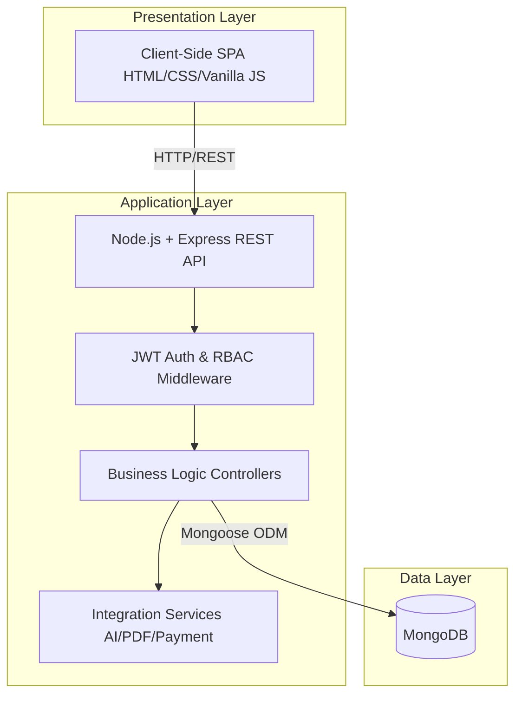
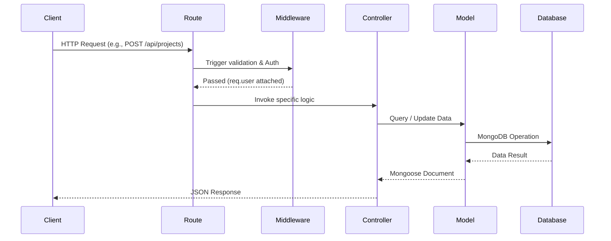
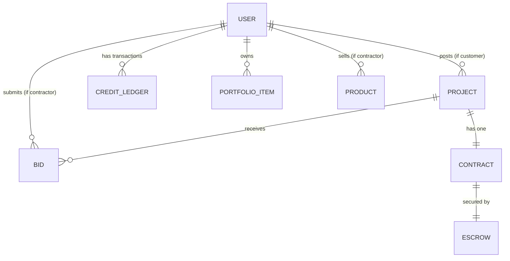
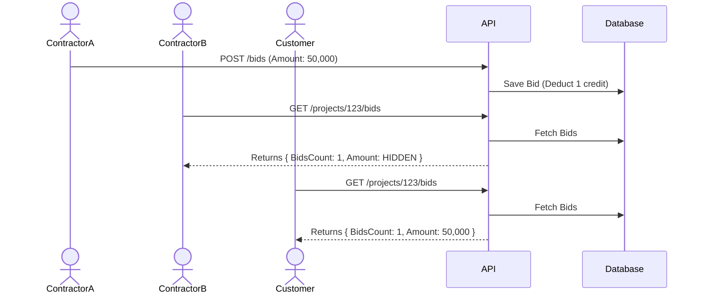

# Chapter 3: System Design

## 3.1 Introduction
The system design phase is a critical step in the software development lifecycle, transforming the established requirements into a clear, structured architecture that guides the implementation process. This chapter details the comprehensive system design of the El-Moquwal platform. It provides an in-depth examination of the architectural patterns selected, the database schemas designed to handle the complex relationships within the construction marketplace, the module-level breakdown of the system, and the robust security measures integrated into the core framework. By outlining these design choices, this chapter establishes a solid technical foundation that ensures the application meets its functional and non-functional requirements, specifically emphasizing security, scalability, and performance within the context of the Egyptian contracting industry.

## 3.2 System Architecture

### 3.2.1 High-Level Architecture Overview
El-Moquwal follows a modern three-tier architecture comprising a Presentation Layer (Client), an Application Layer (API), and a Data Layer (Database). This separation of concerns promotes modularity, independent scalability, and maintainability.



### 3.2.2 Client-Side Architecture
The Presentation Layer is developed as a Vanilla JavaScript Single Page Application (SPA). This approach avoids heavy frameworks, ensuring blazing-fast initial load times and simplicity. Routing is handled client-side via JavaScript History API, updating the DOM dynamically without page reloads. The application maintains authentication state utilizing `localStorage` for access tokens and UI state management, while keeping secure refresh tokens encapsulated in HTTP-only cookies to mitigate Cross-Site Scripting (XSS) vulnerabilities.

### 3.2.3 Backend Architecture
The Application Layer is constructed using Node.js and the Express.js framework, adhering strictly to the Model-View-Controller (MVC) design pattern (adapted for APIs as Model-Route-Controller). The lifecycle of an incoming request flows as follows:



### 3.2.4 Database Architecture
MongoDB, a NoSQL database, was selected for the Data Layer due to its flexibility in handling unstructured and semi-structured data, which is heavily prevalent in construction project requirements. The database leverages Mongoose as the Object Data Modeling (ODM) library. A critical architectural decision was the use of the Mongoose **Discriminator Pattern** to manage the user hierarchy (Customer, Contractor, Admin, Super Admin) within a single `users` collection, optimizing polymorphic queries while maintaining strict schema validation per role. Comprehensive indexing strategies, such as compound indexes on bids (preventing duplicate contractor bids per project), are employed to ensure O(1) or O(log N) lookup times.

### 3.2.5 External Services Integration
The backend communicates with several external services to augment its capabilities:
- **Artificial Intelligence:** Integrates Pollinations.ai (primary) and Anthropic Claude (fallback) for AI-powered price estimation and a RAG-based policy chatbot.
- **Document Generation:** Utilizes Puppeteer (Headless Chrome) to render dynamic Arabic RTL HTML templates into A4 PDF contracts.
- **Payment Gateway:** Interfaces with external payment providers (like Paymob/Fawry, currently mocked via platform gateway) via webhooks to handle escrow deposits and credit purchases.

## 3.3 Database Design

### 3.3.1 Entity-Relationship Overview
The system relies on 18 deeply interconnected collections. The core relationships revolve around Users (Contractors and Customers), Projects, Bids, and Contracts.



### 3.3.2 Discriminator Pattern: User Hierarchy
Instead of maintaining separate collections for different user types, El-Moquwal uses a single `User` collection with Mongoose Discriminators. The base schema contains common fields (name, email, password, role), while derived schemas (`ContractorProfile`, `CustomerProfile`, `AdminProfile`, `SuperAdminProfile`) append role-specific fields. This allows querying all users easily (`User.find()`) or querying specifically (`Contractor.find({ specialty: 'plumbing' })`).

### 3.3.3 Data Dictionary

#### 1. User (Base Collection)
| Field | Type | Description | Constraints/Default |
|-------|------|-------------|---------------------|
| _id | ObjectId | Primary Key | Auto-generated |
| name | String | Full name | Required, max 100 |
| email | String | Email address | Required, Unique |
| phone | String | Egyptian phone number | Required, Unique, Format: 01X... |
| passwordHash | String | Argon2 hashed password | Required, select: false |
| role | String | User role indicator | enum: ['customer', 'contractor', 'admin', 'super_admin'] |
| status | String | Account state | enum: ['active', 'pending', 'suspended'], default: 'active' |
| nationalIdHash | String | Argon2 hashed NID | select: false |
| nationalIdLast4 | String | Masked NID for display | Length 4 |
| loginAttempts | Number | Security tracking | default: 0 |
| lockUntil | Date | Account lock timestamp | default: null |
| isEmailVerified | Boolean | Email verification state | default: false |
| otp | String | Verification code | default: null |
| resetToken | String | Password reset token | default: null |
| referralCode | String | Unique referral identifier | Unique |

#### 2. ContractorProfile (Discriminator)
| Field | Type | Description | Constraints/Default |
|-------|------|-------------|---------------------|
| specialty | String | Contractor discipline | enum: ['civil_engineer', 'architect', 'electrical', 'plumber', 'carpenter', 'painter', 'general_contractor', 'finishing', 'other'] |
| yearsOfExperience | Number | Experience duration | min: 0, default: 0 |
| bio | String | Professional summary | max 1000 |
| certificate | String | Path to qualifications | |
| membershipCard | String | Syndicate card path | |
| nationalIdPhoto | String | Required KYC doc path | Required |
| profilePicture | String | Avatar path | |
| rejectionReason | String | Admin feedback on rejection | max 500 |
| adminNotes | String | Internal admin notes | max 500 |
| approvedBy | ObjectId | Admin who approved | ref: 'User' |
| rating | Number | Average client rating | min: 0, max: 5, default: 0 |
| completedProjects | Number | Total closed projects | default: 0 |
| creditBalance | Number | Available bidding credits | default: 5, min: 0, max: 1000000 |
| isPremium | Boolean | Premium subscription state | default: false |
| subscriptionId | ObjectId | Link to active subscription | ref: 'Subscription' |
| premiumUntil | Date | Expiry of premium | |
| referredBy | ObjectId | User who referred them | ref: 'User' |

#### 3. CustomerProfile (Discriminator)
*(Inherits base User fields with minimal additional metadata needed for property owners).*

#### 4. AdminProfile (Discriminator)
| Field | Type | Description | Constraints/Default |
|-------|------|-------------|---------------------|
| permissions | Array of Strings | Granular access control | enum: ['review_contractors', 'view_projects', 'view_stats', 'manage_disputes', 'manage_featured', 'manage_materials', 'adjust_credits'] |
| createdBySuperAdmin | ObjectId | Creator reference | ref: 'User' |
| notes | String | Admin metadata | max 500 |

#### 5. Project
| Field | Type | Description | Constraints/Default |
|-------|------|-------------|---------------------|
| title | String | Project headline | Required, max 200 |
| description | String | Project details | Required, max 2000 |
| projectType | String | Category | enum: 9 types (similar to specialty) |
| propertyDetails | Object | Location and metrics | Includes governorate, area, floors, etc. |
| requirements | Mixed | Dynamic requirements | |
| budgetRange | String | Estimated customer budget | enum: 6 ranges (e.g., '50k_200k') |
| timeline | String | Expected execution time | enum: 5 options |
| requiredEngineers | Number | Manpower requirement | min: 0 |
| photos | Array of Strings | Uploaded visuals | max 20 |
| aiEstimatedPrice | Object | AI generated estimate | {minEstimate, maxEstimate, reasoning} |
| status | String | Lifecycle state | enum: ['draft', 'open', 'awarded', 'closed'] |
| postedBy | ObjectId | Customer reference | ref: 'User', Required |
| awardedTo | ObjectId | Winning contractor | ref: 'User' |
| awardedBidId | ObjectId | Winning bid reference | ref: 'Bid' |
| closedAt | Date | Completion timestamp | |
| clientRating | Number | Post-project rating | min: 1, max: 5 |
| clientReview | String | Post-project feedback | max 1000 |
| bidsCount | Number | Denormalized metric | default: 0 |
| isPrivate | Boolean | Visibility flag | default: false |
| invitedContractors | Array of ObjectIds | For private projects | ref: 'User' |
| isFeatured | Boolean | Priority listing flag | default: false |
| featuredUntil | Date | Expiry of featured status | |
| isUrgent | Boolean | Urgent tag | default: false |
| closurePhotos | Array of Strings | Final result visuals | |

#### 6. Bid
| Field | Type | Description | Constraints/Default |
|-------|------|-------------|---------------------|
| project | ObjectId | Target project | ref: 'Project', Required |
| contractor | ObjectId | Bidding contractor | ref: 'User', Required |
| amount | Number | Blind monetary bid | Required, min: 0 |
| currency | String | | default: 'EGP' |
| message | String | Proposal text | Required, max 500 |
| proposedDurationDays | Number | Estimated timeframe | min: 1 |
| status | String | Decision state | enum: ['pending', 'accepted', 'rejected'] |
| respondedAt | Date | Timestamp of decision | |
| rejectionReason | String | Feedback to contractor | |
*(Constraint: Unique compound index on {project, contractor} to prevent multiple bids).*

#### 7. Contract
| Field | Type | Description | Constraints/Default |
|-------|------|-------------|---------------------|
| project | ObjectId | Reference project | ref: 'Project', Unique, Required |
| bid | ObjectId | Accepted bid reference | ref: 'Bid', Required |
| customer | ObjectId | Property owner | ref: 'User', Required |
| contractor | ObjectId | Executing contractor | ref: 'User', Required |
| bidAmount | Number | Final agreed price | Required |
| commissionRate | Number | Platform fee percentage | default: 0.02 (2%) |
| customerSignature | Object | Digital signing details | {signed, ipAddress, signatureHash} |
| contractorSignature| Object | Digital signing details | {signed, ipAddress, signatureHash} |
| status | String | Legal state | enum: ['draft', 'pending_signatures', 'active', 'completed', 'disputed'] |
| pdfFilename | String | Path to generated document | |

#### 8. Escrow
| Field | Type | Description | Constraints/Default |
|-------|------|-------------|---------------------|
| project | ObjectId | Linked project | ref: 'Project', Unique |
| totalAmount | Number | Full project cost | Required |
| commissionAmount | Number | Deducted platform fee | Required |
| netAmount | Number | Amount to contractor | Required |
| status | String | Financial state | enum: ['held', 'partially_released', 'released', 'disputed', 'refunded'] |
| milestones | Array of Objects| Payment tranches | {title, amount, percentage, status} |
| disputeResolution| Object | Admin arbitration details | {decision, warrantyDeduction} |

*(The data dictionary extends similarly to Product, MaterialOrder, PortfolioItem, CreditLedger, Transaction, Subscription, PlatformSettings, AuditLog, and GuestSession, strictly enforcing structural integrity at the database level).*

## 3.4 Module Design

### 3.4.1 Authentication & Authorization Module
- **Purpose:** Handles user registration, JWT generation, OTP validation, and Role-Based Access Control (RBAC).
- **Business Rules:** National IDs must be strictly verified against Egyptian standards. Accounts are locked after repeated failed logins. Passwords are mathematically hashed utilizing Argon2id.
- **Data Flow:** Client sends credentials → Controller hashes and compares → Token is generated and signed (Access in payload, Refresh in HTTP-only cookie).

### 3.4.2 National ID Parsing Module
- **Purpose:** Extracts demographic data from a 14-digit Egyptian National ID to ensure KYC compliance.
- **Inputs:** 14-digit numeric string.
- **Outputs:** `{valid: boolean, dob: date, gender: string, governorate: string}`.
- **Business Rules:** Validates the century digit (2 for 19xx, 3 for 20xx), month/day limits, and specific governorate codes defined by the state.

### 3.4.3 Projects & Blind Bidding Module
- **Purpose:** Core engine for project listing and contractor proposals.
- **Business Rules:** Blind Bidding is enforced at the API level. Contractors cannot access the `amount` field of competitors. Submitting a bid deducts credits dynamically based on the project's budget range.

### 3.4.4 Escrow & Milestone Payments Module
- **Purpose:** Protects financial transactions, holding customer funds safely until milestone delivery is approved.
- **Business Rules:** Splits total payment into standard tranches (e.g., 30% start, 40% structure, 30% handover). The platform's 2% commission is securely deducted during the initial transaction routing.

### 3.4.5 Electronic Contracts & Digital Signatures Module
- **Purpose:** Generates legally binding, Arabic-language PDF contracts.
- **Inputs:** Project details, accepted Bid amount, Customer, and Contractor demographics.
- **Business Rules:** Employs dual-signature validation. Signatures are recorded with an SHA256 cryptographic hash of the user context (IP, User-Agent, Timestamp) to ensure non-repudiation under Egyptian civil law.

### 3.4.6 AI Price Estimation Module
- **Purpose:** Provides fair market value estimates to customers prior to publishing.
- **Business Rules:** Integrates a primary LLM (Pollinations) with a fallback to Anthropic Claude. Results are cached on the project object for exactly one hour to minimize API costs and ensure consistency.

## 3.5 Security Design

### 3.5.1 JWT Authentication Lifecycle
El-Moquwal utilizes a dual-token strategy. The **Access Token** (signed via HS256) is short-lived (15 minutes), containing the user ID and role, to minimize the impact of token interception. The **Refresh Token** (7 days) is exclusively transmitted via strict HTTP-only, secure cookies, shielding it from XSS attacks. 

### 3.5.2 Role-Based Access Control (RBAC)
Middleware orchestrates the endpoints based on discriminator roles.
| Role | Allowed Actions / Endpoints |
|------|-----------------------------|
| **Customer** | POST /projects, GET /bids (all visible), POST /contracts/sign |
| **Contractor** | POST /projects/:id/bids, POST /materials, POST /portfolio |
| **Admin** | Granular based on assigned `permissions` array (e.g., `manage_disputes`). |
| **Super Admin** | Unrestricted access across all domains. Automatically bypasses granular permission checks. |

### 3.5.3 Blind Bidding Enforcement
To ensure fair market competition, the system enforces "Blind Bidding". At the database level, bids are stored openly. However, the API `bid.controller.js` acts as an interceptor. If the requester is the project owner (Customer), the raw Mongoose document is returned. If the requester is a Contractor, the backend invokes the custom `toBlindJSON()` schema method, forcefully deleting the `amount` and `message` properties from competitors' objects before serialization.

### 3.5.4 Data Security
Sensitive information, notably the National ID and Passwords, are cryptographically hashed using **Argon2id**, the winner of the Password Hashing Competition, known for its resistance to GPU-based cracking. Mongoose schemas actively prevent these fields from returning in API queries via the `select: false` configuration.

## 3.6 API Design Overview

| Module | Method | Endpoint Path | Auth Required | Description |
|--------|--------|---------------|---------------|-------------|
| Auth | POST | `/api/auth/register/contractor` | None | Register new contractor (requires multipart NID photo) |
| Auth | POST | `/api/auth/login` | None | Authenticate and issue dual JWTs |
| Project | POST | `/api/projects` | Customer | Draft or publish a new construction project |
| Project | GET | `/api/projects/:id` | Optional | Retrieve project details and denormalized bid counts |
| Bid | POST | `/api/projects/:id/bids` | Contractor | Submit a proposal (deducts credit balance) |
| Escrow | POST | `/api/payments/deposit-escrow`| Customer | Initiate secure fund holding for awarded project |
| Contract | POST | `/api/contracts/generate` | System | Auto-trigger PDF creation post bid-acceptance |
| Admin | PUT | `/api/admin/contractors/:id` | Admin | Approve or reject pending contractor applications |

## 3.7 UML Diagrams

### 3.7.1 Use Case Diagram
```mermaid
usecaseDiagram
    actor Customer
    actor Contractor
    actor Admin

    Customer --> (Post Project)
    Customer --> (Accept Bid)
    Customer --> (Deposit Escrow)
    
    Contractor --> (Submit Bid)
    Contractor --> (Sign Contract)
    Contractor --> (Add Portfolio)
    
    Admin --> (Review Contractor)
    Admin --> (Resolve Dispute)
```

### 3.7.2 Sequence Diagram: Blind Bidding Flow


## 3.8 User Interface Design
The design adheres to a "Mobile-First" philosophy, deeply integrating Arabic Right-To-Left (RTL) aesthetics. 
- **Customer Dashboard:** Focuses heavily on active project monitoring, visual escrow milestone progress bars, and transparent bid comparison tables.
- **Contractor Dashboard:** Prioritizes the active credit ledger balance, potential project feed, and portfolio management interface.

## 3.9 Chapter Summary
This chapter has thoroughly documented the structural design of the El-Moquwal system. By employing a scalable Node.js/Express.js backend alongside an inherently flexible MongoDB architecture, the platform effectively mitigates the complexities of multi-role user tracking and transactional security. The implementation of rigorous algorithmic rules, such as Egyptian NID parsing, Blind Bidding logic, and dual-signature PDF generation, ensures that the digital representation aligns seamlessly with local legal constraints and optimal business practices.
