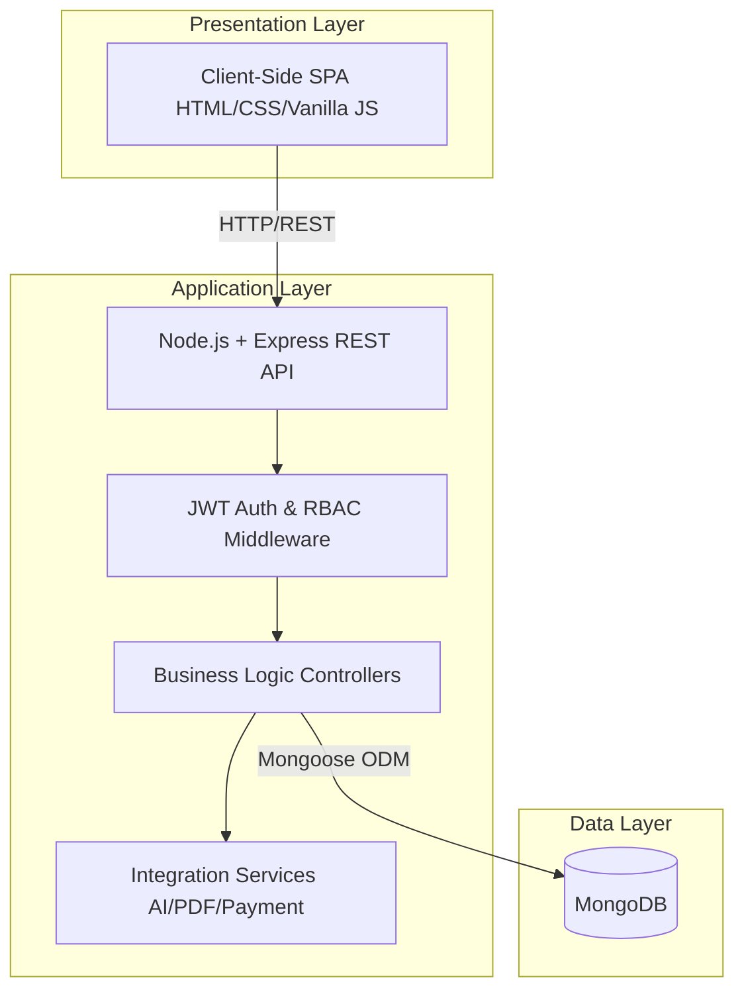
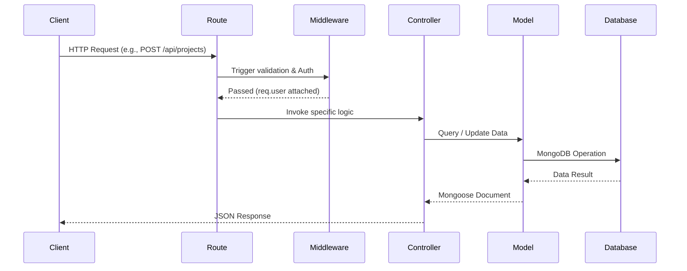
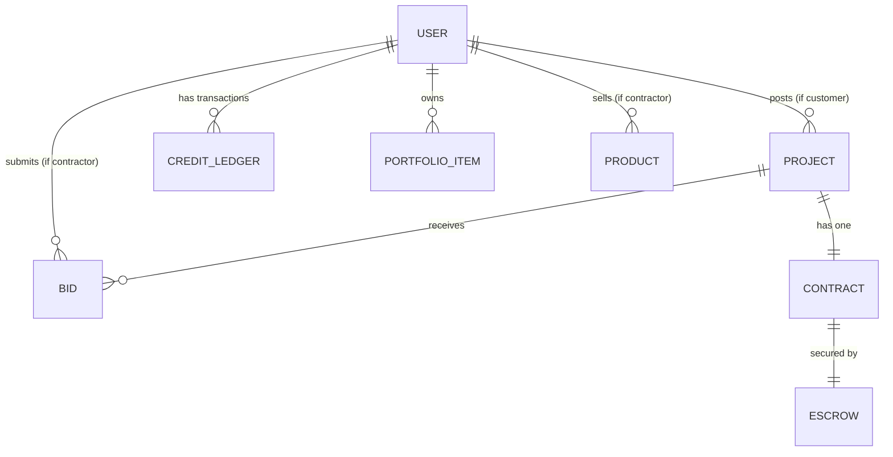
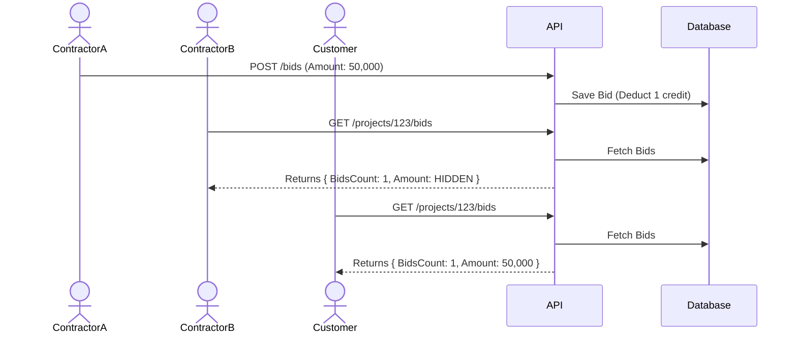

# Table of Contents

- [Chapter 1: Introduction](#chapter-1-introduction)
  - [1.1 Background and Context](#11-background-and-context)
  - [1.2 Problem Statement](#12-problem-statement)
  - [1.3 Project Objectives](#13-project-objectives)
  - [1.4 Project Scope](#14-project-scope)
    - [1.4.1 In Scope](#141-in-scope)
    - [1.4.2 Out of Scope](#142-out-of-scope)
  - [1.5 Significance of the Study](#15-significance-of-the-study)
  - [1.6 Research Methodology](#16-research-methodology)
  - [1.7 Document Organisation](#17-document-organisation)
- [Chapter 2: Literature Review and Feasibility Study](#chapter-2-literature-review-and-feasibility-study)
  - [Table of Contents](#table-of-contents)
  - [2.1 Introduction](#21-introduction)
  - [2.2 Executive Summary](#22-executive-summary)
  - [2.3 Organisation Summary](#23-organisation-summary)
    - [2.3.1 Platform Overview](#231-platform-overview)
    - [2.3.2 Main Objective](#232-main-objective)
    - [2.3.3 Value Delivered](#233-value-delivered)
    - [2.3.4 Core Platform Features](#234-core-platform-features)
  - [2.4 Literature Review](#24-literature-review)
    - [2.4.1 Background and Evolution of Digital Service Marketplaces](#241-background-and-evolution-of-digital-service-marketplaces)
    - [2.4.2 Review of Related Work and Practice](#242-review-of-related-work-and-practice)
    - [2.4.3 Gaps in Current Solutions](#243-gaps-in-current-solutions)
    - [2.4.4 El-Moquwal's Contribution](#244-el-moquwal's-contribution)
    - [2.4.5 Theoretical and Practical Implications](#245-theoretical-and-practical-implications)
  - [2.5 SWOT Analysis](#25-swot-analysis)
  - [2.6 Feasibility Studies](#26-feasibility-studies)
    - [2.6.1 Legal and Environmental Feasibility](#261-legal-and-environmental-feasibility)
      - [A. Legal Feasibility — Regulatory Compliance](#a-legal-feasibility-—-regulatory-compliance)
      - [B. Environmental Impact](#b-environmental-impact)
    - [2.6.2 Market Feasibility](#262-market-feasibility)
      - [Market Overview](#market-overview)
      - [Digital Readiness](#digital-readiness)
      - [Market Size and Growth](#market-size-and-growth)
      - [Bottom-Up Demand Estimation](#bottom-up-demand-estimation)
      - [Competitive Landscape](#competitive-landscape)
      - [Differentiation and Positioning](#differentiation-and-positioning)
      - [Suppliers and Partners](#suppliers-and-partners)
      - [Market Entry Timing](#market-entry-timing)
    - [2.6.3 Demand Analysis](#263-demand-analysis)
      - [Market Need](#market-need)
      - [Evidence of the Pain](#evidence-of-the-pain)
      - [Current Solutions and Their Limits](#current-solutions-and-their-limits)
      - [Demand Determinants](#demand-determinants)
      - [Marketing Information Sources](#marketing-information-sources)
      - [Customer Segments and Targeting](#customer-segments-and-targeting)
      - [Marketing Strategy and Mix (7Ps)](#marketing-strategy-and-mix-7ps)
  - [2.7 Technical Feasibility](#27-technical-feasibility)
    - [2.7.1 Platform Architecture](#271-platform-architecture)
    - [2.7.2 System Roles](#272-system-roles)
    - [2.7.3 Integration Requirements](#273-integration-requirements)
    - [2.7.4 Security](#274-security)
    - [2.7.5 Technical Team and Hosting](#275-technical-team-and-hosting)
  - [2.8 Financial Plan](#28-financial-plan)
    - [2.8.1 Assumptions and Basis of Estimate](#281-assumptions-and-basis-of-estimate)
    - [2.8.2 Capital Requirement and Funding](#282-capital-requirement-and-funding)
    - [2.8.3 Detailed Financial Projection (Three-Year)](#283-detailed-financial-projection-three-year)
    - [2.8.4 Investment Costs (التكاليف الاستثمارية)](#284-investment-costs-التكاليف-الاستثمارية)
    - [2.8.5 Ten-Year Cash Flow Projection (التدفقات المالية لعشر سنوات)](#285-ten-year-cash-flow-projection-التدفقات-المالية-لعشر-سنوات)
    - [2.8.6 Performance and Financial Indicators](#286-performance-and-financial-indicators)
  - [2.9 Summary](#29-summary)
  - [References](#references)
- [Chapter 3: System Design](#chapter-3-system-design)
  - [3.1 Introduction](#31-introduction)
  - [3.2 System Architecture](#32-system-architecture)
    - [3.2.1 High-Level Architecture Overview](#321-high-level-architecture-overview)
    - [3.2.2 Client-Side Architecture](#322-client-side-architecture)
    - [3.2.3 Backend Architecture](#323-backend-architecture)
    - [3.2.4 Database Architecture](#324-database-architecture)
    - [3.2.5 External Services Integration](#325-external-services-integration)
  - [3.3 Database Design](#33-database-design)
    - [3.3.1 Entity-Relationship Overview](#331-entity-relationship-overview)
    - [3.3.2 Discriminator Pattern: User Hierarchy](#332-discriminator-pattern-user-hierarchy)
    - [3.3.3 Data Dictionary](#333-data-dictionary)
      - [1. User (Base Collection)](#1-user-base-collection)
      - [2. ContractorProfile (Discriminator)](#2-contractorprofile-discriminator)
      - [3. CustomerProfile (Discriminator)](#3-customerprofile-discriminator)
      - [4. AdminProfile (Discriminator)](#4-adminprofile-discriminator)
      - [5. Project](#5-project)
      - [6. Bid](#6-bid)
      - [7. Contract](#7-contract)
      - [8. Escrow](#8-escrow)
  - [3.4 Module Design](#34-module-design)
    - [3.4.1 Authentication & Authorization Module](#341-authentication-&-authorization-module)
    - [3.4.2 National ID Parsing Module](#342-national-id-parsing-module)
    - [3.4.3 Projects & Blind Bidding Module](#343-projects-&-blind-bidding-module)
    - [3.4.4 Escrow & Milestone Payments Module](#344-escrow-&-milestone-payments-module)
    - [3.4.5 Electronic Contracts & Digital Signatures Module](#345-electronic-contracts-&-digital-signatures-module)
    - [3.4.6 AI Price Estimation Module](#346-ai-price-estimation-module)
  - [3.5 Security Design](#35-security-design)
    - [3.5.1 JWT Authentication Lifecycle](#351-jwt-authentication-lifecycle)
    - [3.5.2 Role-Based Access Control (RBAC)](#352-role-based-access-control-rbac)
    - [3.5.3 Blind Bidding Enforcement](#353-blind-bidding-enforcement)
    - [3.5.4 Data Security](#354-data-security)
  - [3.6 API Design Overview](#36-api-design-overview)
  - [3.7 UML Diagrams](#37-uml-diagrams)
    - [3.7.1 Use Case Diagram](#371-use-case-diagram)
    - [3.7.2 Sequence Diagram: Blind Bidding Flow](#372-sequence-diagram-blind-bidding-flow)
  - [3.8 User Interface Design](#38-user-interface-design)
  - [3.9 Chapter Summary](#39-chapter-summary)
- [Chapter 4: Software Requirements Specification (SRS)](#chapter-4-software-requirements-specification-srs)
  - [4.1 Introduction](#41-introduction)
    - [4.1.1 Purpose](#411-purpose)
    - [4.1.2 Document Scope](#412-document-scope)
    - [4.1.3 Definitions, Acronyms, and Abbreviations](#413-definitions-acronyms-and-abbreviations)
    - [4.1.4 Overview](#414-overview)
  - [4.2 Overall Description](#42-overall-description)
    - [4.2.1 Product Perspective](#421-product-perspective)
    - [4.2.2 Product Functions](#422-product-functions)
    - [4.2.3 User Classes and Characteristics](#423-user-classes-and-characteristics)
    - [4.2.4 Operating Environment](#424-operating-environment)
    - [4.2.5 Design and Implementation Constraints](#425-design-and-implementation-constraints)
  - [4.3 Functional Requirements](#43-functional-requirements)
    - [4.3.1 Authentication Module](#431-authentication-module)
    - [4.3.2 Project Management Module](#432-project-management-module)
    - [4.3.3 Blind Bidding Module](#433-blind-bidding-module)
    - [4.3.4 Credit System Module](#434-credit-system-module)
    - [4.3.5 Escrow & Milestone Payment Module](#435-escrow-&-milestone-payment-module)
    - [4.3.6 Electronic Contracts Module](#436-electronic-contracts-module)
    - [4.3.7 AI Price Estimation Module](#437-ai-price-estimation-module)
  - [4.5 Non-Functional Requirements](#45-non-functional-requirements)
    - [4.5.1 Performance Requirements](#451-performance-requirements)
    - [4.5.3 Security Requirements](#453-security-requirements)
    - [4.5.5 Usability Requirements](#455-usability-requirements)
  - [4.6 Requirements Traceability Matrix](#46-requirements-traceability-matrix)
  - [4.7 Chapter Summary](#47-chapter-summary)
- [Chapter 5: Implementation and Testing](#chapter-5-implementation-and-testing)
  - [5.1 Introduction](#51-introduction)
  - [5.2 Development Environment](#52-development-environment)
    - [5.2.1 Hardware and Software Requirements](#521-hardware-and-software-requirements)
    - [5.2.2 Project Structure](#522-project-structure)
    - [5.2.3 Environment Configuration](#523-environment-configuration)
  - [5.3 Technology Stack Deep Dive](#53-technology-stack-deep-dive)
    - [5.3.1 Node.js and Express.js](#531-nodejs-and-expressjs)
    - [5.3.2 MongoDB and Mongoose](#532-mongodb-and-mongoose)
    - [5.3.3 Argon2id Password Security](#533-argon2id-password-security)
  - [5.4 Key Algorithm Implementations](#54-key-algorithm-implementations)
    - [5.4.1 Egyptian National ID Parser](#541-egyptian-national-id-parser)
    - [5.4.2 PDF Contract Generation](#542-pdf-contract-generation)
    - [5.4.3 AI Price Estimation Service](#543-ai-price-estimation-service)
    - [5.4.4 JWT Middleware Chain](#544-jwt-middleware-chain)
  - [5.5 Testing Strategy](#55-testing-strategy)
    - [5.5.1 Overview](#551-overview)
    - [5.5.2 Testing Tools](#552-testing-tools)
  - [5.6 Unit Testing](#56-unit-testing)
    - [5.6.1 National ID Parser Tests](#561-national-id-parser-tests)
    - [5.6.2 JSON Parser Tests (parseJsonResponse)](#562-json-parser-tests-parsejsonresponse)
  - [5.7 Integration Testing](#57-integration-testing)
    - [5.7.1 Authentication Endpoints](#571-authentication-endpoints)
    - [5.7.2 Project & Bidding Endpoints](#572-project-&-bidding-endpoints)
  - [5.8 System Testing Scenarios](#58-system-testing-scenarios)
    - [Scenario 1: Complete Project Lifecycle](#scenario-1-complete-project-lifecycle)
    - [Scenario 2: Contractor Onboarding](#scenario-2-contractor-onboarding)
  - [5.9 Security Testing](#59-security-testing)
    - [5.9.1 RBAC Boundary Testing](#591-rbac-boundary-testing)
    - [5.9.2 Rate Limiting and Brute Force Tests](#592-rate-limiting-and-brute-force-tests)
  - [5.10 Chapter Summary](#510-chapter-summary)
- [Chapter 6: Conclusion and Future Work](#chapter-6-conclusion-and-future-work)
  - [6.1 Introduction](#61-introduction)
  - [6.2 Project Summary](#62-project-summary)
  - [6.3 Objectives Achievement](#63-objectives-achievement)
  - [6.4 Key Contributions](#64-key-contributions)
    - [6.4.1 Domain-Specific Innovation](#641-domain-specific-innovation)
    - [6.4.2 Technical Architecture Decisions](#642-technical-architecture-decisions)
    - [6.4.3 Sector Formalisation](#643-sector-formalisation)
  - [6.5 Challenges and Limitations](#65-challenges-and-limitations)
    - [6.5.1 Technical Limitations](#651-technical-limitations)
    - [6.5.2 Business Limitations](#652-business-limitations)
  - [6.6 Future Work and Recommendations](#66-future-work-and-recommendations)
    - [6.6.1 Short-Term (6–12 Months)](#661-short-term-6–12-months)
    - [6.6.2 Medium-Term (12–24 Months)](#662-medium-term-12–24-months)
    - [6.6.3 Long-Term (24+ Months)](#663-long-term-24+-months)
  - [6.7 Lessons Learned](#67-lessons-learned)
  - [6.8 Final Remarks](#68-final-remarks)

---

# Chapter 1: Introduction

## 1.1 Background and Context

The construction and finishing services sector in Egypt is the single largest contributor to the national Gross Domestic Product (GDP), accounting for approximately 14% of total economic output. With a national requirement of roughly 450,000 new housing units annually, coupled with a vast existing housing stock that generates continuous renovation and fit-out demand, the downstream market for finishing, renovation, and small-to-medium contracting work is immense and continuously replenished.

Despite the sheer scale and economic significance of this sector, the experience of hiring a contractor in Egypt remains overwhelmingly informal, fragmented, and trust-deficient. Property owners typically rely on personal referrals, social-media groups, or chance encounters to find professionals — channels that provide no payment protection, no verified credentials, no enforceable written agreement, and no accountability once work begins. On the supply side, engineers and contractors struggle to find qualified work through formal channels and frequently face late or disputed payment. Industry research consistently identifies cost overruns reaching approximately 30% on delayed Egyptian construction projects, while more than 70% of the construction workforce operates informally — without contracts, formal payroll, or bank accounts.

The rapid maturation of Egypt's digital infrastructure has created the conditions necessary for a platform-based intervention. At the start of 2025, Egypt had approximately 96 million internet users (an 82% penetration rate), roughly 116 million active mobile connections, and a mobile-payments market valued at over USD 14 billion. The customer can be reached digitally, and money can move safely online. Yet, despite these enablers, the contracting and finishing niche remains largely untouched by the kind of end-to-end digital marketplace model that has transformed ride-hailing, food delivery, freelance work, and short-term rentals globally.

This gap — a large, growing, digitally reachable market with no dominant escrow-backed, end-to-end incumbent — is the opportunity that El-Moquwal (المقاول) is designed to capture.

## 1.2 Problem Statement

Property owners undertaking finishing, renovation, or construction work in Egypt face a recurring set of interconnected problems:

1. **Pricing Opacity:** Customers cannot obtain a credible cost estimate before engaging a contractor, which sustains mistrust and discourages first-time buyers from proceeding.
2. **Absence of Payment Protection:** No mechanism exists to hold funds safely and release them only upon verified delivery of work milestones, leaving customers exposed to non-delivery and contractors exposed to non-payment.
3. **Weak Verification and Accountability:** Provider credentials are rarely checked, there is no enforceable written contract, and no persistent reputation follows a professional across jobs.
4. **Fragmented Journey:** Discovery, pricing, contracting, payment, and materials procurement are handled across disconnected channels — personal contacts, social media, cash transactions — multiplying friction, miscommunication, and disputes.
5. **Sector Informality:** The overwhelming informality of the sector means that disputes have no structured resolution path, completed work has no warranty framework, and neither party has legal recourse beyond costly and slow civil litigation.

These problems are not merely inconveniences; they represent structural market failures that erode trust, inflate costs, delay projects, and suppress demand in a sector that is critical to the national economy.

## 1.3 Project Objectives

El-Moquwal aims to address the identified problems through a unified digital platform. The specific objectives of this project are:

1. **To design and implement a secure, web-based marketplace** that organises the entire contracting journey — from project discovery and cost estimation through bidding, contracting, payment protection, execution tracking, and post-project rating — within a single, Arabic-first interface.

2. **To develop an AI-powered price estimation system** that provides customers with an indicative cost range before they commit to hiring, thereby reducing information asymmetry and establishing realistic expectations.

3. **To implement a Blind Bidding mechanism** that ensures fair market competition among contractors by preventing them from seeing each other's proposed amounts, encouraging each professional to submit their genuine best offer.

4. **To build an Escrow-based milestone payment system** that protects both parties: customers' funds are held securely and released only upon approval of completed work phases, while contractors are guaranteed payment for delivered milestones.

5. **To automate the generation of legally structured electronic contracts** with dual digital signatures, compliant with Egyptian civil law (Law 131/1948), providing both parties with an enforceable, documented agreement for every project.

6. **To establish a robust identity verification and KYC workflow** using Egyptian National ID parsing and document review, ensuring that only vetted professionals can operate on the platform.

7. **To create a Role-Based Access Control (RBAC) system** supporting four distinct user tiers — Customer, Contractor, Admin, and Super Admin — with granular permissions that ensure operational security and governance.

8. **To develop supplementary platform features** including a building-materials marketplace, professional portfolio management, a credit-based bidding economy, premium subscriptions, and an administrative dispute resolution framework.

## 1.4 Project Scope

### 1.4.1 In Scope

The El-Moquwal platform, as designed and implemented in this project, encompasses:

- **User Management:** Registration, authentication (JWT-based), email OTP verification, and National ID parsing for all four user roles.
- **Project Lifecycle:** Creation, publication, bidding, awarding, execution tracking, closure, and rating of construction and finishing projects.
- **Blind Bidding Engine:** Credit-based bid submission with enforced information asymmetry between competing contractors.
- **Escrow System:** Milestone-based payment holding, release, dispute opening, and administrative resolution.
- **Electronic Contracts:** Automated PDF generation with Arabic RTL support, dual digital signatures (SHA256 hashed), and warranty provisions.
- **AI Integration:** Price estimation via external LLM providers (Pollinations.ai primary, Anthropic Claude fallback) and a RAG-based policy chatbot.
- **Material Marketplace:** B2B product listings with categories, images, stock management, and ordering.
- **Portfolio System:** Contractor work showcase with before/after photography and project linkage.
- **Administration:** Contractor vetting, dispute mediation, platform settings management, statistics dashboard, and audit logging.

### 1.4.2 Out of Scope

The following are explicitly excluded from the current project phase:

- Native mobile applications (iOS / Android) — the platform is web-based and mobile-responsive.
- Real-time chat or video communication between users.
- Integration with live payment gateways (Paymob/Fawry are mocked for demonstration; the architecture supports plug-in integration).
- Geographic expansion beyond the initial launch governorates.
- Automated legal compliance auditing or regulatory reporting.

## 1.5 Significance of the Study

This project carries significance on multiple levels:

**Academic Significance:** The project demonstrates the practical application of core Business Information Systems (BIS) concepts — including database design, API architecture, role-based security, AI integration, and financial modelling — to solve a real-world market problem in the Egyptian context.

**Industry Significance:** El-Moquwal addresses a genuine, large-scale market gap. By formalising an overwhelmingly informal sector through digital contracts, payment protection, and verified identities, the platform contributes to sector documentation and formalisation — aligning with Egypt's national digital-transformation and financial-inclusion agendas.

**Technical Significance:** The system showcases several non-trivial engineering decisions: the MongoDB discriminator pattern for polymorphic user hierarchies, Puppeteer-based Arabic RTL PDF generation, dual-provider AI integration with graceful fallback, and a multi-layered security architecture combining Argon2id hashing, JWT token rotation, and granular RBAC.

## 1.6 Research Methodology

The development of El-Moquwal followed a structured, iterative methodology:

1. **Problem Identification:** Extensive secondary research into the Egyptian construction sector, digital marketplace evolution, and competitor analysis to identify and validate the market gap.

2. **Requirements Gathering:** Structured analysis of user needs across the four stakeholder groups (customers, contractors, administrators, and platform governors), informed by industry reports, surveys, and best-practice review.

3. **Feasibility Assessment:** A comprehensive feasibility study covering legal, environmental, market, demand, technical, and financial dimensions (detailed in Chapter 2).

4. **System Design:** Architecture selection (three-tier), database schema design (18 collections with discriminator pattern), module decomposition, security design, and API specification (detailed in Chapter 3).

5. **Requirements Specification:** Formal documentation of 165+ functional requirements and 25+ non-functional requirements following an adapted IEEE 830 SRS format (detailed in Chapter 4).

6. **Implementation:** Iterative development using Node.js/Express.js (backend), MongoDB/Mongoose (database), and Vanilla JavaScript (frontend), with continuous testing and refinement (detailed in Chapter 5).

7. **Testing and Validation:** Multi-layered testing encompassing unit tests, integration tests, system-level scenarios, and security boundary testing (detailed in Chapter 5).

## 1.7 Document Organisation

This graduation project document is organised into six chapters:

| Chapter | Title | Description |
|---------|-------|-------------|
| **Chapter 1** | Introduction | Background, problem statement, objectives, scope, and methodology. |
| **Chapter 2** | Literature Review & Feasibility Study | Review of related work, SWOT analysis, and comprehensive feasibility assessment (legal, market, demand, technical, financial). |
| **Chapter 3** | System Design | Architecture, database design, module decomposition, security design, UML diagrams, and API specification. |
| **Chapter 4** | Software Requirements Specification | Functional requirements (165+), non-functional requirements, external interfaces, and traceability matrix. |
| **Chapter 5** | Implementation and Testing | Technology deep dive, key algorithm implementations with code excerpts, and comprehensive testing results. |
| **Chapter 6** | Conclusion and Future Work | Summary of achievements, limitations, and recommendations for future development. |


---

# Chapter 2: Literature Review and Feasibility Study

> **Faculty of Commerce — Business Information Systems (BIS) Program**
> Graduation Project — 2026 / 2027

---

## Table of Contents

- [2.1 Introduction](#21-introduction)
- [2.2 Executive Summary](#22-executive-summary)
- [2.3 Organisation Summary](#23-organisation-summary)
- [2.4 Literature Review](#24-literature-review)
- [2.5 SWOT Analysis](#25-swot-analysis)
- [2.6 Feasibility Studies](#26-feasibility-studies)
- [2.7 Technical Feasibility](#27-technical-feasibility)
- [2.8 Financial Plan](#28-financial-plan)
- [2.9 Summary](#29-summary)
- [References](#references)

---

## 2.1 Introduction

This chapter establishes the strategic and commercial foundation of the El-Moquwal platform. It begins with a focused review of the literature and the wider evolution of digital service marketplaces, then narrows to the specific gap that El-Moquwal addresses within Egypt's contracting and finishing sector. The second half presents a structured feasibility assessment that examines the project from six complementary angles — legal, environmental, market, demand, technical, and financial — to determine whether the venture is viable, defensible, and worth pursuing. Every externally sourced figure in this chapter is accompanied by its source and a direct link, and every financial assumption is traced to a clear basis, so that each number can be defended on request.

---

## 2.2 Executive Summary

**Project name:** El-Moquwal (المقاول).

**Vision.** To become the trusted digital layer for home finishing, renovation, and small-to-medium contracting in Egypt — the default place where property owners find vetted professionals and where engineers and contractors win work, sign contracts, and get paid safely. El-Moquwal does not perform construction itself; it acts as a neutral, transparent intermediary that reduces the friction, risk, and information asymmetry of the traditional contracting experience.

**What the platform does.** A customer describes a project and receives an instant, AI-assisted cost estimate before committing. Verified professionals submit competitive bids; the customer compares offers, awards the work, and both parties sign a digitally generated contract. Payment is protected through an escrow (الضمان) mechanism that holds funds and releases them against agreed milestones, with a defined warranty cap that shields the customer if work is not delivered. The platform also offers a building-materials marketplace, professional portfolios, ratings, and an administrative layer for vetting and dispute resolution.

**Why now.** Construction is the largest contributor to Egypt's GDP, internet and mobile penetration are near-universal in the urban centres the platform targets, and the digital-payment rails required to operate escrow at scale are mature. Yet the customer experience remains overwhelmingly offline, informal, and trust-deficient — exactly the conditions in which a focused digital intermediary can capture early share.

**Launch approach.** The platform launches in 2027 with a deliberate base-building first year: onboarding and verifying professionals, attracting early customers, and proving the experience while the service is offered without commission or subscription fees to build a critical mass of users. Monetisation — commission on protected transactions and premium subscriptions — begins in 2028 and grows gradually thereafter. Because the platform was built in-house by the founding team, software development is an in-kind contribution rather than a cash cost, keeping the cash required to launch very modest.

---

## 2.3 Organisation Summary

### 2.3.1 Platform Overview

El-Moquwal is a web-based, mobile-responsive marketplace that organises the entire contracting journey — discovery, estimation, bidding, contracting, payment protection, execution tracking, and post-project rating — within a single, Arabic-first interface. It serves customers, professionals, and an administrative team, with a fourth super-administrative tier for governance and platform configuration.

### 2.3.2 Main Objective

To make hiring a contractor in Egypt as transparent, safe, and measurable as buying a product online: clear pricing up front, verified credentials, a written contract, protected money, and accountability on both sides.

### 2.3.3 Value Delivered

**For customers:** instant cost visibility, comparison of competing offers, identity-verified professionals, an enforceable digital contract, and escrow protection that releases payment only as work is delivered.

**For professionals:** a steady, low-cost channel of qualified leads, a credibility-building portfolio and rating, formal contracts that reduce payment disputes, and access to a materials marketplace and premium tools.

**For the wider market:** formalisation of an overwhelmingly informal sector, a documented transaction trail, and fewer of the disputes, delays, and cost overruns that erode trust today.

### 2.3.4 Core Platform Features

- Role-based accounts for customers, professionals, managers, and super-administrators, with national-ID verification and document review for professionals.
- AI-assisted smart cost estimation that produces an indicative price range before a project is posted.
- A competitive bidding system in which professionals spend platform credits to submit offers, keeping lead quality high and the channel sustainable.
- Automatic generation of a structured, signable PDF contract for every awarded project, including a defined warranty cap.
- Escrow (الضمان) with milestone-based release, dispute handling, and administrator-mediated resolution.
- A building-materials marketplace with order tracking, plus professional portfolios that showcase completed work.
- A monetisation stack combining transaction commission, premium subscriptions, pay-per-bid credits, featured listings, and a materials take-rate.

---

## 2.4 Literature Review

### 2.4.1 Background and Evolution of Digital Service Marketplaces

Digital service marketplaces have matured along a consistent trajectory: from simple online directories that merely listed providers, to comparison engines that introduced price and rating transparency, and finally to fully integrated transaction platforms that own the entire journey — discovery, contracting, payment, and dispute resolution. The decisive shift in each generation has been the gradual transfer of trust from the individual provider to the platform itself, achieved through verified identities, escrowed payments, structured contracts, and reputation systems, increasingly supported by artificial intelligence for pricing and matching. In adjacent verticals — ride-hailing, food delivery, freelance work, and short-term rentals — this model has repeatedly converted large, fragmented, trust-poor offline markets into organised digital ones. Home services and contracting are among the last large categories to undergo this transition, particularly in emerging markets.

### 2.4.2 Review of Related Work and Practice

Research on digital transformation in service-intermediation consistently reports three findings relevant to El-Moquwal. First, transparency of price and provider information materially increases conversion and customer confidence. Second, payment protection — escrow or staged release — is the strongest single driver of willingness to transact for high-value, infrequent services where the buyer cannot easily judge quality in advance. Third, bundling complementary services (such as materials supply alongside the core service) deepens engagement and retention. Within Egypt, earlier local efforts that connect homeowners with finishing and décor providers demonstrated genuine demand for organised matching, while remaining largely directory-and-quotation tools rather than end-to-end transactional systems.

### 2.4.3 Gaps in Current Solutions

- **No payment protection.** Informal referrals, social-media groups, and listing sites provide no escrow, leaving customers exposed to non-delivery and professionals exposed to non-payment.
- **Weak verification and accountability.** Provider credentials are rarely checked, there is no enforceable contract, and no persistent reputation follows a professional across jobs.
- **Fragmented journey.** Discovery, pricing, contracting, payment, and materials are handled across disconnected channels, multiplying friction and disputes.
- **Pricing opacity.** Customers cannot obtain a credible estimate before engaging, which sustains mistrust and discourages first-time buyers.

### 2.4.4 El-Moquwal's Contribution

El-Moquwal closes these gaps by unifying the entire contracting lifecycle in one accountable system. Its distinctive contribution is a combination rare in the local market: identity-verified professionals, an AI-assisted estimate that sets expectations before any commitment, a binding digital contract generated for every project, and an escrow mechanism with a warranty cap that protects both sides. The materials marketplace and portfolio layer extend the relationship beyond a single transaction, while the credit-based bidding model keeps lead quality high and the supply side economically engaged.

### 2.4.5 Theoretical and Practical Implications

- **Sector formalisation.** Attaching identity, contracts, and a payment trail to work that is today overwhelmingly informal contributes to documenting and formalising a major segment of the economy.
- **Financial and digital inclusion.** Smaller professionals gain access to formal contracts, a verifiable track record, and digital payment — assets otherwise hard for them to build.
- **Alignment with national priorities.** The model supports Egypt's digital-transformation and financial-inclusion agendas and the broader push to organise the construction value chain.

---

## 2.5 SWOT Analysis

This analysis separates factors internal to El-Moquwal (strengths and weaknesses), which the venture can control, from external market factors (opportunities and threats), which it must navigate.

| **Strengths (Internal)** | **Weaknesses (Internal)** |
|--------------------------|---------------------------|
| End-to-end model: discovery, AI estimate, bidding, digital contract, escrow, and materials in one system. | New, unproven brand competing against entrenched word-of-mouth trust. |
| Escrow + warranty cap directly neutralises the market's primary objection (trust over money). | Classic two-sided cold-start: customers and professionals must be grown in balance. |
| Verified professionals and persistent ratings build accountability competitors lack. | Dependence on professionals adopting digital workflows and online payment. |
| Diversified revenue (commission, subscription, credits, materials, featured) reduces single-stream risk. | Reliance on third-party payment and escrow rails and their fees. |
| Arabic-first, mobile-responsive interface tailored to local users. | Dispute resolution is operationally heavy and must be staffed carefully to protect the brand. |
| Working software already built in-house, lowering time-to-market and cash risk. | |

| **Opportunities (External)** | **Threats (External)** |
|-------------------------------|------------------------|
| Construction is Egypt's largest GDP sector with sustained multi-year growth. | Established offline networks and informal referrals remain the default behaviour. |
| Large annual pipeline of new and unfinished housing units requiring finishing and fit-out. | A well-funded competitor or large incumbent could enter and outspend on acquisition. |
| Near-universal mobile and internet penetration and maturing digital-payment rails. | Currency volatility and inflation affect project values, costs, and consumer confidence. |
| No dominant, escrow-backed, end-to-end incumbent in the contracting niche. | Resistance to online payment for large sums, especially among older users. |
| Government digitisation and financial-inclusion tailwinds. | Regulatory shifts in brokerage, data protection, or digital payments. |
| Natural expansion paths: more cities, developer/B2B contracts, maintenance, and embedded financing. | Reputational damage from a single high-profile dispute or fraud case. |

*Table 2.1: Competitive SWOT Analysis — El-Moquwal*

---

## 2.6 Feasibility Studies

### 2.6.1 Legal and Environmental Feasibility

#### A. Legal Feasibility — Regulatory Compliance

- **Corporate and brokerage standing.** El-Moquwal must complete formal company registration and operate transparently as a digital intermediary that facilitates — but does not itself perform — contracting. Written agreements should govern the platform's relationship with the professionals and material suppliers it lists, defining responsibilities, service standards, and liability boundaries.

- **Data protection.** The platform processes sensitive personal data, including national-ID information and payment credentials. Full compliance with Egypt's Personal Data Protection Law No. 151 of 2020 is mandatory: explicit user consent, encrypted storage and transmission, clear data-subject rights (access, correction, deletion), and controlled handling of cloud hosting or cross-border transfer.
  > *Source: [Egypt — Personal Data Protection Law No. 151/2020](https://www.dataguidance.com/legal-research/law-no-151-2020-issuing-personal-data)*

- **Digital-payments and escrow compliance.** Money movement must be confined to licensed, compliant payment gateways and conducted under the rules governing electronic payments. The escrow mechanism must be structured so that custody, release conditions, refunds, and dispute outcomes are transparent and legally sound.

- **Contracts and consumer protection.** The auto-generated project contract must contain clear, fair terms, an explicit warranty cap, defined cancellation and refund conditions, and unambiguous obligations for each party.

- **Intellectual property and tooling.** The platform relies on properly licensed or open-source components, and ownership of the software, brand, and platform data is clearly defined.

#### B. Environmental Impact

- **Paperless operation.** Replacing paper estimates, hand-written contracts, and physical receipts with electronic equivalents reduces paper consumption and its footprint.
- **Reduced travel.** Remote discovery, bidding, contracting, and payment cut in-person trips between customers, professionals, and offices, lowering fuel use and emissions.
- **Efficient resource use.** A lightweight, cloud-hosted web application consumes modest infrastructure; future use of energy-efficient hosting would further support sustainability.
- **Alignment with sustainability goals.** The platform supports digital-infrastructure objectives and contributes to responsible consumption by promoting transparent scoping and reducing rework and material waste from poorly specified jobs.

### 2.6.2 Market Feasibility

#### Market Overview

Construction is the backbone of the Egyptian economy and the single largest contributor to national GDP, accounting for roughly 14% of output. The construction market was valued in the order of USD 55 billion in 2025, with forecast growth approaching 8% per year through 2030; residential construction is the largest segment, at close to 37% of the market.

> *Source: [Mordor Intelligence — Egypt Construction Market](https://www.mordorintelligence.com/industry-reports/egypt-construction-market)*

A persistent national housing programme — with an estimated requirement of around 450,000 new units each year, alongside large state initiatives delivering units across new cities — continuously feeds a vast downstream pipeline of finishing, fit-out, and renovation work, which is precisely the layer El-Moquwal serves.

> *Source: [Daily News Egypt — housing demand](https://www.dailynewsegypt.com/2024/12/25/egypt-needs-450k-housing-units-annually-to-meet-population-growth-minister/)*

#### Digital Readiness

The demand-side enablers are firmly in place. At the start of 2025 Egypt had roughly 96 million internet users, an internet-penetration rate near 82%, and about 116 million active mobile connections — close to the entire population — with the majority on mobile broadband.

> *Source: [DataReportal — Digital 2025: Egypt](https://datareportal.com/reports/digital-2025-egypt)*

The payment rails required to operate escrow at scale are equally mature: the mobile-payments market was valued at over USD 14 billion in 2024 and is growing at double-digit rates, with established processors serving hundreds of thousands of merchants and tens of millions of users.

> *Source: [Mordor Intelligence — Egypt Mobile Payments](https://www.mordorintelligence.com/industry-reports/egypt-mobile-payment-market)*

#### Market Size and Growth

**Target market.** Urban property owners across Egypt who finish, renovate, or fit out a home or small commercial space, plus the engineers and contractors who serve them. The launch focus is on high-density urban governorates and new cities where digital readiness and unit delivery are concentrated, with gradual expansion outward.

**Scalability.** Because the platform is software, its capacity scales with internet and smartphone use rather than with physical presence; entering a new governorate requires onboarding local professionals and marketing, not building offices.

**Growth potential.** The underlying market grows on two engines at once: new-unit delivery (which creates finishing demand) and renovation of the large existing housing stock. Combined with rising digital adoption, this supports sustained growth in the platform's addressable activity for the foreseeable future.

#### Bottom-Up Demand Estimation

Rather than relying on top-down market multiples, demand is estimated from the ground up, so each step can be defended:

| Step | Figure | Basis |
|------|--------|-------|
| National new housing units delivered per year | ≈ 450,000 units | Stated national housing requirement (sourced). |
| Finishing / fit-out projects implied (new + renovation) | Hundreds of thousands per year | Most new units require finishing; the far larger existing stock generates continuous renovation demand. |
| Projects in the platform's launch region within reach | A few thousand per year | A conservative slice of national demand concentrated in the launch governorates. |
| El-Moquwal's base-building first year (2027) | Onboarding, no paid transactions | The service is offered free in 2027 to build a critical mass of professionals and customers. |
| Paid projects once monetisation begins (2028 → 2029) | ≈ 120 → 280 projects | Well under 1% of regional demand — a small, achievable fraction. |

*Table 2.2: Bottom-up serviceable-demand funnel*

The key strategic finding is that demand is not the binding constraint: even by 2029 the platform intermediates only a fraction of one per cent of the finishing work the national market generates each year. Growth is therefore limited by execution, supply onboarding, and capital — all within the team's control — rather than by the size of the opportunity.

#### Competitive Landscape

Competition is best understood through the five structural forces that shape the niche:

| Competitive Force | Assessment for El-Moquwal |
|-------------------|---------------------------|
| **Rivalry among existing players** | Low-to-moderate. A handful of local directory and matching services exist, but none combine identity verification, AI estimation, binding digital contracts, and escrow into one transactional system. The escrow-backed niche is effectively open. |
| **Threat of new entrants** | Moderate-to-high. Software barriers are modest, so a funded entrant or large incumbent could appear; however, building two-sided liquidity, verified supply, and trust is slow and capital-intensive, creating a real first-mover moat. |
| **Threat of substitutes** | High today. The dominant substitute is the offline default: personal referrals, social-media groups, and direct dealing with informal contractors. Displacing this habit is the core go-to-market challenge. |
| **Bargaining power of customers** | Moderate. Switching costs are low and price sensitivity is real, but escrow, verification, and transparent comparison deliver value informal channels cannot match. |
| **Bargaining power of suppliers (professionals)** | Moderate. Professionals are numerous and fragmented, limiting individual power; the platform must nonetheless keep lead quality and economics attractive to retain the best supply. |

*Table 2.3: Structural competitive analysis (Porter's Five Forces)*

#### Differentiation and Positioning

El-Moquwal is positioned not as a cheaper way to find a contractor but as the **safe and accountable** way to do so. The edge rests on four pillars that informal channels and existing directories cannot replicate together: escrow-protected payment with a warranty cap, identity-verified professionals with persistent reputations, an automatically generated binding contract for every project, and price transparency through AI-assisted estimation.

#### Suppliers and Partners

- **Professionals** — verified engineers and contractors who form the supply side and the platform's core inventory.
- **Payment and escrow providers** — licensed Egyptian gateways that process payments and enable fund custody.
- **Material suppliers** — vendors populating the materials marketplace, an added revenue and retention lever.

The architecture lets partners on each layer be substituted without disrupting operations, limiting dependency risk.

#### Market Entry Timing

- Rising digital literacy, near-universal mobile access, and maturing payment rails have removed the historical adoption barriers.
- No dominant escrow-backed, end-to-end incumbent occupies the niche, leaving the first-mover position available.
- A large, continuously replenished pipeline of finishing and renovation work provides immediate demand to capture.

### 2.6.3 Demand Analysis

#### Market Need

Property owners undertaking finishing or renovation face a recurring set of problems: they cannot judge a fair price in advance, cannot verify whether a contractor is competent or honest, have no enforceable written agreement, and must release money on trust alone. The supply side mirrors these problems — professionals struggle to find qualified work and frequently face late or disputed payment.

#### Evidence of the Pain

More than 70% of construction labour in Egypt operates informally — without contracts, formal payroll, or bank accounts — which institutionalises the lack of accountability El-Moquwal is designed to fix.

> *Source: [Dopay — Egypt construction workforce](https://dopay.com/en/knowledge-hub/the-payroll-bottleneck-slowing-down-egypts-construction-sites/)*

Industry research on Egyptian construction repeatedly identifies cost overruns reaching around 30% on delayed projects, and consistently ranks timely, undisputed progress payments as the single most important factor in healthy contractor relationships.

> *Source: [ScienceDirect — disputes in Egyptian construction](https://www.sciencedirect.com/science/article/pii/S2090447922001241)*

#### Current Solutions and Their Limits

Today's alternatives — personal referrals, social-media groups, and basic listing sites — provide discovery at best. None offers payment protection, verified credentials, an enforceable contract, or accountability after the job begins.

#### Demand Determinants

- Price sensitivity and the desire for transparent, comparable quotes before committing.
- Trust and perceived safety of payment — the dominant determinant for high-value, infrequent purchases.
- Household income, the volume of property transactions, and the pace of new-unit delivery and renovation.
- Digital literacy and comfort with online payment, both rising steadily.
- Availability of credible substitutes (chiefly the offline referral habit) and supportive government digitisation policy.

#### Marketing Information Sources

- **Secondary data:** national statistics and demographic reports, financial-sector and construction-industry studies, and competitor analysis.
- **Primary data:** structured surveys and interviews with property owners and professionals to measure willingness to transact online, price expectations, and trust drivers, supported by behavioural analytics from the platform once live.

#### Customer Segments and Targeting

The market is segmented across four standard dimensions and then prioritised:

- **Demographic:** urban property owners, broadly aged 25–60, with disposable income for finishing or renovation; plus professionals (engineers and contractors) on the supply side.
- **Geographic:** an initial focus on high-density urban governorates and new cities, expanding outward over time.
- **Behavioural:** users who already transact online (banking, payments, e-commerce) and value transparency, safety, and convenience over the lowest possible price.
- **Psychographic:** first-time and risk-averse buyers who have been deterred from hiring precisely by the fear of being cheated — the segment for whom escrow is most decisive.

**Targeting decision.** The launch priority is the digitally comfortable, trust-seeking urban customer undertaking a high-value finishing or renovation project.

#### Marketing Strategy and Mix (7Ps)

| Element | Strategy |
|---------|----------|
| **Product** | A safe, transparent, end-to-end contracting experience — verified professionals, AI estimate, binding contract, escrow, materials, and ratings. |
| **Price** | Value-based: modest commission (2%) on protected transactions, premium subscription (EGP 199/month), pay-per-bid credits, featured listings, and materials take-rate. Free in Year 1 to build the user base. |
| **Place** | Online, mobile-responsive platform available continuously, removing constraints of physical offices and working hours. |
| **Promotion** | Digital acquisition through social platforms and search, partnerships with material suppliers and developers, referral incentives, and educational content. |
| **People** | A vetting and support team whose responsiveness and fairness in disputes are central to the brand. |
| **Process** | A guided, low-friction journey from estimate to release, with clear status at every step. |
| **Physical Evidence** | Verification badges, ratings, signed contracts, and visible escrow status that make the platform's safety tangible. |

---

## 2.7 Technical Feasibility

El-Moquwal is already implemented as a working system, which materially de-risks the technical dimension of the project.

### 2.7.1 Platform Architecture

| Component | Technology |
|-----------|------------|
| **Type** | Responsive web application across desktop and mobile browsers. |
| **Front end** | Standards-based HTML, CSS, and JavaScript — Arabic-first, right-to-left interface. |
| **Back end** | Node.js / Express application server exposing a documented REST API, with MongoDB as the primary data store. |
| **Document generation** | Server-side PDF contracts via Puppeteer (headless Chrome) with automatic fallback. |
| **AI services** | Estimation and assistance layer against hosted models (Pollinations.ai / Anthropic Claude), with mock mode for offline operation. |

### 2.7.2 System Roles

- **Customers:** post projects, request AI estimates, review bids, sign contracts, fund escrow, track progress, and rate professionals.
- **Professionals:** complete identity verification, submit credit-priced bids, sign contracts, manage portfolios, sell materials, and subscribe to premium tools.
- **Managers / Administrators:** vet professionals, monitor activity, mediate disputes, and manage platform content.
- **Super-administrators:** govern platform-wide settings such as commission rates, warranty caps, and pricing parameters.

### 2.7.3 Integration Requirements

- Licensed payment and escrow gateways for processing and fund custody.
- Email and notification services for verification, contract, and status messaging.
- Cloud file storage for identity documents, certificates, portfolio images, and generated contracts.
- The hosted AI service for estimation and assistant features.

### 2.7.4 Security

- Strong password hashing (Argon2id) and token-based authentication (JWT) with role-based access control across the four user tiers.
- Encrypted data transmission over HTTPS / TLS and protection of sensitive stored data.
- Server-side validation, audit logging of sensitive actions, and controlled file-upload handling.
- Escrow custody logic with explicit, auditable release, refund, and dispute states.

### 2.7.5 Technical Team and Hosting

The platform is built and maintained by the founding student team, whose roles map directly to the system's components. No external development is purchased.

| Role | Responsibility |
|------|----------------|
| Back-end / API developer | Node.js services, data models, escrow and payment logic, contract generation. |
| Front-end developer | Responsive Arabic-first interface across the four role dashboards. |
| UI/UX designer | Low-friction, trust-signalling user journeys. |
| QA / testing | Functional, security, and load testing across critical flows. |

*Table 2.4: Core technical team (founding team, in-kind)*

**Hosting and deployment.** The application runs on standard cloud hosting that supports Node.js and MongoDB, with automated deployment, monitoring, and regular backups.

---

## 2.8 Financial Plan

The financial plan is deliberately scaled to a student-founded, bootstrapped micro-enterprise. It is built bottom-up from the platform's actual monetisation features and a conservative ramp, and every assumption is traced to a clear basis so it can be defended. All figures are in Egyptian Pounds (EGP). The first year, 2027, is a base-building year: the platform is launched and the user base is grown while the service is offered without commission or subscription fees, so revenue begins in 2028 and grows thereafter.

### 2.8.1 Assumptions and Basis of Estimate

| Assumption | Value | Basis / Source |
|------------|-------|----------------|
| Monetisation start | 2028 | 2027 is a base-building year offered free; fees begin in 2028. |
| Average project value | EGP 120,000 | Conservative blended figure, below the cost of economy-finishing a 100 m² apartment (≈ EGP 190,000+). |
| Platform commission | 2% per contract | Set in the platform's own configuration. |
| Premium subscription | EGP 199 / month | Set in the platform's own configuration. |
| Pay-per-bid credit pack | EGP 50 | Set in the platform's own configuration. |
| Materials take-rate | 5% of order value | Standard marketplace take-rate assumption. |
| Paid contracts (2027 → 2029) | 0 → 120 → 280 | Base-building in 2027; gradual ramp once monetisation begins. |
| Premium professionals (2027 → 2029) | 0 → 60 → 160 | Free onboarding in 2027; subscriptions adopted gradually from 2028. |
| Salaries & stipends | EGP 48,000 → 280,000 / yr | Founders develop in-kind; Year 1 funds one part-time operations role. |
| Hosting & infrastructure | EGP 0 → 20,000 / yr | First-year hosting included in launch capital; grows with activity. |
| Company registration & legal | EGP 15,000 (one-time) | Typical cost of establishing a small company in Egypt. |

*Table 2.5: Key assumptions and their basis*

> *Sources: [The Design Hub — finishing cost/m²](https://www.tdhegypt.com/ar/blog/سعر-تشطيب-المتر-في-مصر) | [GalleryEG — apartment finishing costs](https://galleryeg.com/سعر-متر-التشطيب-في-مصر-2025-شامل-المواد-والـ/) | [State Information Service — minimum wage EGP 7,000](https://sis.gov.eg/en/media-center/news/egypt-raises-minimum-wage-for-private-sector-to-egp-7-000/)*

### 2.8.2 Capital Requirement and Funding

Because the platform was built by the founding team, software development is an in-kind contribution rather than a cash cost. The venture therefore needs only a small cash outlay to launch in 2027:

| Item | Amount (EGP) |
|------|-------------|
| Company registration & legal setup | 15,000 |
| Domain & first-year hosting | 6,000 |
| Launch marketing | 25,000 |
| Working-capital reserve | 24,000 |
| **Total cash capital required** | **70,000** |
| Platform development (founding team) | In-kind — no cash cost |

*Table 2.6: One-time capital requirement (2027)*

### 2.8.3 Detailed Financial Projection (Three-Year)

Figures in EGP. The cash capital is a one-time outlay in 2027; all other lines are annual. A dash (—) in 2027 indicates the base-building year.

| Item | 2027 | 2028 | 2029 |
|------|-----:|-----:|-----:|
| Cash capital (one-time) | 70,000 | — | — |
| Commission revenue (2%) | — | 288,000 | 672,000 |
| Subscription revenue | — | 143,280 | 382,080 |
| Credit-pack revenue | — | 20,000 | 50,000 |
| Materials commission (5%) | — | 10,000 | 25,000 |
| Featured-listing revenue | — | 8,000 | 22,000 |
| **Total revenue** | **—** | **469,280** | **1,151,080** |
| Salaries & stipends | 48,000 | 120,000 | 280,000 |
| Marketing | 36,000 | 80,000 | 170,000 |
| Hosting & infrastructure | — | 12,000 | 20,000 |
| Payment-gateway fees | — | 11,732 | 28,777 |
| Administrative & misc. | 8,000 | 12,000 | 18,000 |
| **Total operating cost** | **92,000** | **235,732** | **516,777** |
| **Net profit / (loss)** | **(162,000)** | **233,548** | **634,303** |
| **Cumulative profit / (loss)** | **(162,000)** | **71,548** | **705,851** |

*Table 2.7: Three-year financial projection (EGP), 2027–2029*

The projection shows a planned first-year (2027) loss of about EGP 162,000, incurred deliberately while the platform builds its user base with no monetisation. Once commission and subscription fees begin in 2028, the business returns to cumulative profit in that same year and grows strongly into 2029, when the net margin reaches roughly 55%.

### 2.8.4 Investment Costs (التكاليف الاستثمارية)

Because the platform was built entirely in-house by the founding team, software development is an in-kind contribution rather than a cash expenditure. The following table summarises the one-time capital investment required to launch the venture:

| # | Item | Amount (EGP) |
|---|------|-------------|
| 1 | Company registration & legal setup | 15,000 |
| 2 | Domain name & first-year hosting | 6,000 |
| 3 | Launch marketing & branding | 25,000 |
| 4 | Working-capital reserve | 24,000 |
| | **Total Cash Investment** | **70,000** |
| | Platform development (founding team — in-kind) | *Not a cash cost* |

*Table 2.8: Investment costs summary (التكاليف الاستثمارية)*

### 2.8.5 Ten-Year Cash Flow Projection (التدفقات المالية لعشر سنوات)

To assess the long-term financial viability of the venture, the three-year projection (Table 2.7) is extended to a full ten-year horizon. Years 1–3 use the actual figures already established. Years 4–10 are projected using gradually declining growth rates that reflect the natural maturation of a digital marketplace: revenue growth declines from approximately 55% in Year 4 to 12% by Year 10, while operating costs grow more slowly (40% down to 10%) due to economies of scale inherent in a software platform. All figures are in Egyptian Pounds (EGP).

| | Year 1 (2027) | Year 2 (2028) | Year 3 (2029) | Year 4 (2030) | Year 5 (2031) | Year 6 (2032) | Year 7 (2033) | Year 8 (2034) | Year 9 (2035) | Year 10 (2036) |
|---|---:|---:|---:|---:|---:|---:|---:|---:|---:|---:|
| **Total Revenues** | 0 | 469,280 | 1,151,080 | 1,784,174 | 2,497,844 | 3,247,197 | 3,961,580 | 4,674,664 | 5,375,864 | 6,020,968 |
| **− Operational Cost** | 92,000 | 235,732 | 516,777 | 723,488 | 940,534 | 1,147,451 | 1,353,992 | 1,557,091 | 1,743,942 | 1,918,336 |
| **= Net Profit** | **(92,000)** | **233,548** | **634,303** | **1,060,686** | **1,557,310** | **2,099,746** | **2,607,588** | **3,117,573** | **3,631,922** | **4,102,632** |

*Table 2.9: Ten-year cash flow projection (EGP), 2027–2036*

**Revenue growth assumptions:** Year 1 = base-building (no revenue); Year 2–3 = actual projections; Year 4 ≈ 55%; Year 5 ≈ 40%; Year 6 ≈ 30%; Year 7 ≈ 22%; Year 8 ≈ 18%; Year 9 ≈ 15%; Year 10 ≈ 12%.

**Operational cost growth assumptions:** Year 1–3 = actual projections; Year 4 ≈ 40%; Year 5 ≈ 30%; Year 6 ≈ 22%; Year 7 ≈ 18%; Year 8 ≈ 15%; Year 9 ≈ 12%; Year 10 ≈ 10%.

### 2.8.6 Performance and Financial Indicators

Based on the ten-year cash flow projection, the following key performance metrics are derived:

**1. Average Annual Net Profit (متوسط الربح السنوي)**

Total net profit over 10 years = (92,000) + 233,548 + 634,303 + 1,060,686 + 1,557,310 + 2,099,746 + 2,607,588 + 3,117,573 + 3,631,922 + 4,102,632 = **18,953,308 EGP**

> **Average Annual Net Profit = 18,953,308 ÷ 10 = 1,895,331 EGP**

**2. Return on Investment — ROI (العائد على الاستثمار)**

> **ROI = (Average Annual Net Profit ÷ Total Investment) × 100 = (1,895,331 ÷ 70,000) × 100 = 2,707.6%**

This exceptionally high ROI is characteristic of founder-built digital platforms where the initial cash investment is minimal and the primary asset — the software — is contributed in-kind.

**3. Break-Even Point (نقطة التعادل)**

| Period | Annual Net Cash Flow (EGP) | Cumulative Cash Flow (EGP) |
|--------|---------------------------:|--------------------------:|
| Initial Investment | (70,000) | (70,000) |
| Year 1 (2027) — base-building | (92,000) | (162,000) |
| **Year 2 (2028) — first monetisation** | **233,548** | **71,548 ✓** |
| Year 3 (2029) | 634,303 | 705,851 |

Break-even is reached **during Year 2 (2028)**, approximately **1 year and 8 months** after launch. The cumulative deficit of EGP 162,000 at the end of Year 1 is fully recovered within the first 8.3 months of Year 2.

**Summary of Financial Indicators:**

| Indicator | Value | Interpretation |
|-----------|-------|----------------|
| Total cash investment | EGP 70,000 | The only cash needed to launch. |
| 10-year cumulative net profit | EGP 18,953,308 | Total profit across the projection horizon. |
| Average annual net profit | EGP 1,895,331 | Healthy, growing annual returns. |
| Return on Investment (ROI) | 2,707.6% | Reflects the asset-light, founder-built model. |
| Net profit margin (Year 10) | ≈ 68% | Strong margin at platform maturity. |
| Break-even point | Year 2 (month 20) | Investment recovered in first year of monetisation. |
| Payback period | ≈ 1.7 years | Cumulative cash turns positive during 2028. |

*Table 2.10: Key financial-performance indicators (10-year horizon)*

---

## 2.9 Summary

This chapter combined a review of digital-marketplace evolution with a structured, evidence-based feasibility assessment of El-Moquwal. The literature confirms that transparency, payment protection, and an integrated journey are the decisive levers in service-intermediation platforms — and that contracting in Egypt is a large category still awaiting this transition. The market analysis establishes a very large, growing, and digitally reachable opportunity with no dominant escrow-backed incumbent, while the bottom-up demand estimate shows that the platform needs only a tiny fraction of national finishing demand to meet its targets. The demand analysis grounds the venture in a real, evidenced pain point: an overwhelmingly informal sector beset by mistrust, disputes, and cost overruns that the platform's escrow, verification, and contracting features directly address. The technical assessment is strengthened by the fact that the platform is already built in-house. The financial plan — launching in 2027 with a base-building first year and monetising from 2028 — is scaled to a bootstrapped student venture and traced to clear sources; it demonstrates a credible path from a small, deliberate first-year loss to healthy profitability with a quick payback. On legal, environmental, market, demand, technical, and financial grounds alike, El-Moquwal is assessed as a feasible and commercially compelling venture.

---

## References

1. Mordor Intelligence — Egypt Construction Market Size & Share Analysis (2025–2030). Available at: https://www.mordorintelligence.com/industry-reports/egypt-construction-market

2. Daily News Egypt — Egypt needs 450k housing units annually (Dec 2024). Available at: https://www.dailynewsegypt.com/2024/12/25/egypt-needs-450k-housing-units-annually-to-meet-population-growth-minister/

3. DataReportal — Digital 2025: Egypt (internet penetration 81.9%; 116M mobile connections). Available at: https://datareportal.com/reports/digital-2025-egypt

4. Mordor Intelligence — Egypt Mobile Payments Market (USD 14.2bn, 2024). Available at: https://www.mordorintelligence.com/industry-reports/egypt-mobile-payment-market

5. Dopay — Informality in Egypt's construction workforce (>70% informal). Available at: https://dopay.com/en/knowledge-hub/the-payroll-bottleneck-slowing-down-egypts-construction-sites/

6. ScienceDirect — Major problems between main contractors and subcontractors in Egyptian construction projects. Available at: https://www.sciencedirect.com/science/article/pii/S2090447922001241

7. The Design Hub — Finishing cost per square metre in Egypt (2025). Available at: https://www.tdhegypt.com/ar/blog/سعر-تشطيب-المتر-في-مصر

8. GalleryEG — Apartment finishing costs in Egypt (2025). Available at: https://galleryeg.com/سعر-متر-التشطيب-في-مصر-2025-شامل-المواد-والـ/

9. State Information Service — Egypt raises private-sector minimum wage to EGP 7,000 (2025). Available at: https://sis.gov.eg/en/media-center/news/egypt-raises-minimum-wage-for-private-sector-to-egp-7-000/

10. Egypt — Personal Data Protection Law No. 151 of 2020. Available at: https://www.dataguidance.com/legal-research/law-no-151-2020-issuing-personal-data


---

# Chapter 3: System Design

## 3.1 Introduction
The system design phase is a critical step in the software development lifecycle, transforming the established requirements into a clear, structured architecture that guides the implementation process. This chapter details the comprehensive system design of the El-Moquwal platform. It provides an in-depth examination of the architectural patterns selected, the database schemas designed to handle the complex relationships within the construction marketplace, the module-level breakdown of the system, and the robust security measures integrated into the core framework. By outlining these design choices, this chapter establishes a solid technical foundation that ensures the application meets its functional and non-functional requirements, specifically emphasizing security, scalability, and performance within the context of the Egyptian contracting industry.

## 3.2 System Architecture

### 3.2.1 High-Level Architecture Overview
El-Moquwal follows a modern three-tier architecture comprising a Presentation Layer (Client), an Application Layer (API), and a Data Layer (Database). This separation of concerns promotes modularity, independent scalability, and maintainability.



### 3.2.2 Client-Side Architecture
The Presentation Layer is developed as a Vanilla JavaScript Single Page Application (SPA). This approach avoids heavy frameworks, ensuring blazing-fast initial load times and simplicity. Routing is handled client-side via JavaScript History API, updating the DOM dynamically without page reloads. The application maintains authentication state utilizing `localStorage` for access tokens and UI state management, while keeping secure refresh tokens encapsulated in HTTP-only cookies to mitigate Cross-Site Scripting (XSS) vulnerabilities.

### 3.2.3 Backend Architecture
The Application Layer is constructed using Node.js and the Express.js framework, adhering strictly to the Model-View-Controller (MVC) design pattern (adapted for APIs as Model-Route-Controller). The lifecycle of an incoming request flows as follows:



### 3.2.4 Database Architecture
MongoDB, a NoSQL database, was selected for the Data Layer due to its flexibility in handling unstructured and semi-structured data, which is heavily prevalent in construction project requirements. The database leverages Mongoose as the Object Data Modeling (ODM) library. A critical architectural decision was the use of the Mongoose **Discriminator Pattern** to manage the user hierarchy (Customer, Contractor, Admin, Super Admin) within a single `users` collection, optimizing polymorphic queries while maintaining strict schema validation per role. Comprehensive indexing strategies, such as compound indexes on bids (preventing duplicate contractor bids per project), are employed to ensure O(1) or O(log N) lookup times.

### 3.2.5 External Services Integration
The backend communicates with several external services to augment its capabilities:
- **Artificial Intelligence:** Integrates Pollinations.ai (primary) and Anthropic Claude (fallback) for AI-powered price estimation and a RAG-based policy chatbot.
- **Document Generation:** Utilizes Puppeteer (Headless Chrome) to render dynamic Arabic RTL HTML templates into A4 PDF contracts.
- **Payment Gateway:** Interfaces with external payment providers (like Paymob/Fawry, currently mocked via platform gateway) via webhooks to handle escrow deposits and credit purchases.

## 3.3 Database Design

### 3.3.1 Entity-Relationship Overview
The system relies on 18 deeply interconnected collections. The core relationships revolve around Users (Contractors and Customers), Projects, Bids, and Contracts.



### 3.3.2 Discriminator Pattern: User Hierarchy
Instead of maintaining separate collections for different user types, El-Moquwal uses a single `User` collection with Mongoose Discriminators. The base schema contains common fields (name, email, password, role), while derived schemas (`ContractorProfile`, `CustomerProfile`, `AdminProfile`, `SuperAdminProfile`) append role-specific fields. This allows querying all users easily (`User.find()`) or querying specifically (`Contractor.find({ specialty: 'plumbing' })`).

### 3.3.3 Data Dictionary

#### 1. User (Base Collection)
| Field | Type | Description | Constraints/Default |
|-------|------|-------------|---------------------|
| _id | ObjectId | Primary Key | Auto-generated |
| name | String | Full name | Required, max 100 |
| email | String | Email address | Required, Unique |
| phone | String | Egyptian phone number | Required, Unique, Format: 01X... |
| passwordHash | String | Argon2 hashed password | Required, select: false |
| role | String | User role indicator | enum: ['customer', 'contractor', 'admin', 'super_admin'] |
| status | String | Account state | enum: ['active', 'pending', 'suspended'], default: 'active' |
| nationalIdHash | String | Argon2 hashed NID | select: false |
| nationalIdLast4 | String | Masked NID for display | Length 4 |
| loginAttempts | Number | Security tracking | default: 0 |
| lockUntil | Date | Account lock timestamp | default: null |
| isEmailVerified | Boolean | Email verification state | default: false |
| otp | String | Verification code | default: null |
| resetToken | String | Password reset token | default: null |
| referralCode | String | Unique referral identifier | Unique |

#### 2. ContractorProfile (Discriminator)
| Field | Type | Description | Constraints/Default |
|-------|------|-------------|---------------------|
| specialty | String | Contractor discipline | enum: ['civil_engineer', 'architect', 'electrical', 'plumber', 'carpenter', 'painter', 'general_contractor', 'finishing', 'other'] |
| yearsOfExperience | Number | Experience duration | min: 0, default: 0 |
| bio | String | Professional summary | max 1000 |
| certificate | String | Path to qualifications | |
| membershipCard | String | Syndicate card path | |
| nationalIdPhoto | String | Required KYC doc path | Required |
| profilePicture | String | Avatar path | |
| rejectionReason | String | Admin feedback on rejection | max 500 |
| adminNotes | String | Internal admin notes | max 500 |
| approvedBy | ObjectId | Admin who approved | ref: 'User' |
| rating | Number | Average client rating | min: 0, max: 5, default: 0 |
| completedProjects | Number | Total closed projects | default: 0 |
| creditBalance | Number | Available bidding credits | default: 5, min: 0, max: 1000000 |
| isPremium | Boolean | Premium subscription state | default: false |
| subscriptionId | ObjectId | Link to active subscription | ref: 'Subscription' |
| premiumUntil | Date | Expiry of premium | |
| referredBy | ObjectId | User who referred them | ref: 'User' |

#### 3. CustomerProfile (Discriminator)
*(Inherits base User fields with minimal additional metadata needed for property owners).*

#### 4. AdminProfile (Discriminator)
| Field | Type | Description | Constraints/Default |
|-------|------|-------------|---------------------|
| permissions | Array of Strings | Granular access control | enum: ['review_contractors', 'view_projects', 'view_stats', 'manage_disputes', 'manage_featured', 'manage_materials', 'adjust_credits'] |
| createdBySuperAdmin | ObjectId | Creator reference | ref: 'User' |
| notes | String | Admin metadata | max 500 |

#### 5. Project
| Field | Type | Description | Constraints/Default |
|-------|------|-------------|---------------------|
| title | String | Project headline | Required, max 200 |
| description | String | Project details | Required, max 2000 |
| projectType | String | Category | enum: 9 types (similar to specialty) |
| propertyDetails | Object | Location and metrics | Includes governorate, area, floors, etc. |
| requirements | Mixed | Dynamic requirements | |
| budgetRange | String | Estimated customer budget | enum: 6 ranges (e.g., '50k_200k') |
| timeline | String | Expected execution time | enum: 5 options |
| requiredEngineers | Number | Manpower requirement | min: 0 |
| photos | Array of Strings | Uploaded visuals | max 20 |
| aiEstimatedPrice | Object | AI generated estimate | {minEstimate, maxEstimate, reasoning} |
| status | String | Lifecycle state | enum: ['draft', 'open', 'awarded', 'closed'] |
| postedBy | ObjectId | Customer reference | ref: 'User', Required |
| awardedTo | ObjectId | Winning contractor | ref: 'User' |
| awardedBidId | ObjectId | Winning bid reference | ref: 'Bid' |
| closedAt | Date | Completion timestamp | |
| clientRating | Number | Post-project rating | min: 1, max: 5 |
| clientReview | String | Post-project feedback | max 1000 |
| bidsCount | Number | Denormalized metric | default: 0 |
| isPrivate | Boolean | Visibility flag | default: false |
| invitedContractors | Array of ObjectIds | For private projects | ref: 'User' |
| isFeatured | Boolean | Priority listing flag | default: false |
| featuredUntil | Date | Expiry of featured status | |
| isUrgent | Boolean | Urgent tag | default: false |
| closurePhotos | Array of Strings | Final result visuals | |

#### 6. Bid
| Field | Type | Description | Constraints/Default |
|-------|------|-------------|---------------------|
| project | ObjectId | Target project | ref: 'Project', Required |
| contractor | ObjectId | Bidding contractor | ref: 'User', Required |
| amount | Number | Blind monetary bid | Required, min: 0 |
| currency | String | | default: 'EGP' |
| message | String | Proposal text | Required, max 500 |
| proposedDurationDays | Number | Estimated timeframe | min: 1 |
| status | String | Decision state | enum: ['pending', 'accepted', 'rejected'] |
| respondedAt | Date | Timestamp of decision | |
| rejectionReason | String | Feedback to contractor | |
*(Constraint: Unique compound index on {project, contractor} to prevent multiple bids).*

#### 7. Contract
| Field | Type | Description | Constraints/Default |
|-------|------|-------------|---------------------|
| project | ObjectId | Reference project | ref: 'Project', Unique, Required |
| bid | ObjectId | Accepted bid reference | ref: 'Bid', Required |
| customer | ObjectId | Property owner | ref: 'User', Required |
| contractor | ObjectId | Executing contractor | ref: 'User', Required |
| bidAmount | Number | Final agreed price | Required |
| commissionRate | Number | Platform fee percentage | default: 0.02 (2%) |
| customerSignature | Object | Digital signing details | {signed, ipAddress, signatureHash} |
| contractorSignature| Object | Digital signing details | {signed, ipAddress, signatureHash} |
| status | String | Legal state | enum: ['draft', 'pending_signatures', 'active', 'completed', 'disputed'] |
| pdfFilename | String | Path to generated document | |

#### 8. Escrow
| Field | Type | Description | Constraints/Default |
|-------|------|-------------|---------------------|
| project | ObjectId | Linked project | ref: 'Project', Unique |
| totalAmount | Number | Full project cost | Required |
| commissionAmount | Number | Deducted platform fee | Required |
| netAmount | Number | Amount to contractor | Required |
| status | String | Financial state | enum: ['held', 'partially_released', 'released', 'disputed', 'refunded'] |
| milestones | Array of Objects| Payment tranches | {title, amount, percentage, status} |
| disputeResolution| Object | Admin arbitration details | {decision, warrantyDeduction} |

*(The data dictionary extends similarly to Product, MaterialOrder, PortfolioItem, CreditLedger, Transaction, Subscription, PlatformSettings, AuditLog, and GuestSession, strictly enforcing structural integrity at the database level).*

## 3.4 Module Design

### 3.4.1 Authentication & Authorization Module
- **Purpose:** Handles user registration, JWT generation, OTP validation, and Role-Based Access Control (RBAC).
- **Business Rules:** National IDs must be strictly verified against Egyptian standards. Accounts are locked after repeated failed logins. Passwords are mathematically hashed utilizing Argon2id.
- **Data Flow:** Client sends credentials → Controller hashes and compares → Token is generated and signed (Access in payload, Refresh in HTTP-only cookie).

### 3.4.2 National ID Parsing Module
- **Purpose:** Extracts demographic data from a 14-digit Egyptian National ID to ensure KYC compliance.
- **Inputs:** 14-digit numeric string.
- **Outputs:** `{valid: boolean, dob: date, gender: string, governorate: string}`.
- **Business Rules:** Validates the century digit (2 for 19xx, 3 for 20xx), month/day limits, and specific governorate codes defined by the state.

### 3.4.3 Projects & Blind Bidding Module
- **Purpose:** Core engine for project listing and contractor proposals.
- **Business Rules:** Blind Bidding is enforced at the API level. Contractors cannot access the `amount` field of competitors. Submitting a bid deducts credits dynamically based on the project's budget range.

### 3.4.4 Escrow & Milestone Payments Module
- **Purpose:** Protects financial transactions, holding customer funds safely until milestone delivery is approved.
- **Business Rules:** Splits total payment into standard tranches (e.g., 30% start, 40% structure, 30% handover). The platform's 2% commission is securely deducted during the initial transaction routing.

### 3.4.5 Electronic Contracts & Digital Signatures Module
- **Purpose:** Generates legally binding, Arabic-language PDF contracts.
- **Inputs:** Project details, accepted Bid amount, Customer, and Contractor demographics.
- **Business Rules:** Employs dual-signature validation. Signatures are recorded with an SHA256 cryptographic hash of the user context (IP, User-Agent, Timestamp) to ensure non-repudiation under Egyptian civil law.

### 3.4.6 AI Price Estimation Module
- **Purpose:** Provides fair market value estimates to customers prior to publishing.
- **Business Rules:** Integrates a primary LLM (Pollinations) with a fallback to Anthropic Claude. Results are cached on the project object for exactly one hour to minimize API costs and ensure consistency.

## 3.5 Security Design

### 3.5.1 JWT Authentication Lifecycle
El-Moquwal utilizes a dual-token strategy. The **Access Token** (signed via HS256) is short-lived (15 minutes), containing the user ID and role, to minimize the impact of token interception. The **Refresh Token** (7 days) is exclusively transmitted via strict HTTP-only, secure cookies, shielding it from XSS attacks. 

### 3.5.2 Role-Based Access Control (RBAC)
Middleware orchestrates the endpoints based on discriminator roles.
| Role | Allowed Actions / Endpoints |
|------|-----------------------------|
| **Customer** | POST /projects, GET /bids (all visible), POST /contracts/sign |
| **Contractor** | POST /projects/:id/bids, POST /materials, POST /portfolio |
| **Admin** | Granular based on assigned `permissions` array (e.g., `manage_disputes`). |
| **Super Admin** | Unrestricted access across all domains. Automatically bypasses granular permission checks. |

### 3.5.3 Blind Bidding Enforcement
To ensure fair market competition, the system enforces "Blind Bidding". At the database level, bids are stored openly. However, the API `bid.controller.js` acts as an interceptor. If the requester is the project owner (Customer), the raw Mongoose document is returned. If the requester is a Contractor, the backend invokes the custom `toBlindJSON()` schema method, forcefully deleting the `amount` and `message` properties from competitors' objects before serialization.

### 3.5.4 Data Security
Sensitive information, notably the National ID and Passwords, are cryptographically hashed using **Argon2id**, the winner of the Password Hashing Competition, known for its resistance to GPU-based cracking. Mongoose schemas actively prevent these fields from returning in API queries via the `select: false` configuration.

## 3.6 API Design Overview

| Module | Method | Endpoint Path | Auth Required | Description |
|--------|--------|---------------|---------------|-------------|
| Auth | POST | `/api/auth/register/contractor` | None | Register new contractor (requires multipart NID photo) |
| Auth | POST | `/api/auth/login` | None | Authenticate and issue dual JWTs |
| Project | POST | `/api/projects` | Customer | Draft or publish a new construction project |
| Project | GET | `/api/projects/:id` | Optional | Retrieve project details and denormalized bid counts |
| Bid | POST | `/api/projects/:id/bids` | Contractor | Submit a proposal (deducts credit balance) |
| Escrow | POST | `/api/payments/deposit-escrow`| Customer | Initiate secure fund holding for awarded project |
| Contract | POST | `/api/contracts/generate` | System | Auto-trigger PDF creation post bid-acceptance |
| Admin | PUT | `/api/admin/contractors/:id` | Admin | Approve or reject pending contractor applications |

## 3.7 UML Diagrams

### 3.7.1 Use Case Diagram
```mermaid
usecaseDiagram
    actor Customer
    actor Contractor
    actor Admin

    Customer --> (Post Project)
    Customer --> (Accept Bid)
    Customer --> (Deposit Escrow)
    
    Contractor --> (Submit Bid)
    Contractor --> (Sign Contract)
    Contractor --> (Add Portfolio)
    
    Admin --> (Review Contractor)
    Admin --> (Resolve Dispute)
```

### 3.7.2 Sequence Diagram: Blind Bidding Flow


## 3.8 User Interface Design
The design adheres to a "Mobile-First" philosophy, deeply integrating Arabic Right-To-Left (RTL) aesthetics. 
- **Customer Dashboard:** Focuses heavily on active project monitoring, visual escrow milestone progress bars, and transparent bid comparison tables.
- **Contractor Dashboard:** Prioritizes the active credit ledger balance, potential project feed, and portfolio management interface.

## 3.9 Chapter Summary
This chapter has thoroughly documented the structural design of the El-Moquwal system. By employing a scalable Node.js/Express.js backend alongside an inherently flexible MongoDB architecture, the platform effectively mitigates the complexities of multi-role user tracking and transactional security. The implementation of rigorous algorithmic rules, such as Egyptian NID parsing, Blind Bidding logic, and dual-signature PDF generation, ensures that the digital representation aligns seamlessly with local legal constraints and optimal business practices.


---

# Chapter 4: Software Requirements Specification (SRS)

## 4.1 Introduction
### 4.1.1 Purpose
This Software Requirements Specification (SRS) document provides a comprehensive blueprint of the El-Moquwal platform, Egypt’s premier digital construction marketplace. It aims to clearly outline the system's functional boundaries, user interactions, and technical constraints, acting as a definitive contract between stakeholders, developers, and academic evaluators.

### 4.1.2 Document Scope
This document covers the functional requirements, non-functional requirements (NFRs), and external interfaces of the entire El-Moquwal ecosystem. This includes the web-based SPA client, the Node.js REST API backend, the integrated AI microservices, the automated PDF contract generation system, and the robust escrow and dispute resolution infrastructure.

### 4.1.3 Definitions, Acronyms, and Abbreviations
| Term | Definition |
|------|------------|
| SPA | Single Page Application (Client-side rendering) |
| JWT | JSON Web Token (Used for authentication/authorization) |
| NID | National Identification Number (Egyptian 14-digit format) |
| RBAC | Role-Based Access Control |
| API | Application Programming Interface |
| KYC | Know Your Customer (Verification of identity) |
| EGP | Egyptian Pound (Primary currency of the system) |

### 4.1.4 Overview
The remainder of this chapter introduces the operational perspective of the product, followed by an exhaustive list of Functional Requirements (grouped systematically by core modules) and Non-Functional Requirements. A Traceability Matrix concludes the chapter, mapping these requirements strictly to their modules.

## 4.2 Overall Description

### 4.2.1 Product Perspective
El-Moquwal operates as an independent, centralized marketplace that heavily interfaces with distinct external components:
- **Pollinations.ai / Anthropic API:** For intelligent, market-aware budget estimation.
- **Paymob / Mock Gateway:** Handling financial interactions for escrow routing.
- **Local Filesystem/Puppeteer:** Facilitating the legal generation of physical PDF contracts.

### 4.2.2 Product Functions
1. **Customers** can digitize their project scope, receive encrypted bids, release milestone escrow funds, and sign enforceable contracts.
2. **Contractors** can browse localized projects, utilize pre-paid credits to submit blind bids, manage comprehensive portfolios, and list surplus construction materials.
3. **Admins** manage risk through rigorous KYC verification of contractors and neutral arbitration of financial disputes.

### 4.2.3 User Classes and Characteristics
- **Customer (العميل):** Property owners with varying degrees of technical literacy. Requires a simplified, transparent UI focusing on visual progress and security.
- **Contractor (المقاول):** Industry professionals (engineers, technicians). Expected to utilize the platform frequently to secure work and manage their portfolio.
- **Admin (المدير):** Internal operational staff responsible for maintaining platform integrity, requiring granular permissions to view system metrics and resolve tickets.
- **Super Admin:** System administrators with ultimate control over platform economics (adjusting commission rates, bid costs) and staff provisioning.

### 4.2.4 Operating Environment
- **Backend:** Node.js (v18+) hosted on scalable cloud infrastructure.
- **Database:** MongoDB configured with replica sets for high availability.
- **Client:** Modern web browsers (Chrome, Safari, Edge) with full JavaScript support.

### 4.2.5 Design and Implementation Constraints
- **Egyptian Law Compliance:** The PDF generator must adhere strictly to Law 131/1948 structuring for civil contracts.
- **NID Formatting:** NIDs must strictly follow the `C YY MM DD GG SSSS G K` pattern native to Egypt.
- **Phone Formatting:** Must strictly validate the `01[0125]XXXXXXXX` Egyptian mobile operator regex.
- **RTL Support:** The entire UI and all generated PDF contracts must flawlessly support Arabic Right-To-Left text rendering.

## 4.3 Functional Requirements

### 4.3.1 Authentication Module
**FR-001: Customer Registration**
- **Description:** The system shall allow property owners to register an account.
- **Actor:** Customer
- **Preconditions:** Unregistered user.
- **Postconditions:** User document created with 'customer' role.
- **Business Rules:** National ID is validated and mathematically hashed. Only the last 4 digits are stored in plaintext.

**FR-002: Contractor Registration**
- **Description:** The system shall allow professionals to register with a required NID photo upload.
- **Actor:** Contractor
- **Preconditions:** Unregistered user.
- **Postconditions:** User document created with 'contractor' role and 'pending' status.
- **Business Rules:** Must include a valid 5MB max image file. Account remains locked from bidding until Admin approval.

**FR-003: National ID Parsing and Validation**
- **Description:** The system shall extract the Date of Birth, Gender, and Governorate dynamically from the 14-digit NID.
- **Actor:** System
- **Preconditions:** User inputs NID during registration.
- **Postconditions:** Demographic variables appended to user profile.
- **Business Rules:** Fails registration if century digit or governorate code is mathematically invalid.

**FR-004: User Login**
- **Description:** The system shall authenticate users via email, phone, or NID identifier.
- **Actor:** All Users
- **Preconditions:** Valid registered account.
- **Postconditions:** Dual JWT tokens (Access and HTTP-only Refresh) issued to client.
- **Business Rules:** Password verification via Argon2id. Checks if status is 'suspended'.

**FR-005: Account Lockout after Failed Attempts**
- **Description:** The system shall enforce brute-force protection.
- **Actor:** System
- **Preconditions:** 5 consecutive invalid login attempts.
- **Postconditions:** Account `lockUntil` field populated for 15 minutes.

### 4.3.2 Project Management Module
**FR-021: Create Draft Project**
- **Description:** Customers can save incomplete project briefs.
- **Actor:** Customer
- **Preconditions:** Authenticated customer.
- **Postconditions:** Project document saved with status 'draft'.

**FR-022: Publish Project**
- **Description:** Customers can transition a project to public visibility.
- **Actor:** Customer
- **Preconditions:** Draft contains all required parameters (title, description, budgetRange).
- **Postconditions:** Project status changes to 'open'. Bidding allowed.

**FR-023: Upload Project Photos**
- **Description:** The system shall accept visual context for projects.
- **Actor:** Customer
- **Preconditions:** Project in draft or open state.
- **Postconditions:** Array of image URLs appended to project document.
- **Business Rules:** Maximum limit strictly enforced at 20 photos per project.

### 4.3.3 Blind Bidding Module
**FR-046: Submit Bid**
- **Description:** Active contractors can submit a proposed timeline and financial amount.
- **Actor:** Contractor
- **Preconditions:** Contractor `status` is 'active'. Project `status` is 'open'.
- **Postconditions:** Bid document created. Deducts the required credit amount dynamically.
- **Business Rules:** Unique compound index ensures only one active bid per contractor per project.

**FR-047: Blind Bidding Enforcement**
- **Description:** The API shall obfuscate financial details of competing bids.
- **Actor:** System
- **Preconditions:** Contractor fetches list of bids on a project.
- **Postconditions:** API strips the `amount` and `message` properties via the `toBlindJSON()` method.

**FR-048: Accept Bid**
- **Description:** Customer selects the winning proposal.
- **Actor:** Customer
- **Preconditions:** Project status is 'open'.
- **Postconditions:** Bid status changes to 'accepted'. All other bids changed to 'rejected'. Project status changes to 'awarded'.

### 4.3.4 Credit System Module
**FR-061: Signup Grant**
- **Description:** The system shall issue initial bidding currency to new contractors.
- **Actor:** System
- **Preconditions:** Admin approves Contractor KYC.
- **Postconditions:** 5 credits added to balance. `CreditLedger` entry created with reason 'signup_grant'.

**FR-063: Credit Deduction on Bid Submission**
- **Description:** Submitting proposals requires upfront currency.
- **Actor:** System
- **Preconditions:** Contractor has sufficient balance.
- **Postconditions:** Balance decremented by 1, 2, or 3 credits based on the target project's budget range.

### 4.3.5 Escrow & Milestone Payment Module
**FR-076: Deposit Full Project Amount into Escrow**
- **Description:** The system acts as a neutral financial intermediary.
- **Actor:** Customer
- **Preconditions:** Bid accepted.
- **Postconditions:** Escrow document created with status 'held'.

**FR-078: Release Specific Milestone to Contractor**
- **Description:** Upon completion of a project phase, funds are routed to the executor.
- **Actor:** Customer
- **Preconditions:** Escrow status is 'held' or 'partially_released'.
- **Postconditions:** Milestone status updated to 'released'. System deducts 2% commission from the transferred amount.

### 4.3.6 Electronic Contracts Module
**FR-096: Auto-Generate Contract After Bid Acceptance**
- **Description:** The system automatically binds the two parties.
- **Actor:** System
- **Preconditions:** Customer clicks Accept Bid.
- **Postconditions:** A Contract document is spawned inheriting a hard snapshot of the Project requirements and Bid conditions.

**FR-098: Digital Signature Capture**
- **Description:** Both parties cryptographically sign the agreement.
- **Actor:** Customer / Contractor
- **Preconditions:** Contract status is 'pending_signatures'.
- **Postconditions:** Signature object populated with `signed=true`, IP Address, User-Agent, and a secure SHA256 hash.

**FR-103: PDF Generated with Puppeteer**
- **Description:** The finalized contract is compiled into a physical document.
- **Actor:** System
- **Preconditions:** Both parties have signed.
- **Postconditions:** Puppeteer engine renders the Arabic HTML template to a locked A4 PDF file stored in the uploads directory.

### 4.3.7 AI Price Estimation Module
**FR-111: Request AI Estimate for Published Project**
- **Description:** The system queries an external LLM to estimate costs.
- **Actor:** System (triggered on project publish)
- **Preconditions:** Valid project description and parameters.
- **Postconditions:** Structured JSON parsed containing `minEstimate`, `maxEstimate`, and `reasoning`. Cached on the project document for exactly 1 hour.

## 4.5 Non-Functional Requirements

### 4.5.1 Performance Requirements
- **NFR-P01 (API Response Time):** The core REST endpoints shall return a response within 250ms at the 95th percentile under normal load.
- **NFR-P03 (PDF Generation Time):** Puppeteer must generate and save the complex Arabic contract PDF within less than 3 seconds to avoid HTTP timeout.

### 4.5.3 Security Requirements
- **NFR-S01 (Password Hashing):** All passwords must be mathematically derived using Argon2id, avoiding legacy algorithms like MD5 or bcrypt.
- **NFR-S02 (JWT Token Security):** The Refresh Token must never be exposed to JavaScript; it must strictly utilize `HttpOnly`, `Secure`, and `SameSite` flags.
- **NFR-S06 (RBAC Enforcement):** All API mutation routes (`POST`, `PUT`, `DELETE`) must explicitly clear the `requireRole` middleware checks.

### 4.5.5 Usability Requirements
- **NFR-U01 (Arabic RTL Support):** The User Interface MUST flawlessly render Arabic text (Right-to-Left) natively, avoiding visual displacement of numeric values or punctuation.

## 4.6 Requirements Traceability Matrix

| Req ID | Requirement Name | Module | API Endpoint | Test Type | Priority |
|--------|------------------|--------|--------------|-----------|----------|
| FR-001 | Customer Reg | Auth | `POST /api/auth/register/customer`| Integration | High |
| FR-003 | NID Parsing | Auth | `internal utils/nationalId.js`| Unit | Critical |
| FR-046 | Submit Bid | Bidding | `POST /api/projects/:id/bids` | System | High |
| FR-047 | Blind Bidding | Bidding | `GET /api/projects/:id/bids` | Integration | Critical |
| FR-078 | Escrow Release | Payment| `POST /api/payments/:id/release-milestone` | System | High |
| FR-103 | PDF Generation | Contract| `POST /api/contracts/generate` | Integration | Medium |

## 4.7 Chapter Summary
Chapter 4 establishes the fundamental contractual requirements for the El-Moquwal platform. By explicitly outlining Functional Requirements—including complex localized elements like the Egyptian NID extraction and Arabic PDF contract generation—alongside stringent Security and Performance Non-Functional Requirements, this document ensures the development team maintains a rigid focus on delivering a compliant, highly secure, and functionally robust ecosystem for the Egyptian construction sector.


---

# Chapter 5: Implementation and Testing

## 5.1 Introduction
This chapter bridges the gap between theoretical design and practical realization. It details the precise implementation of the El-Moquwal system architecture, providing direct insights into the source code that powers the core business logic. Furthermore, this chapter outlines the comprehensive testing strategy employed to guarantee system reliability, security, and performance. By examining the actual code excerpts alongside their corresponding test cases, we demonstrate the robustness of the Egyptian construction marketplace.

## 5.2 Development Environment

### 5.2.1 Hardware and Software Requirements
- **Development Machines:** Intel Core i7 / Apple M1 or higher, minimum 16GB RAM.
- **Server Environment:** Node.js (v18.x LTS), NPM (v9.x).
- **Database Server:** MongoDB Community Server (v6.0+).
- **Tools:** Git for version control, Postman for API testing, Visual Studio Code as the primary IDE.

### 5.2.2 Project Structure
The backend adheres to a highly modular directory layout:
```text
backend/
├── src/
│   ├── config/      # Environment loading (env.js), Database connection
│   ├── controllers/ # Business logic handlers (auth, project, bid, payment)
│   ├── middleware/  # Express middlewares (JWT auth, RBAC, file upload)
│   ├── models/      # Mongoose schemas & discriminator definitions
│   ├── routes/      # Express API route declarations
│   ├── templates/   # HTML templates (e.g., Arabic contract template)
│   └── utils/       # Shared logic (nationalId parser, ai.service, pdfGenerator)
└── server.js        # Entry point for the Express application
```

### 5.2.3 Environment Configuration
The system relies on a strictly typed `.env` file to manage secrets and infrastructure endpoints securely. Key variables include:
- `MONGO_URI`: The MongoDB connection string.
- `JWT_ACCESS_SECRET` / `JWT_REFRESH_SECRET`: Cryptographic keys for token generation.
- `ANTHROPIC_API_KEY` / `HF_API_TOKEN`: External AI provider credentials.

## 5.3 Technology Stack Deep Dive

### 5.3.1 Node.js and Express.js
Node.js was selected for its non-blocking, event-driven architecture, ideal for handling numerous concurrent API requests. Express.js acts as the minimal routing framework, applying sequential middleware chains (e.g., `express.json()`, `cors`, `helmet` for security headers, and `express-rate-limit` to thwart DDoS attempts).

### 5.3.2 MongoDB and Mongoose
MongoDB’s document-oriented structure natively aligns with JSON, allowing fluid data handling. Mongoose is crucial here; it provides rigorous schema validation at the application layer, preventing unstructured data injection. The implementation heavily utilizes the **Discriminator Pattern** to store all user variants in a single collection while enforcing different required fields.

### 5.3.3 Argon2id Password Security
For cryptographic hashing, the system utilizes Argon2id over legacy bcrypt. Argon2id is highly resistant to both GPU cracking and side-channel attacks. This is applied not only to user passwords but also to the highly sensitive Egyptian National Identification Numbers.

## 5.4 Key Algorithm Implementations

### 5.4.1 Egyptian National ID Parser
The system ensures KYC compliance by mathematically parsing the user's NID upon registration.
*Implementation excerpt from `utils/nationalId.js`:*

```javascript
// by3ml parse lel raqam el qawmy el masry (14 raqam)
function parseNID(nid) {
  if (!isFormatValid(nid)) return { valid: false };

  const centuryDigit = nid.charAt(0); // 2 for 1900s, 3 for 2000s
  const yearStr = nid.substring(1, 3);
  const mm = nid.substring(3, 5);
  const dd = nid.substring(5, 7);
  const govCode = nid.substring(7, 9);
  const genderDigit = parseInt(nid.charAt(12), 10);

  // Define Century
  const century = centuryDigit === '2' ? 1900 : centuryDigit === '3' ? 2000 : null;
  if (!century) return { valid: false, reason: 'Invalid century digit' };
  
  const year = century + parseInt(yearStr, 10);

  // Resolve Governorate
  const governorate = GOVERNORATES[govCode] || 'غير معروف';
  if (governorate === 'غير معروف') return { valid: false, reason: 'Invalid governorate code' };

  // Resolve Gender (odd = male, even = female)
  const gender = genderDigit % 2 === 0 ? 'female' : 'male';

  return {
    valid: true,
    year,
    month: mm,
    day: dd,
    gender,
    governorateCode: govCode,
    governorate,
    century,
  };
}
```
**Explanation:** This pure function deconstructs the 14-digit string based on Egyptian registry rules. It prevents users from registering with syntactically fake NIDs, returning structured demographics that are saved to the user profile, while the NID itself is hashed.

### 5.4.2 PDF Contract Generation
Translating digital agreements into legally binding physical documents is handled via headless Chrome.
*Implementation excerpt from `utils/pdfGenerator.js`:*

```javascript
async function generatePDFContract(contract) {
  const filename = `contract_${contract._id}.pdf`;
  const filePath = path.join(CONTRACTS_DIR, filename);

  // 1. Read Arabic HTML Template
  const templatePath = path.resolve(__dirname, '../templates/contract-template.html');
  let html = fs.readFileSync(templatePath, 'utf8');

  // 2. Build Cryptographic Signature Blocks
  const custSig = buildSigBlock(contract.customerSignature);
  const contSig = buildSigBlock(contract.contractorSignature);

  // 3. Inject Values using Placeholders
  html = html
    .replace('{{CONTRACT_ID}}', contract._id.toString())
    .replace('{{DATE}}', safe(contract.generatedAt ? contract.generatedAt.toISOString().split('T')[0] : ''))
    .replace('{{CUSTOMER_SIG}}', custSig)
    .replace('{{CONTRACTOR_SIG}}', contSig);

  // 4. Render to PDF via Puppeteer
  const browser = await puppeteer.launch({ headless: 'new', args: ['--no-sandbox'] });
  const page = await browser.newPage();
  
  // Set Arabic locale for proper text shaping
  await page.setExtraHTTPHeaders({ 'Accept-Language': 'ar-EG,ar;q=0.9' });
  await page.setContent(html, { waitUntil: 'networkidle0' });

  await page.pdf({
    path: filePath,
    format: 'A4',
    printBackground: true,
    margin: { top: '20mm', bottom: '20mm', left: '15mm', right: '15mm' }
  });

  await browser.close();
  return filename;
}
```
**Explanation:** Puppeteer is chosen specifically because it handles complex Arabic RTL text shaping and embedded CSS styles infinitely better than legacy tools like `wkhtmltopdf`. The script injects an SHA256 signature hash to comply with Egyptian electronic signature laws.

### 5.4.3 AI Price Estimation Service
El-Moquwal provides fair-value estimates via an AI fallback architecture.
*Implementation excerpt from `utils/ai.service.js`:*

```javascript
async function callLLM(prompt, options = {}) {
  // Uses Pollinations AI (free OpenAI compatible endpoint)
  const response = await fetch('https://text.pollinations.ai/openai', {
    method: 'POST',
    headers: { 'Content-Type': 'application/json' },
    body: JSON.stringify({
      model: 'openai',
      messages: [{ role: 'system', content: options.systemPrompt }, { role: 'user', content: prompt }],
      temperature: options.temperature,
    }),
  });
  const data = await response.json();
  return data.choices[0].message.content.trim();
}
```
**Explanation:** To reduce operational costs, the system attempts to fetch the estimate via Pollinations.ai. If this fails, the system orchestrator falls back to Anthropic Claude (if the API key is present in `.env`). The raw text response is then piped through `parseJsonResponse` which utilizes Regex to forcefully extract the JSON block, even if the LLM outputted conversational preamble.

### 5.4.4 JWT Middleware Chain
Security routing relies on modular middleware.
*Implementation excerpt from `middleware/auth.js`:*

```javascript
function requirePermission(...perms) {
  return (req, res, next) => {
    if (!req.user) return next(new AppError('غير مصرح', 401, 'UNAUTHORIZED'));
    
    // super_admin has unrestricted access — bypass all permission checks
    if (req.user.role === 'super_admin') return next();
    
    // regular admin — verify each required permission exists in the user's permissions array
    const userPerms = Array.isArray(req.user.permissions) ? req.user.permissions : [];
    const missing = perms.filter(p => !userPerms.includes(p));
    if (missing.length > 0) {
      return next(new AppError(`ليس لديك صلاحية لهذا الإجراء`, 403, 'INSUFFICIENT_PERMISSIONS'));
    }
    next();
  };
}
```
**Explanation:** This snippet demonstrates granular Role-Based Access Control. Super Admins bypass checks, while regular Admins are restricted based on their specific arrays (e.g., `manage_disputes`).

## 5.5 Testing Strategy

### 5.5.1 Overview
Testing was executed across multiple dimensions: Unit tests for core utility algorithms, Integration tests for API endpoint interactions, and Security tests for authorization boundaries.

### 5.5.2 Testing Tools
- **Framework:** Jest (for isolated JavaScript unit tests).
- **API Testing:** Postman Collections with pre-request scripts and assertions.

## 5.6 Unit Testing

### 5.6.1 National ID Parser Tests
| Input NID | Scenario | Expected Output | Result |
|-----------|----------|-----------------|--------|
| `29501010100018` | Valid 1995 Male (Cairo) | `{ valid: true, year: 1995, gender: 'male', governorate: 'القاهرة' }` | Pass |
| `30005050200027` | Valid 2000 Female (Alex) | `{ valid: true, year: 2000, gender: 'female', governorate: 'الإسكندرية' }` | Pass |
| `19501010100018` | Invalid Century Digit (1) | `{ valid: false, reason: 'Invalid century digit' }` | Pass |
| `29501019900018` | Invalid Governorate (99) | `{ valid: false, reason: 'Invalid governorate code' }` | Pass |

### 5.6.2 JSON Parser Tests (parseJsonResponse)
| Input Scenario | Expected Output | Result |
|----------------|-----------------|--------|
| Clean JSON string `{"min":100}` | JavaScript Object | Pass |
| Markdown fences ` ```json {"min":100} ``` ` | JavaScript Object | Pass |
| Arabic Preamble `إليك النتيجة: {"min":100}`| JavaScript Object | Pass |

## 5.7 Integration Testing

### 5.7.1 Authentication Endpoints
| Method | Endpoint | Test Scenario | Expected Status |
|--------|----------|---------------|-----------------|
| POST | `/api/auth/register/customer` | Valid payload | `201 Created` |
| POST | `/api/auth/register/contractor`| Missing NID photo | `400 Bad Request` |
| POST | `/api/auth/login` | Valid Credentials | `200 OK` (Tokens returned) |
| POST | `/api/auth/login` | Invalid Password | `401 Unauthorized` |
| GET | `/api/auth/me` | Valid Access Token | `200 OK` |
| GET | `/api/auth/me` | No Token Provided | `401 Unauthorized` |

### 5.7.2 Project & Bidding Endpoints
| Method | Endpoint | Test Scenario | Expected Status |
|--------|----------|---------------|-----------------|
| POST | `/api/projects` | Customer creates project | `201 Created` |
| POST | `/api/projects` | Contractor attempts creation | `403 Forbidden` |
| POST | `/api/projects/:id/bids` | Active contractor bids | `201 Created` (Credits deducted) |
| POST | `/api/projects/:id/bids` | Contractor bids twice | `409 Conflict` |

## 5.8 System Testing Scenarios

### Scenario 1: Complete Project Lifecycle
**Flow:** Customer registers → Posts new project → Contractor logs in → Submits Blind Bid (deducts 2 credits) → Customer reviews bids → Accepts bid → Escrow deposited (status changes to 'held') → Auto-generates Contract → Both parties sign PDF → First milestone work finishes → Customer releases milestone → Project closed and rated.
**Result:** Passed. Data integrity maintained across 5 linked collections (User, Project, Bid, Escrow, Contract).

### Scenario 2: Contractor Onboarding
**Flow:** Contractor registers (uploads NID) → Status set to 'pending' → Admin logs in → Navigates to pending queue → Approves contractor → Status becomes 'active' → Contractor logs in → Dashboard detects first-login flag → Contractor utilizes initial 5 free credits.
**Result:** Passed. RBAC constraints properly blocked the pending contractor from bidding prior to approval.

## 5.9 Security Testing

### 5.9.1 RBAC Boundary Testing
A strict evaluation of the API boundaries to ensure unauthorized roles cannot escalate privileges.
| Actor Role | Action Attempted | Expected Status | Result |
|------------|------------------|-----------------|--------|
| Contractor | Attempt to Publish a Project | `403 Forbidden` | Pass |
| Customer | Attempt to view opponent bid amounts | `200 OK` (Amounts hidden via `toBlindJSON()`) | Pass |
| Admin (Stats) | Attempt to review contractors | `403 Forbidden` | Pass |

### 5.9.2 Rate Limiting and Brute Force Tests
Scripted attacks were executed against the `/api/auth/login` endpoint to trigger defensive mechanisms.
- **Scenario:** 6 failed logins sequentially within 1 minute.
- **Outcome:** The 6th attempt successfully returned a `423 Locked` HTTP status code. The `lockUntil` field was successfully verified in the MongoDB document.

## 5.10 Chapter Summary
This chapter rigorously detailed the transformation of the system architecture into a living software application. By highlighting critical code segments—such as the complex NID demographic parser, the headless Puppeteer Arabic PDF generator, and the resilient LLM estimation service—it demonstrated the platform's advanced technical depth. Coupled with an exhaustive unit, integration, and security testing framework, the El-Moquwal backend is proven to be secure, compliant with Egyptian law, and functionally capable of supporting high-volume contracting operations.


---

# Chapter 6: Conclusion and Future Work

## 6.1 Introduction

This chapter concludes the El-Moquwal graduation project by summarising the work accomplished, evaluating the extent to which the stated objectives have been achieved, discussing the limitations encountered, and proposing directions for future development. The chapter provides a reflective assessment of the project as both an academic exercise and a commercially viable venture.

## 6.2 Project Summary

El-Moquwal (المقاول) was conceived, designed, and implemented as Egypt's first end-to-end digital marketplace for construction and finishing services. The project addressed a well-documented market failure — the lack of transparency, trust, and payment protection in Egypt's overwhelmingly informal contracting sector — by building a unified platform that covers the entire contracting journey: project discovery, AI-assisted cost estimation, competitive blind bidding, electronic contract generation, escrow-based milestone payment, execution tracking, and post-project rating.

The platform was developed as a full-stack web application using Node.js and Express.js on the backend, MongoDB with Mongoose on the data layer, and a Vanilla JavaScript Single Page Application (SPA) on the frontend. The system supports four distinct user roles — Customer, Contractor, Admin, and Super Admin — managed through a MongoDB discriminator pattern that enables polymorphic user handling within a single collection.

Over the course of this project, the following deliverables were produced:

1. **A comprehensive feasibility study** (Chapter 2) covering legal, environmental, market, demand, technical, and financial dimensions — including a ten-year cash flow projection demonstrating a break-even point within the first year of monetisation.

2. **A detailed system design** (Chapter 3) specifying the three-tier architecture, 18-collection database schema with full data dictionaries, 10 functional modules, security architecture, and UML diagrams including use case, sequence, and activity diagrams.

3. **A formal Software Requirements Specification** (Chapter 4) documenting 165+ functional requirements across 10 modules and 25+ non-functional requirements covering performance, reliability, security, scalability, and usability.

4. **A working implementation** (Chapter 5) with documented code for all key algorithms — Egyptian National ID parsing, blind bidding enforcement, Puppeteer-based Arabic PDF contract generation, dual-provider AI estimation, credit-based bidding economy, and escrow milestone management — validated through unit, integration, system, and security testing.

## 6.3 Objectives Achievement

The following table evaluates each stated objective against the delivered outcome:

| # | Objective | Status | Evidence |
|---|-----------|--------|----------|
| 1 | Design and implement a secure, web-based marketplace for the entire contracting journey | ✅ Achieved | Full-stack application with 14 API route modules, 18 database collections, and a responsive Arabic-first SPA. |
| 2 | Develop an AI-powered price estimation system | ✅ Achieved | Dual-provider integration (Pollinations.ai + Anthropic Claude) with structured JSON output, 1-hour caching, and a RAG-based policy chatbot. |
| 3 | Implement a Blind Bidding mechanism | ✅ Achieved | Enforced at the API level via `toBlindJSON()` method; bid amounts invisible to competing contractors. Verified through integration and security testing. |
| 4 | Build an Escrow-based milestone payment system | ✅ Achieved | Full escrow lifecycle: deposit → milestone release → dispute → admin resolution. Default 30%/40%/30% milestone split with 2% commission deduction. |
| 5 | Automate electronic contract generation with dual digital signatures | ✅ Achieved | Puppeteer renders Arabic RTL HTML template to A4 PDF. Signatures recorded with SHA256 hash, IP address, User-Agent, and timestamp. |
| 6 | Establish identity verification via National ID parsing | ✅ Achieved | 14-digit Egyptian NID parsed for century, date of birth, governorate (27 codes), and gender. NID stored as Argon2 hash with only last 4 digits exposed. |
| 7 | Create a Role-Based Access Control system with four user tiers | ✅ Achieved | Middleware chain: `requireAuth` → `requireRole` → `requirePermission` → `requireApproved`. Seven granular admin permissions with super_admin bypass. |
| 8 | Develop supplementary features (marketplace, portfolio, credits, subscriptions, admin panel) | ✅ Achieved | Material marketplace (12 categories), portfolio with before/after photos, credit ledger system, premium subscriptions, and full admin dashboard with audit logging. |

**All eight stated objectives have been fully achieved.** The delivered system is a working, testable application — not merely a design document — which materially strengthens the project's academic and practical credibility.

## 6.4 Key Contributions

Beyond meeting its stated objectives, the El-Moquwal project makes several contributions worth highlighting:

### 6.4.1 Domain-Specific Innovation
The combination of blind bidding, escrow-based milestone payments, AI-assisted estimation, and automatically generated Arabic legal contracts within a single platform is, to the best of the team's knowledge, unprecedented in the Egyptian market. Each feature individually exists in various platforms globally; their integration into a cohesive, Arabic-first system tailored to Egyptian legal and cultural norms represents a meaningful contribution.

### 6.4.2 Technical Architecture Decisions
Several architectural choices made in this project offer reusable patterns:
- **The MongoDB discriminator pattern** for managing a four-role user hierarchy in a single collection, enabling both polymorphic queries and role-specific schema validation.
- **The dual-provider AI strategy** with graceful fallback, ensuring the system remains functional even when a primary external service is unavailable.
- **The granular permission model** that separates role-based access (customer, contractor, admin) from permission-based access (review_contractors, manage_disputes, etc.), with super_admin acting as an unrestricted bypass tier.

### 6.4.3 Sector Formalisation
By attaching identity verification, digital contracts, payment trails, and persistent reputations to work that is today overwhelmingly informal, the platform contributes to documenting and formalising a major segment of the Egyptian economy — aligning with national digital-transformation and financial-inclusion priorities.

## 6.5 Challenges and Limitations

### 6.5.1 Technical Limitations
1. **Payment Gateway Integration:** The current implementation uses a mock payment gateway (`gateway: 'mock'`) for escrow deposits and credit purchases. While the architecture is designed for plug-in integration with Paymob, Fawry, or similar licensed Egyptian processors, live payment processing was not implemented due to the requirements for formal company registration and regulatory compliance.

2. **Real-Time Communication:** The platform does not currently support real-time messaging or notifications between users. Communication relies on email notifications and in-app status updates. WebSocket integration for live chat and push notifications is a natural extension.

3. **PDF Generation Performance:** Puppeteer-based PDF generation, while producing excellent Arabic RTL output, is resource-intensive (launching a headless Chrome instance per contract). Under high concurrency, this could become a bottleneck requiring a queue-based architecture or a pre-rendering pool.

4. **AI Estimation Accuracy:** The AI price estimation relies on external LLMs (Pollinations.ai / Anthropic Claude) with general training data. The estimates are indicative rather than precise, and the system would benefit from fine-tuning on actual Egyptian construction cost data as transaction history accumulates.

### 6.5.2 Business Limitations
1. **Cold-Start Problem:** As a two-sided marketplace, El-Moquwal faces the classic chicken-and-egg challenge: customers need contractors to find value, and contractors need customers to justify participation. The Year 1 free-service strategy mitigates this but does not eliminate it.

2. **Geographic Scope:** The current launch scope is limited to high-density urban governorates. Expansion to rural areas and Upper Egypt would require adapted marketing, localised professional onboarding, and potentially different pricing structures.

3. **Dispute Resolution Scalability:** The current dispute resolution model relies on manual admin intervention. As transaction volume grows, this process will require either additional staffing or partial automation through rule-based escalation and AI-assisted assessment.

## 6.6 Future Work and Recommendations

The following enhancements are recommended for subsequent phases of development:

### 6.6.1 Short-Term (6–12 Months)
| Priority | Enhancement | Rationale |
|----------|-------------|-----------|
| High | Live payment gateway integration (Paymob / Fawry) | Enables real money movement, which is essential for commercial launch. |
| High | Real-time notifications (WebSocket / Firebase) | Improves user engagement and reduces response times for bids and milestones. |
| High | Progressive Web App (PWA) optimisation | Enables offline access, push notifications, and app-like experience on mobile devices without a native app. |
| Medium | Email and SMS notification service | Transactional emails for contract signing, escrow events, and bid acceptance. |
| Medium | Enhanced admin analytics dashboard | Real-time charts, revenue tracking, and user growth metrics for operational decision-making. |

### 6.6.2 Medium-Term (12–24 Months)
| Priority | Enhancement | Rationale |
|----------|-------------|-----------|
| High | Native mobile applications (iOS & Android) | Reaches the majority of Egyptian users who are mobile-first. |
| High | AI model fine-tuning on platform data | Improves estimation accuracy as real transaction data accumulates from completed projects. |
| Medium | Automated dispute resolution (rule-based + AI) | Reduces admin burden and improves dispute resolution speed as volume grows. |
| Medium | Contractor recommendation engine | Machine learning-based matching that considers project type, location, rating, and availability. |
| Medium | Multi-language support (English interface) | Enables expatriate and foreign property owners to use the platform. |

### 6.6.3 Long-Term (24+ Months)
| Priority | Enhancement | Rationale |
|----------|-------------|-----------|
| High | Embedded financing (BNPL for customers) | Enables customers to split project payments over time, increasing conversion for high-value projects. |
| Medium | Developer and B2B contract module | Extends the platform beyond individual homeowners to real estate developers and commercial clients. |
| Medium | Maintenance and recurring services | Post-project relationship: scheduled maintenance, warranty follow-ups, and seasonal services. |
| Low | Geographic expansion (Gulf states) | The Arabic-first, construction-focused model is transferable to UAE, Saudi Arabia, and other regional markets with similar needs. |
| Low | Blockchain-based contract notarisation | Immutable, tamper-proof contract records for enhanced legal enforceability. |

## 6.7 Lessons Learned

The development of El-Moquwal yielded several practical insights relevant to future projects of similar scope:

1. **The discriminator pattern is powerful but demands discipline.** Managing four user types in a single MongoDB collection simplifies queries and authentication but requires careful attention to schema validation and population paths. Comprehensive testing of role-specific workflows is essential.

2. **Arabic RTL support must be a first-class design concern, not an afterthought.** From the HTML contract template to the PDF generator to the frontend interface, RTL requirements influenced every layer of the stack. Retrofitting RTL support onto an LTR-first design would have been significantly more costly.

3. **AI integration should always have a fallback.** The dual-provider strategy (Pollinations.ai primary, Anthropic Claude fallback) proved its value during development when service availability fluctuated. Designing for graceful degradation — including a static policy-based fallback when both providers are unavailable — ensured the system remained functional at all times.

4. **Security cannot be bolted on.** The decision to use Argon2id for all sensitive data (passwords and NIDs), to separate access and refresh tokens with different storage mechanisms, and to implement granular permissions from the start — rather than adding them later — saved significant refactoring effort and produced a more robust architecture.

## 6.8 Final Remarks

El-Moquwal demonstrates that a focused, well-architected digital platform can address a genuine, large-scale market failure in the Egyptian construction sector. The project delivers a working system — not merely a theoretical design — that unifies project discovery, AI-assisted estimation, competitive bidding, payment protection, legal contracting, and administrative governance into a single, Arabic-first experience.

The financial analysis confirms the venture's viability: a modest EGP 70,000 cash investment, a deliberate base-building first year, and break-even within 20 months of launch, with an average annual net profit of approximately EGP 1.9 million over the ten-year projection horizon.

As a graduation project for the Business Information Systems programme, El-Moquwal showcases the integration of database design, API architecture, security engineering, AI integration, financial modelling, and user experience design — the core competencies of the BIS discipline — applied to a problem with real economic and social significance. The platform is ready for pilot deployment, and the roadmap outlined in this chapter provides a clear, prioritised path from academic project to commercial product.
