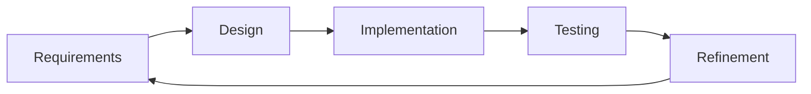
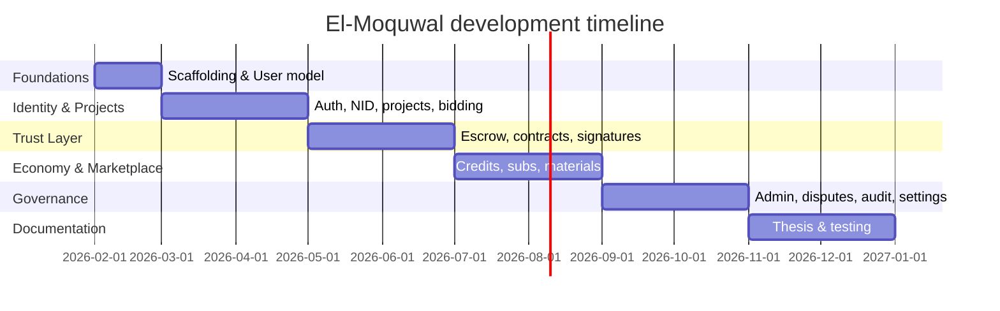
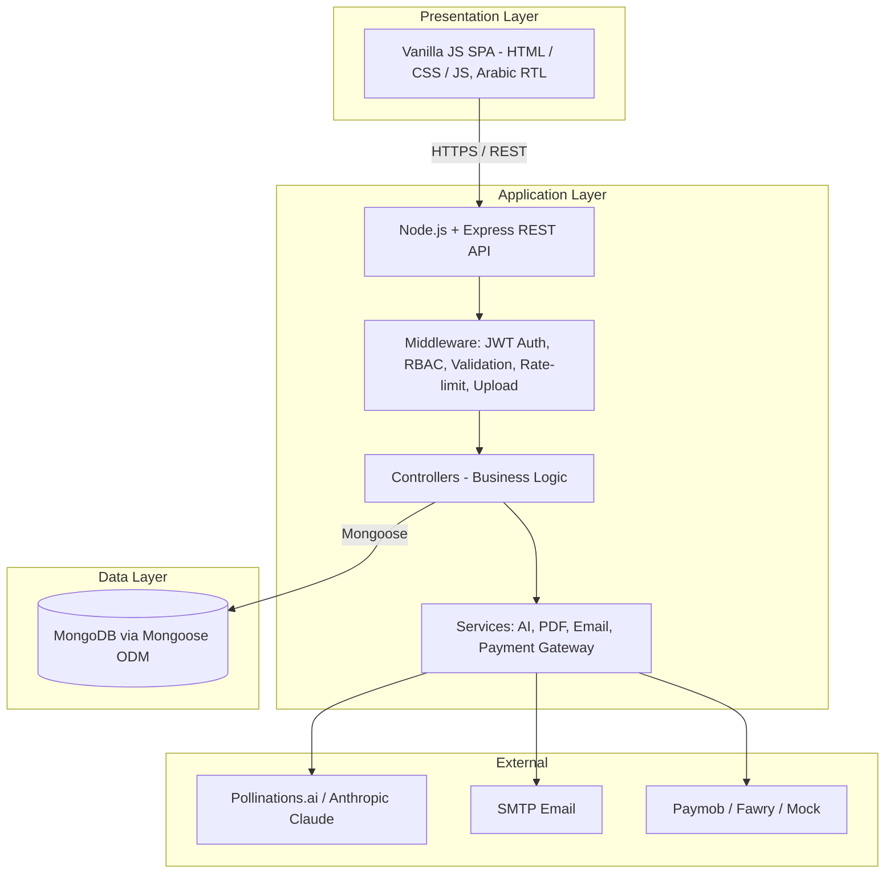
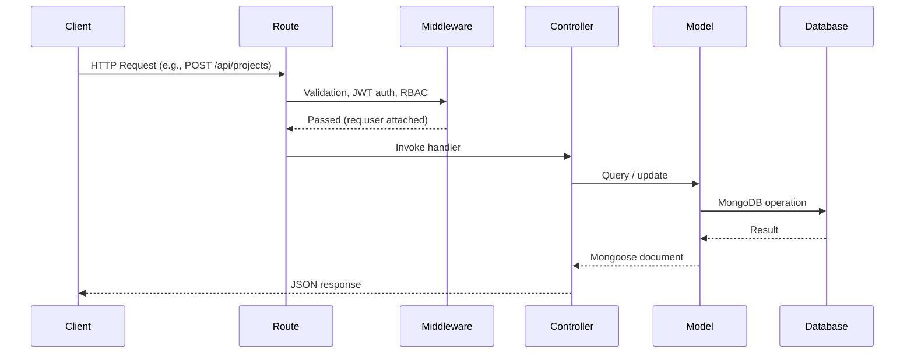
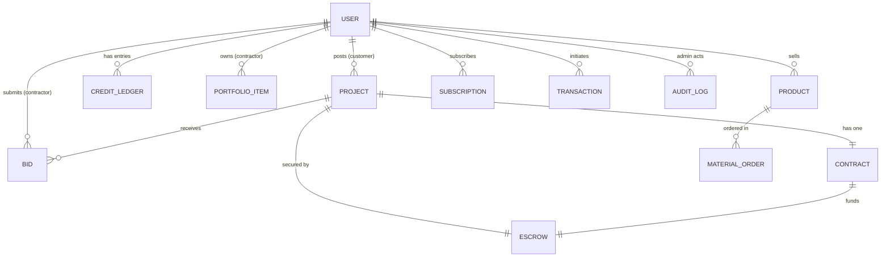
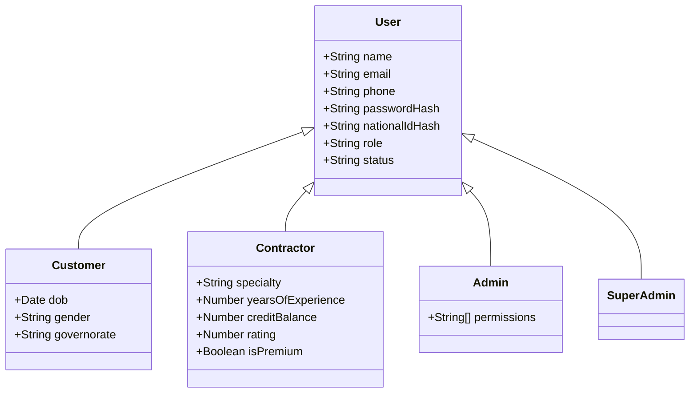
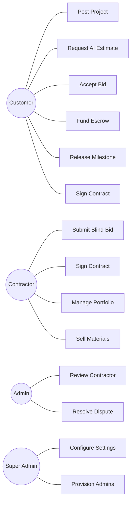
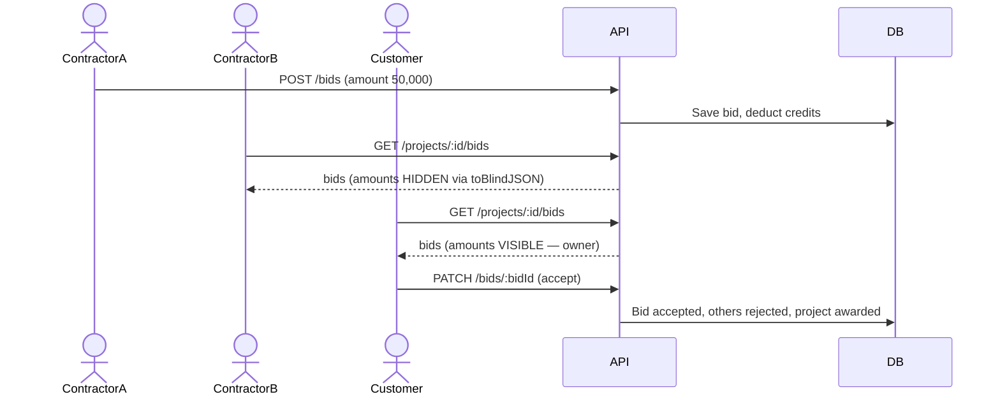
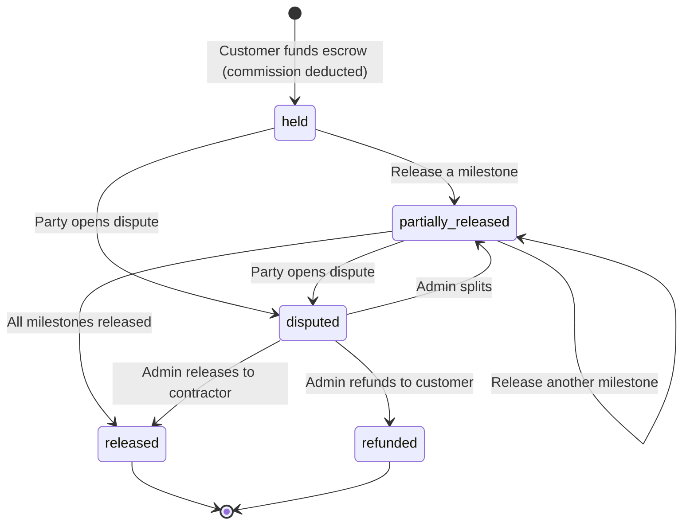

Faculty of Commerce

Business Information Systems Department (BIS)

Assiut University  |  2026 – 2027

Graduation Project Documentation

# El-Moquwal (المقاول)

### A Digital Marketplace for Construction and Finishing Services in Egypt

*An escrow-protected, AI-assisted platform that unifies project discovery, blind competitive bidding, electronic contracting, and milestone payments for the Egyptian contracting sector.*

---

**Prepared By**

| Name | Name |
| --- | --- |
| _______________________ | _______________________ |
| _______________________ | _______________________ |
| _______________________ | _______________________ |

**Academic Supervisors**

Dr. Ebram Kamal William

Dr. Doaa Ebrahim Hasaballah

*Submitted in partial fulfilment of the requirements for the award of the Bachelor of Business Information Systems degree.*

\newpage

## Supervisor Certificate

This is to certify that the graduation project titled **"El-Moquwal — A Digital Marketplace for Construction and Finishing Services in Egypt"** is a bonafide record of work carried out under our supervision and guidance. It is approved as a genuine account of the candidates' research, design, and development efforts, submitted in partial fulfilment of the requirements for the award of the **Bachelor of Business Information Systems** degree.

| Supervisor | Signature | Date |
| --- | --- | --- |
| Dr. Ebram Kamal William | _________________ | ___ / ___ / 2027 |
| Dr. Doaa Ebrahim Hasaballah | _________________ | ___ / ___ / 2027 |

\newpage

## Declaration

We hereby declare that this graduation project, **El-Moquwal**, and the documentation accompanying it are the result of our own work, except where explicit reference is made to the work of others. The system described herein — its backend services, data models, frontend interfaces, and supporting algorithms — was designed and implemented by the project team. All external sources, statistics, and third-party libraries are acknowledged in the body of the document and in the references. This work has not been submitted, in whole or in part, for any other degree or qualification.

\newpage

## Acknowledgments

We express our sincere gratitude to our academic supervisors, **Dr. Ebram Kamal William** and **Dr. Doaa Ebrahim Hasaballah**, for their continuous guidance, constructive feedback, and patience throughout every phase of this project — from feasibility analysis and system design through implementation, testing, and documentation.

We thank the Faculty of Commerce and the Business Information Systems Department at Assiut University for providing the academic framework, resources, and mentorship that made this work possible.

We also acknowledge the contractors, property owners, and industry professionals who participated in informal interviews and usability feedback sessions, whose real-world insights shaped the platform's blind-bidding, escrow, and contract-signing workflows.

Finally, we thank our families and colleagues for their encouragement during the long development cycles required to deliver a production-grade, full-stack system with an Arabic-first user experience, AI integration, and legally structured electronic contracts.

\newpage

## Abstract

**El-Moquwal** (المقاول) is a web-based digital marketplace designed to formalise the historically informal relationship between Egyptian property owners and construction and finishing contractors. The platform unifies the entire contracting journey within a single Arabic-first interface: project discovery, AI-assisted cost estimation, blind competitive bidding, escrow-protected milestone payments, Arabic right-to-left electronic contracts with dual digital signatures, contractor portfolio management, a building-materials marketplace, a referral economy, and granular administrative governance.

The system is built on a **Node.js / Express / MongoDB** backend with a **Vanilla JavaScript single-page-application** frontend. It implements **JWT authentication with HTTP-only refresh cookies**, **Argon2id hashing of passwords and National IDs**, a **Mongoose discriminator-based user hierarchy** spanning four roles, **Puppeteer-based PDF contract generation**, and **dual-provider LLM integration** (Pollinations.ai primary, Anthropic Claude fallback, with a deterministic offline fallback). A four-tier **Role-Based Access Control** matrix governs Customers, Contractors, Admins, and Super Admins, with seven granular administrative permissions.

This documentation presents the complete software-engineering lifecycle: a software proposal, a structured software analysis (problem analysis, scope, stakeholder analysis, related work, feasibility study, business model, requirements elicitation, and project management), the system design, a formal Software Requirements Specification, the implementation and testing methodology, a conclusion with future work, a complete API reference, and supporting appendices.

**Keywords:** Construction marketplace; Escrow; Blind bidding; Egypt PropTech; Electronic contracts; National-ID verification; BIS graduation project.

\newpage

## Table of Contents

- [Chapter 1: Software Proposal](#chapter-1-software-proposal)
  - [1.1 Introduction](#11-introduction)
  - [1.2 Aim of the Project](#12-aim-of-the-project)
  - [1.3 Methodology](#13-methodology)
    - [1.3.1 Iterative, Incremental Development](#131-iterative-incremental-development)
    - [1.3.2 Technology Stack](#132-technology-stack)
    - [1.3.3 Development Process](#133-development-process)
  - [1.4 Significance of the Work](#14-significance-of-the-work)
  - [1.5 Organisation of the Thesis](#15-organisation-of-the-thesis)
- [Chapter 2: Software Analysis](#chapter-2-software-analysis)
  - [2.1 Introduction](#21-introduction)
  - [2.2 Problem Analysis and Motivation](#22-problem-analysis-and-motivation)
    - [2.2.1 Challenges Faced by Property Owners](#221-challenges-faced-by-property-owners)
    - [2.2.2 Challenges Faced by Contractors and Engineers](#222-challenges-faced-by-contractors-and-engineers)
    - [2.2.3 Sector-Wide Informality and Fragmentation](#223-sector-wide-informality-and-fragmentation)
  - [2.3 Proposed Solution](#23-proposed-solution)
  - [2.4 Scope of the Project](#24-scope-of-the-project)
    - [2.4.1 Included Features](#241-included-features)
    - [2.4.2 Excluded Features](#242-excluded-features)
  - [2.5 Stakeholder Analysis](#25-stakeholder-analysis)
    - [2.5.1 Primary Stakeholders](#251-primary-stakeholders)
    - [2.5.2 Secondary Stakeholders](#252-secondary-stakeholders)
    - [2.5.3 Internal Stakeholders](#253-internal-stakeholders)
    - [2.5.4 Stakeholder Influence–Interest Analysis](#254-stakeholder-influenceinterest-analysis)
  - [2.6 Related Work](#26-related-work)
    - [2.6.1 Evolution of Digital Service Marketplaces](#261-evolution-of-digital-service-marketplaces)
    - [2.6.2 Comparative Analysis of Existing Solutions](#262-comparative-analysis-of-existing-solutions)
    - [2.6.3 Competitive Positioning](#263-competitive-positioning)
  - [2.7 SWOT Analysis](#27-swot-analysis)
  - [2.8 Feasibility Study](#28-feasibility-study)
    - [2.8.1 Legal and Environmental Feasibility](#281-legal-and-environmental-feasibility)
    - [2.8.2 Market Feasibility](#282-market-feasibility)
    - [2.8.3 Demand Analysis](#283-demand-analysis)
    - [2.8.4 Technical Feasibility](#284-technical-feasibility)
    - [2.8.5 Financial Feasibility](#285-financial-feasibility)
  - [2.9 Marketing Strategy and Go-to-Market](#29-marketing-strategy-and-go-to-market)
    - [2.9.1 STP — Segmentation, Targeting, Positioning](#291-stp--segmentation-targeting-positioning)
    - [2.9.2 Marketing Mix — The 7Ps](#292-marketing-mix--the-7ps)
    - [2.9.3 Pricing Strategy](#293-pricing-strategy)
    - [2.9.4 Go-to-Market Phases](#294-go-to-market-phases)
    - [2.9.5 Marketing Campaign Plan & ROMI](#295-marketing-campaign-plan--romi)
    - [2.9.6 Key Performance Indicators (KPIs)](#296-key-performance-indicators-kpis)
  - [2.10 Business Model](#210-business-model)
    - [2.10.1 Revenue Streams](#2101-revenue-streams)
    - [2.10.2 Value Proposition](#2102-value-proposition)
    - [2.10.3 Business Model Canvas](#2103-business-model-canvas)
  - [2.11 Requirements Elicitation](#211-requirements-elicitation)
  - [2.12 Project Management](#212-project-management)
    - [2.12.1 Team and Responsibilities](#2121-team-and-responsibilities)
    - [2.12.2 Timeline](#2122-timeline)
    - [2.12.3 Risk Management](#2123-risk-management)
  - [2.13 Chapter Summary](#213-chapter-summary)
  - [References](#references)
- [Chapter 3: System Design](#chapter-3-system-design)
  - [3.1 Introduction](#31-introduction)
  - [3.2 System Architecture](#32-system-architecture)
    - [3.2.1 High-Level Architecture Overview](#321-high-level-architecture-overview)
    - [3.2.2 Client-Side Architecture](#322-client-side-architecture)
    - [3.2.3 Backend Architecture](#323-backend-architecture)
    - [3.2.4 Database Architecture](#324-database-architecture)
    - [3.2.5 External Services Integration](#325-external-services-integration)
  - [3.3 Database Design](#33-database-design)
    - [3.3.1 Entity-Relationship Overview](#331-entity-relationship-overview)
    - [3.3.2 Discriminator Pattern: User Hierarchy](#332-discriminator-pattern-user-hierarchy)
    - [3.3.3 Mongoose Models and Collections](#333-mongoose-models-and-collections)
    - [3.3.4 Data Dictionary](#334-data-dictionary)
  - [3.4 Module Design](#34-module-design)
    - [3.4.1 Authentication & Authorization Module](#341-authentication--authorization-module)
    - [3.4.2 National-ID Parsing Module](#342-national-id-parsing-module)
    - [3.4.3 Projects & Blind-Bidding Module](#343-projects--blind-bidding-module)
    - [3.4.4 Escrow & Milestone-Payments Module](#344-escrow--milestone-payments-module)
    - [3.4.5 Electronic Contracts & Digital Signatures Module](#345-electronic-contracts--digital-signatures-module)
    - [3.4.6 AI Price-Estimation Module](#346-ai-price-estimation-module)
    - [3.4.7 Marketplace, Portfolio, Economy & Admin Modules](#347-marketplace-portfolio-economy--admin-modules)
  - [3.5 UML Diagrams](#35-uml-diagrams)
    - [3.5.1 Use-Case Diagram](#351-use-case-diagram)
    - [3.5.2 Sequence Diagram: Blind-Bidding Flow](#352-sequence-diagram-blind-bidding-flow)
    - [3.5.3 Activity Diagram: Escrow Milestone Lifecycle](#353-activity-diagram-escrow-milestone-lifecycle)
  - [3.6 User-Interface Design](#36-user-interface-design)
  - [3.7 Security Design](#37-security-design)
    - [3.7.1 JWT Authentication Lifecycle](#371-jwt-authentication-lifecycle)
    - [3.7.2 Role-Based Access Control (RBAC)](#372-role-based-access-control-rbac)
    - [3.7.3 Blind-Bidding Enforcement](#373-blind-bidding-enforcement)
    - [3.7.4 Data Protection](#374-data-protection)
  - [3.8 Chapter Summary](#38-chapter-summary)
- [Chapter 4: Software Requirements Specification (SRS)](#chapter-4-software-requirements-specification-srs)
  - [4.1 Introduction](#41-introduction)
    - [4.1.1 Purpose](#411-purpose)
    - [4.1.2 Scope](#412-scope)
    - [4.1.3 Definitions, Acronyms, and Abbreviations](#413-definitions-acronyms-and-abbreviations)
    - [4.1.4 Overview](#414-overview)
  - [4.2 Overall Description](#42-overall-description)
    - [4.2.1 Product Perspective](#421-product-perspective)
    - [4.2.2 Product Functions](#422-product-functions)
    - [4.2.3 User Classes and Characteristics](#423-user-classes-and-characteristics)
    - [4.2.4 Operating Environment](#424-operating-environment)
    - [4.2.5 Design and Implementation Constraints](#425-design-and-implementation-constraints)
    - [4.2.6 Assumptions and Dependencies](#426-assumptions-and-dependencies)
  - [4.3 Functional Requirements](#43-functional-requirements)
    - [4.3.1 Authentication Module](#431-authentication-module)
    - [4.3.2 Project Management Module](#432-project-management-module)
    - [4.3.3 Blind-Bidding Module](#433-blind-bidding-module)
    - [4.3.4 Credit-Economy Module](#434-credit-economy-module)
    - [4.3.5 Escrow & Milestone-Payment Module](#435-escrow--milestone-payment-module)
    - [4.3.6 Electronic-Contracts Module](#436-electronic-contracts-module)
    - [4.3.7 Marketplace, Portfolio & Subscription Modules](#437-marketplace-portfolio--subscription-modules)
    - [4.3.8 Administration Module](#438-administration-module)
  - [4.4 External Interface Requirements](#44-external-interface-requirements)
    - [4.4.1 User Interfaces](#441-user-interfaces)
    - [4.4.2 Software Interfaces](#442-software-interfaces)
    - [4.4.3 Communication Interfaces](#443-communication-interfaces)
  - [4.5 Non-Functional Requirements](#45-non-functional-requirements)
    - [4.5.1 Performance](#451-performance)
    - [4.5.2 Reliability](#452-reliability)
    - [4.5.3 Scalability](#453-scalability)
    - [4.5.4 Security](#454-security)
    - [4.5.5 Availability & Maintainability](#455-availability--maintainability)
    - [4.5.6 Usability](#456-usability)
  - [4.6 Requirements Traceability Matrix](#46-requirements-traceability-matrix)
  - [4.7 Chapter Summary](#47-chapter-summary)
- [Chapter 5: Implementation and Testing](#chapter-5-implementation-and-testing)
  - [5.1 Introduction](#51-introduction)
  - [5.2 Development Environment](#52-development-environment)
    - [5.2.1 Hardware and Software](#521-hardware-and-software)
    - [5.2.2 Project Structure](#522-project-structure)
    - [5.2.3 Environment Configuration](#523-environment-configuration)
  - [5.3 Technology Stack](#53-technology-stack)
    - [5.3.1 Node.js and Express.js](#531-nodejs-and-expressjs)
    - [5.3.2 MongoDB and Mongoose](#532-mongodb-and-mongoose)
    - [5.3.3 Argon2id Password Security](#533-argon2id-password-security)
  - [5.4 Key Algorithm Implementations](#54-key-algorithm-implementations)
    - [5.4.1 Egyptian National-ID Parser](#541-egyptian-national-id-parser)
    - [5.4.2 Atomic Credit Deduction on Bid](#542-atomic-credit-deduction-on-bid)
    - [5.4.3 PDF Contract Generation](#543-pdf-contract-generation)
    - [5.4.4 AI Price-Estimation Service](#544-ai-price-estimation-service)
    - [5.4.5 JWT Middleware and RBAC](#545-jwt-middleware-and-rbac)
  - [5.5 Testing Strategy](#55-testing-strategy)
  - [5.6 Unit Testing](#56-unit-testing)
    - [5.6.1 National-ID Parser](#561-national-id-parser)
    - [5.6.2 JSON Response Parser (parseJsonResponse)](#562-json-response-parser-parsejsonresponse)
    - [5.6.3 Bid Credit Cost (getBidCreditCost)](#563-bid-credit-cost-getbidcreditcost)
  - [5.7 Integration Testing](#57-integration-testing)
    - [5.7.1 Authentication Endpoints](#571-authentication-endpoints)
    - [5.7.2 Project & Bidding Endpoints](#572-project--bidding-endpoints)
  - [5.8 System Testing](#58-system-testing)
    - [Scenario 1 — Complete Project Lifecycle](#scenario-1--complete-project-lifecycle)
    - [Scenario 2 — Contractor Onboarding](#scenario-2--contractor-onboarding)
  - [5.9 Security Testing](#59-security-testing)
    - [5.9.1 RBAC Boundary Testing](#591-rbac-boundary-testing)
    - [5.9.2 Brute-Force / Lockout](#592-brute-force--lockout)
  - [5.10 Chapter Summary](#510-chapter-summary)
- [Chapter 6: Conclusion and Future Work](#chapter-6-conclusion-and-future-work)
  - [6.1 Introduction](#61-introduction)
  - [6.2 Project Summary](#62-project-summary)
  - [6.3 Objectives Achievement](#63-objectives-achievement)
  - [6.4 Key Contributions](#64-key-contributions)
  - [6.5 Challenges and Limitations](#65-challenges-and-limitations)
  - [6.6 Future Work and Recommendations](#66-future-work-and-recommendations)
  - [6.7 Lessons Learned](#67-lessons-learned)
  - [6.8 Final Remarks](#68-final-remarks)
- [Appendix A: API Reference](#appendix-a-api-reference)
  - [A.1 Introduction](#a1-introduction)
  - [Auth](#auth)
    - [POST /api/auth/guest](#post-apiauthguest)
    - [POST /api/auth/register/customer](#post-apiauthregistercustomer)
    - [POST /api/auth/register/contractor](#post-apiauthregistercontractor)
    - [POST /api/auth/login](#post-apiauthlogin)
    - [POST /api/auth/admin/login](#post-apiauthadminlogin)
    - [POST /api/auth/refresh](#post-apiauthrefresh)
    - [POST /api/auth/logout](#post-apiauthlogout)
    - [GET /api/auth/me](#get-apiauthme)
    - [GET /api/auth/credit-ledger](#get-apiauthcredit-ledger)
    - [POST /api/auth/send-otp](#post-apiauthsend-otp)
    - [POST /api/auth/verify-otp](#post-apiauthverify-otp)
    - [POST /api/auth/forgot-password](#post-apiauthforgot-password)
    - [POST /api/auth/reset-password](#post-apiauthreset-password)
  - [Projects](#projects)
    - [POST /api/projects](#post-apiprojects)
    - [GET /api/projects](#get-apiprojects)
    - [GET /api/projects/:id](#get-apiprojectsid)
    - [PATCH /api/projects/:id](#patch-apiprojectsid)
    - [DELETE /api/projects/:id](#delete-apiprojectsid)
    - [POST /api/projects/:id/publish](#post-apiprojectsidpublish)
    - [POST /api/projects/:id/close](#post-apiprojectsidclose)
    - [POST /api/projects/:id/ai-estimate](#post-apiprojectsidai-estimate)
  - [Bids (Blind Bidding System)](#bids-blind-bidding-system)
    - [POST /api/projects/:id/bids](#post-apiprojectsidbids)
    - [GET /api/projects/:id/bids](#get-apiprojectsidbids)
    - [PATCH /api/projects/:id/bids/:bidId](#patch-apiprojectsidbidsbidid)
  - [Billing & Payments](#billing--payments)
    - [POST /api/payments/purchase-credits](#post-apipaymentspurchase-credits)
    - [GET /api/billing/ledger](#get-apibillingledger)
    - [GET /api/payments/escrow/:projectId](#get-apipaymentsescrowprojectid)
    - [POST /api/billing/feature-project](#post-apibillingfeature-project)
    - [POST /api/payments/deposit-escrow](#post-apipaymentsdeposit-escrow)
    - [POST /api/payments/:projectId/release-milestone](#post-apipaymentsprojectidrelease-milestone)
    - [POST /api/payments/:projectId/dispute](#post-apipaymentsprojectiddispute)
    - [POST /api/payments/:projectId/resolve-dispute](#post-apipaymentsprojectidresolve-dispute)
    - [POST /api/payments/webhook/paymob](#post-apipaymentswebhookpaymob)
  - [Contracts (Electronic Signatures)](#contracts-electronic-signatures)
    - [POST /api/contracts/generate](#post-apicontractsgenerate)
    - [POST /api/contracts/:id/sign](#post-apicontractsidsign)
    - [GET /api/contracts/:id](#get-apicontractsid)
    - [GET /api/contracts/project/:projectId](#get-apicontractsprojectprojectid)
    - [GET /api/contracts/:id/pdf](#get-apicontractsidpdf)
    - [POST /api/contracts/:id/claim](#post-apicontractsidclaim)
    - [POST /api/contracts/:id/resolve](#post-apicontractsidresolve)
  - [Material Marketplace](#material-marketplace)
    - [GET /api/materials](#get-apimaterials)
    - [GET /api/materials/:id](#get-apimaterialsid)
    - [POST /api/materials](#post-apimaterials)
    - [PATCH /api/materials/:id](#patch-apimaterialsid)
    - [DELETE /api/materials/:id](#delete-apimaterialsid)
    - [POST /api/materials/:id/order](#post-apimaterialsidorder)
    - [PATCH /api/materials/orders/:orderId](#patch-apimaterialsordersorderid)
    - [GET /api/materials/orders/mine](#get-apimaterialsordersmine)
  - [Portfolios](#portfolios)
    - [GET /api/portfolio/:contractorId](#get-apiportfoliocontractorid)
    - [POST /api/portfolio](#post-apiportfolio)
    - [DELETE /api/portfolio/:id](#delete-apiportfolioid)
  - [Referrals](#referrals)
    - [GET /api/referral/code](#get-apireferralcode)
    - [POST /api/referral/apply](#post-apireferralapply)
  - [Subscriptions](#subscriptions)
    - [POST /api/subscriptions/subscribe](#post-apisubscriptionssubscribe)
    - [DELETE /api/subscriptions](#delete-apisubscriptions)
    - [GET /api/subscriptions/me](#get-apisubscriptionsme)
  - [Admin](#admin)
    - [GET /api/admin/contractors/pending](#get-apiadmincontractorspending)
    - [POST /api/admin/contractors/:id/approve](#post-apiadmincontractorsidapprove)
    - [POST /api/admin/contractors/:id/reject](#post-apiadmincontractorsidreject)
    - [GET /api/admin/disputes](#get-apiadmindisputes)
    - [GET /api/admin/settings](#get-apiadminsettings)
    - [PATCH /api/admin/settings](#patch-apiadminsettings)
    - [POST /api/admin/create-reviewer](#post-apiadmincreate-reviewer)
  - [AI Agent](#ai-agent)
    - [POST /api/ai/project-brief](#post-apiaiproject-brief)
    - [POST /api/ai/bid-draft](#post-apiaibid-draft)
    - [POST /api/ai/compare-bids](#post-apiaicompare-bids)
    - [POST /api/ai/detect-anomalies](#post-apiaidetect-anomalies)
    - [POST /api/ai/chat](#post-apiaichat)
    - [POST /api/ai/policy-chat](#post-apiaipolicy-chat)
    - [POST /api/ai/estimate-project](#post-apiaiestimate-project)
  - [Health Check](#health-check)
    - [GET /api/health](#get-apihealth)
  - [Error Format](#error-format)
    - [Common Error Codes:](#common-error-codes)
- [Appendix B: User Interface Gallery](#appendix-b-user-interface-gallery)
  - [B.1 Customer Interface](#b1-customer-interface)
  - [B.2 Contractor Interface](#b2-contractor-interface)
  - [B.3 Administration Interface](#b3-administration-interface)

\newpage

## List of Figures

| Figure | Title |
| --- | --- |
| Figure 1.1 | Iterative development methodology of El-Moquwal |
| Figure 2.1 | AI-assisted cost estimation while posting a project (UI) |
| Figure 2.2 | Blind bid comparison with AI compare and anomaly detection (UI) |
| Figure 2.3 | Escrow with milestone-based release (UI) |
| Figure 3.1 | High-level three-tier system architecture |
| Figure 3.2 | Backend request lifecycle (route → middleware → controller → model) |
| Figure 3.3 | Entity-Relationship overview of the core domain |
| Figure 3.4 | User discriminator hierarchy (class diagram) |
| Figure 3.5 | Use-case diagram |
| Figure 3.6 | Sequence diagram — blind bidding flow |
| Figure 3.7 | Activity diagram — escrow milestone lifecycle |
| Figure 3.8 | Customer dashboard (UI) |
| Figure 3.9 | Project-posting wizard — project type (UI) |
| Figure 3.10 | Property details with GPS capture (UI) |
| Figure 3.11 | Contractor dashboard (UI) |
| Figure 3.12 | Super-admin platform settings (UI) |
| Figure 3.13 | Administrator dashboard (UI) |

\newpage

## List of Tables

| Table | Title |
| --- | --- |
| Table 2.1 | Stakeholder influence–interest analysis |
| Table 2.2 | Comparative analysis of existing solutions |
| Table 2.3 | Competitive SWOT analysis |
| Table 2.4 | Market sizing — TAM / SAM / SOM |
| Table 2.5 | Bottom-up serviceable-demand funnel |
| Table 2.6 | Structural competitive analysis (Porter's Five Forces) |
| Table 2.7 | Key financial assumptions and their basis |
| Table 2.8 | One-time capital requirement and use of funds |
| Table 2.9 | Three-year financial projection (EGP) |
| Table 2.10 | Ten-year cash-flow projection (EGP) |
| Table 2.11 | Key financial-performance indicators |
| Table 2.12 | Unit economics of an average relationship |
| Table 2.13 | Market segmentation |
| Table 2.14 | Marketing mix — the 7Ps |
| Table 2.15 | Pricing tiers |
| Table 2.16 | Phase-1 marketing campaign plan |
| Table 2.17 | Key performance indicators (KPIs) |
| Table 2.18 | Business Model Canvas |
| Table 2.19 | Project risk register |
| Table 3.1 | Mongoose models and physical collections |
| Table 4.1 | Requirements traceability matrix |

\newpage

## List of Abbreviations

| Abbreviation | Meaning |
| --- | --- |
| API | Application Programming Interface |
| BIS | Business Information Systems |
| BMC | Business Model Canvas |
| CRUD | Create, Read, Update, Delete |
| EGP | Egyptian Pound |
| ER | Entity-Relationship |
| JWT | JSON Web Token |
| KYC | Know Your Customer |
| LLM | Large Language Model |
| NID | National Identification Number (14-digit Egyptian) |
| ODM | Object Data Modeling |
| OTP | One-Time Password |
| PDF | Portable Document Format |
| RAG | Retrieval-Augmented Generation |
| RBAC | Role-Based Access Control |
| REST | Representational State Transfer |
| RTL | Right-to-Left (Arabic text direction) |
| SPA | Single-Page Application |
| SRS | Software Requirements Specification |
| TLS | Transport Layer Security |
| TTL | Time To Live |

\newpage

---

# Chapter 1: Software Proposal

## 1.1 Introduction

The construction and finishing sector is the single largest contributor to Egypt's Gross Domestic Product, accounting for roughly 14% of national economic output. With a national requirement of approximately 450,000 new housing units each year — and a vast existing housing stock that generates continuous renovation and fit-out demand — the downstream market for finishing, renovation, and small-to-medium contracting work is immense and continuously replenished.

Despite the scale and economic significance of this sector, the experience of hiring a contractor in Egypt remains overwhelmingly informal, fragmented, and trust-deficient. Property owners typically rely on personal referrals, social-media groups, or chance encounters to find professionals — channels that provide no payment protection, no verified credentials, no enforceable written agreement, and no accountability once work begins. On the supply side, engineers and contractors struggle to find qualified work through formal channels and frequently face late or disputed payment.

At the same time, the digital enablers required for a platform-based intervention are firmly in place. At the start of 2025 Egypt had approximately 96 million internet users (an internet-penetration rate near 82%), roughly 116 million active mobile connections, and a mobile-payments market valued at over USD 14 billion. The customer can be reached digitally, and money can move safely online — yet the contracting and finishing niche remains largely untouched by the kind of end-to-end digital marketplace model that has transformed ride-hailing, food delivery, freelance work, and short-term rentals globally.

**El-Moquwal** (المقاول) is the platform designed to capture this gap. It is a web-based, mobile-responsive marketplace that organises the entire contracting journey — discovery, AI-assisted estimation, competitive blind bidding, electronic contracting, escrow-protected payment, execution tracking, and post-project rating — within a single, Arabic-first interface. El-Moquwal does not perform construction itself; it acts as a neutral, transparent intermediary that reduces the friction, risk, and information asymmetry of the traditional contracting experience.

This chapter presents the project proposal: the aim of the work, the methodology and technology stack used to deliver it, the significance of the contribution, and the organisation of the remainder of this document.

## 1.2 Aim of the Project

The aim of this project is to design and implement a secure, full-stack digital marketplace that formalises home finishing, renovation, and small-to-medium contracting in Egypt by unifying the contracting lifecycle in one accountable system. The project pursues the following specific objectives:

1. **A unified, Arabic-first marketplace** that organises the entire contracting journey — from project discovery and cost estimation through bidding, contracting, payment protection, execution tracking, and post-project rating — within a single interface.

2. **An AI-assisted price-estimation system** that gives customers an indicative cost range before they commit to hiring, reducing information asymmetry and setting realistic expectations.

3. **A blind-bidding mechanism** that ensures fair market competition by preventing contractors from seeing each other's proposed amounts, so each professional submits a genuine best offer.

4. **An escrow-based milestone-payment system** that protects both parties: customers' funds are held securely and released only as work phases are approved, while contractors are guaranteed payment for delivered milestones.

5. **Automated, legally structured electronic contracts** with dual digital signatures, aligned with Egyptian civil law, generated for every awarded project.

6. **A robust identity-verification and KYC workflow** built on Egyptian National-ID parsing and document review, ensuring that only vetted professionals can operate on the platform.

7. **A four-tier Role-Based Access Control system** — Customer, Contractor, Admin, and Super Admin — with granular permissions that ensure operational security and governance.

8. **Supplementary platform features** including a building-materials marketplace, professional portfolios, a credit-based bidding economy, premium subscriptions, a referral programme, and an administrative dispute-resolution framework.

## 1.3 Methodology

### 1.3.1 Iterative, Incremental Development

The platform was developed using an iterative, incremental approach inspired by Agile principles. Rather than attempting a single monolithic delivery, the system was built feature-by-feature in short cycles, each producing a working, testable increment. Every cycle followed the same loop: a short requirements pass, design, implementation, testing against the running API, and refinement based on the result.

The work proceeded through five logical levels of increasing capability:

- **Level 0 — Foundations:** project scaffolding, environment validation, database connection, and the User model with discriminators.
- **Level 1 — Identity and projects:** authentication, National-ID parsing, OTP verification, project creation, and the blind-bidding engine.
- **Level 1.5 — Trust layer:** escrow with milestone release, dispute handling, electronic contracts, and digital signatures.
- **Level 2 — Economy and marketplace:** the credit-based bidding economy, premium subscriptions, the materials marketplace, portfolios, and referrals.
- **Level 3 — Governance:** the administrative dashboard, contractor vetting, dispute resolution, audit logging, and configurable platform settings.

This layering kept each increment shippable and testable, and allowed trust-critical features (escrow, contracts, RBAC) to be hardened before the economy and governance layers were built on top of them.



*Figure 1.1: Iterative development methodology of El-Moquwal.*

### 1.3.2 Technology Stack

The technology stack was chosen to favour rapid iteration, a single shared language across the stack, and a flexible data model suited to the varied shapes of construction-project data.

**Frontend technologies.** A Vanilla JavaScript single-page application using standards-based HTML5 and CSS3, with an Arabic-first, right-to-left layout. No heavy framework is used, which keeps initial load times low and the codebase transparent. Client-side routing is handled with the History API, and authentication state is held in `localStorage` (access token) while the refresh token is kept in an HTTP-only cookie.

**Backend technologies.** Node.js with the Express.js framework exposes a documented REST API. Security middleware includes `helmet` (security headers), `cors`, and `express-rate-limit`. Passwords and National IDs are hashed with **Argon2id**; authentication uses **JWT** access and refresh tokens; environment variables are validated at boot with **Zod**.

**Database technologies.** MongoDB is the primary data store, accessed through the Mongoose ODM. A discriminator pattern stores the four user roles in a single `users` collection while enforcing role-specific schemas.

**Artificial intelligence and external services.** AI price estimation and assistant features call hosted LLMs — Pollinations.ai as the primary endpoint and Anthropic Claude as a fallback — with a deterministic offline fallback when neither is available. PDF contracts are rendered with **Puppeteer** (headless Chrome). Transactional email/OTP is sent over SMTP (Nodemailer). Payment and escrow are designed for licensed Egyptian gateways (Paymob, Fawry), abstracted behind a gateway interface that currently defaults to a mock processor.

**Development and collaboration tools.** Git for version control, Visual Studio Code as the primary IDE, Postman for API testing, and Jest for unit testing.

### 1.3.3 Development Process

Each feature passed through a consistent pipeline. Requirements were captured as short functional statements; data models were defined in Mongoose with validation and indexes; controllers implemented the business rules behind RBAC middleware; endpoints were verified with Postman collections and Jest unit tests for pure logic (National-ID parsing, JSON extraction); and the frontend was wired to the verified API. Trust-critical paths — authentication, escrow, blind-bidding enforcement, and signature capture — received additional security-boundary testing before being considered complete.

## 1.4 Significance of the Work

This project carries significance on three complementary levels.

**Academic significance.** The project demonstrates the practical application of core Business Information Systems concepts — database design, REST API architecture, role-based security, AI integration, and financial modelling — to a real-world market problem in the Egyptian context. It integrates the breadth of the BIS discipline into a single, working system rather than an isolated prototype.

**Industry significance.** El-Moquwal addresses a genuine, large-scale market gap. By attaching digital contracts, payment protection, and verified identities to an overwhelmingly informal sector, the platform contributes to sector documentation and formalisation — aligning with Egypt's national digital-transformation and financial-inclusion agendas.

**Technical significance.** The system showcases several non-trivial engineering decisions: a MongoDB discriminator pattern for a polymorphic user hierarchy, Puppeteer-based Arabic RTL PDF generation, dual-provider AI integration with graceful fallback, and a multi-layered security architecture combining Argon2id hashing, JWT token rotation, and granular RBAC.

## 1.5 Organisation of the Thesis

This document is organised into six chapters and a set of appendices:

| Chapter | Title | Description |
|---------|-------|-------------|
| **Chapter 1** | Software Proposal | Introduction, aim, methodology, technology stack, significance, and organisation. |
| **Chapter 2** | Software Analysis | Problem analysis, proposed solution, scope, stakeholder analysis, related work, feasibility study, business model, requirements elicitation, and project management. |
| **Chapter 3** | System Design | Architecture, database design, module design, UML diagrams, user-interface design, and security design. |
| **Chapter 4** | Software Requirements Specification | Functional and non-functional requirements, external interfaces, and a traceability matrix. |
| **Chapter 5** | Implementation and Testing | Development environment, key algorithm implementations, and the testing methodology with results. |
| **Chapter 6** | Conclusion and Future Work | Summary of achievements, limitations, and a prioritised roadmap. |

The appendices provide a complete **API reference**, a **user-interface gallery**, and supporting reference material.

---
# Chapter 2: Software Analysis

> **Faculty of Commerce — Business Information Systems (BIS) Program**
> Graduation Project — 2026 / 2027

## 2.1 Introduction

This chapter establishes the strategic and analytical foundation of the El-Moquwal platform. It begins by analysing the problem and its motivation from the perspective of every party in the contracting transaction, then states the proposed solution and the precise scope of the system. It identifies and prioritises the stakeholders, reviews related work and the competitive landscape, and presents a structured feasibility assessment across legal, environmental, market, demand, technical, and financial dimensions — including a three-tier market sizing (TAM/SAM/SOM) and a full financial model with unit economics. It then sets out the marketing strategy and go-to-market plan (STP, the 7Ps, pricing, a campaign plan with ROMI, and KPIs), the business model, the requirements-elicitation approach, and the project-management plan. Every externally sourced figure is accompanied by its source and a direct link, and every financial assumption is traced to a clear basis, so that each number can be defended on request.

## 2.2 Problem Analysis and Motivation

Property owners undertaking finishing, renovation, or construction work in Egypt, and the professionals who serve them, face a recurring set of interconnected problems. These are not merely inconveniences; they are structural market failures that erode trust, inflate costs, delay projects, and suppress demand in a sector critical to the national economy.

### 2.2.1 Challenges Faced by Property Owners

- **Pricing opacity.** Customers cannot obtain a credible cost estimate before engaging a contractor, which sustains mistrust and discourages first-time buyers from proceeding.
- **No payment protection.** No mechanism exists to hold funds safely and release them only upon verified delivery of work milestones, leaving customers exposed to non-delivery, abandonment, and substandard work.
- **Weak verification.** Provider credentials are rarely checked. The owner cannot easily tell a competent, honest professional from an unreliable one before committing money and access to their property.
- **No enforceable agreement.** Work usually proceeds on a verbal understanding. When a dispute arises, there is no written contract, no warranty framework, and no recourse beyond slow and costly civil litigation.

### 2.2.2 Challenges Faced by Contractors and Engineers

- **Unreliable lead flow.** Qualified work is found through personal networks and chance, not through a formal, predictable channel.
- **Payment risk.** Late or disputed payment is endemic. Industry research consistently ranks timely, undisputed progress payments as the single most important factor in healthy contractor relationships.
- **No portable reputation.** A professional's track record does not follow them across jobs, so good work does not compound into a credible, marketable reputation.

### 2.2.3 Sector-Wide Informality and Fragmentation

More than 70% of Egypt's construction workforce operates informally — without contracts, formal payroll, or bank accounts — which institutionalises the absence of accountability. Discovery, pricing, contracting, payment, and materials procurement are handled across disconnected channels (personal contacts, social media, cash transactions), multiplying friction, miscommunication, and disputes. Industry research repeatedly identifies cost overruns reaching around 30% on delayed Egyptian projects.

> *Sources: [Dopay — Egypt construction workforce](https://dopay.com/en/knowledge-hub/the-payroll-bottleneck-slowing-down-egypts-construction-sites/) | [ScienceDirect — disputes in Egyptian construction](https://www.sciencedirect.com/science/article/pii/S2090447922001241)*

## 2.3 Proposed Solution

El-Moquwal closes these gaps by unifying the entire contracting lifecycle in one accountable system. A customer describes a project and receives an instant, AI-assisted cost estimate before committing. Verified professionals submit competitive **blind** bids; the customer compares offers, awards the work, and both parties sign a digitally generated contract. Payment is protected through an **escrow** (الضمان) mechanism that holds funds and releases them against agreed milestones, with a defined warranty cap that shields the customer if work is not delivered. The platform also offers a building-materials marketplace, professional portfolios, ratings, a referral economy, and an administrative layer for vetting and dispute resolution.

The distinctive contribution is a combination rare in the local market: identity-verified professionals, an AI-assisted estimate that sets expectations before any commitment, a binding digital contract generated for every project, and an escrow mechanism with a warranty cap that protects both sides. The credit-based bidding model keeps lead quality high and the supply side economically engaged, while the materials marketplace and portfolio layer extend the relationship beyond a single transaction.


*Figure 2.1: The customer requests an instant AI-assisted price estimate while posting a project, reducing information asymmetry before any commitment.*


*Figure 2.2: The customer compares competing bids (amounts visible only to the project owner) with AI-assisted comparison and anomaly detection, then accepts the best offer.*


*Figure 2.3: Funds are held in escrow and released by milestone (30% / 40% / 30% of the net amount), with the 2% platform commission shown transparently.*

## 2.4 Scope of the Project

### 2.4.1 Included Features

The platform, as designed and implemented in this project, encompasses:

- **User management:** registration, JWT authentication, email-OTP verification, and Egyptian National-ID parsing for all four user roles, with document-based KYC for contractors.
- **Project lifecycle:** creation, draft/publish, bidding, awarding, execution tracking, closure, and rating of construction and finishing projects.
- **Blind-bidding engine:** credit-based bid submission with enforced information asymmetry between competing contractors.
- **Escrow system:** milestone-based fund holding, release, dispute opening, and administrative resolution with a warranty cap.
- **Electronic contracts:** automated PDF generation with Arabic RTL support, dual digital signatures (SHA-256 hashed), and warranty provisions.
- **AI integration:** price estimation via external LLMs (Pollinations.ai primary, Anthropic Claude fallback) and a policy-aware assistant.
- **Material marketplace:** B2B product listings with categories, images, stock management, and ordering.
- **Portfolio system:** contractor work showcase with before/after photography and project linkage.
- **Platform economy:** a credit ledger, premium subscriptions, featured/urgent project listings, and a referral programme.
- **Administration:** contractor vetting, dispute mediation, configurable platform settings, statistics, and audit logging.

### 2.4.2 Excluded Features

The following are explicitly excluded from the current project phase:

- Native mobile applications (iOS / Android) — the platform is web-based and mobile-responsive.
- Real-time chat or video communication between users.
- Integration with live payment gateways — Paymob and Fawry are abstracted behind a gateway interface but default to a mock processor; live processing requires formal company registration and regulatory clearance.
- Geographic expansion beyond the initial launch governorates.
- Automated legal-compliance auditing or regulatory reporting.

## 2.5 Stakeholder Analysis

### 2.5.1 Primary Stakeholders

- **Customers (property owners):** post projects, request estimates, compare bids, sign contracts, fund escrow, and rate professionals. They are the demand side and the primary source of transaction value.
- **Contractors and engineers:** complete KYC, submit credit-priced bids, sign contracts, manage portfolios, sell materials, and subscribe to premium tools. They are the supply side and the platform's core inventory.

### 2.5.2 Secondary Stakeholders

- **Material suppliers:** vendors who populate the materials marketplace, an added revenue and retention lever.
- **Payment and escrow providers:** licensed Egyptian gateways that process payments and enable fund custody.
- **Referrers:** existing users who introduce new professionals in exchange for credit bonuses.

### 2.5.3 Internal Stakeholders

- **Administrators (reviewers):** vet professionals, monitor activity, mediate disputes, and manage content under granular permissions.
- **Super administrators:** govern platform-wide economics (commission rate, warranty cap, credit and subscription pricing) and provision staff accounts.
- **The founding/development team:** designs, builds, and operates the platform.

### 2.5.4 Stakeholder Influence–Interest Analysis

| Stakeholder | Interest | Influence | Management strategy |
|-------------|----------|-----------|---------------------|
| Customers | High | Medium | Manage closely — escrow, transparency, and support drive adoption. |
| Contractors | High | High | Manage closely — supply liquidity and lead quality are existential. |
| Super administrators | High | High | Key players — control economics and governance. |
| Administrators | Medium | Medium | Keep satisfied — operational throughput and fair disputes. |
| Material suppliers | Medium | Low | Keep informed — incremental revenue and retention. |
| Payment providers | Medium | High | Keep satisfied — compliant, reliable money movement. |

*Table 2.1: Stakeholder influence–interest analysis.*

## 2.6 Related Work

### 2.6.1 Evolution of Digital Service Marketplaces

Digital service marketplaces have matured along a consistent trajectory: from simple directories that merely listed providers, to comparison engines that introduced price and rating transparency, and finally to fully integrated transaction platforms that own the entire journey — discovery, contracting, payment, and dispute resolution. The decisive shift in each generation has been the gradual transfer of trust from the individual provider to the platform itself, achieved through verified identities, escrowed payments, structured contracts, and reputation systems. In adjacent verticals — ride-hailing, food delivery, freelance work, and short-term rentals — this model has repeatedly converted large, fragmented, trust-poor offline markets into organised digital ones. Home services and contracting are among the last large categories to undergo this transition, particularly in emerging markets.

Research on digital transformation in service intermediation consistently reports three findings relevant to El-Moquwal. First, transparency of price and provider information materially increases conversion and customer confidence. Second, payment protection — escrow or staged release — is the strongest single driver of willingness to transact for high-value, infrequent services where the buyer cannot easily judge quality in advance. Third, bundling complementary services (such as materials supply alongside the core service) deepens engagement and retention.

### 2.6.2 Comparative Analysis of Existing Solutions

| Capability | Personal referrals / social media | Local listing & quotation sites | **El-Moquwal** |
|------------|-----------------------------------|---------------------------------|----------------|
| Discovery of professionals | Limited, network-bound | Yes | Yes |
| Identity verification / KYC | No | Rarely | Yes (National ID + documents) |
| Pre-commitment price estimate | No | Manual quotes | AI-assisted instant estimate |
| Competitive bidding | No | Sometimes | Yes (blind, credit-priced) |
| Binding electronic contract | No | No | Yes (dual digital signatures) |
| Payment protection (escrow) | No | No | Yes (milestone release + warranty cap) |
| Persistent reputation | No | Partial | Yes (ratings + portfolio) |
| Dispute resolution | No | No | Yes (admin-mediated) |

*Table 2.2: Comparative analysis of existing solutions.*

### 2.6.3 Competitive Positioning

El-Moquwal is positioned not as a cheaper way to find a contractor but as the **safe and accountable** way to do so. Within Egypt, earlier local efforts that connect homeowners with finishing and décor providers demonstrated genuine demand for organised matching, while remaining largely directory-and-quotation tools rather than end-to-end transactional systems. El-Moquwal's edge rests on four pillars that informal channels and existing directories cannot replicate together: escrow-protected payment with a warranty cap, identity-verified professionals with persistent reputations, an automatically generated binding contract for every project, and price transparency through AI-assisted estimation.

## 2.7 SWOT Analysis

This analysis separates factors internal to El-Moquwal (strengths and weaknesses), which the venture can control, from external market factors (opportunities and threats), which it must navigate.

| **Strengths (Internal)** | **Weaknesses (Internal)** |
|--------------------------|---------------------------|
| End-to-end model: discovery, AI estimate, bidding, digital contract, escrow, and materials in one system. | New, unproven brand competing against entrenched word-of-mouth trust. |
| Escrow + warranty cap directly neutralises the market's primary objection (trust over money). | Classic two-sided cold-start: customers and professionals must be grown in balance. |
| Verified professionals and persistent ratings build accountability competitors lack. | Dependence on professionals adopting digital workflows and online payment. |
| Diversified revenue (commission, subscription, credits, materials, featured) reduces single-stream risk. | Reliance on third-party payment and escrow rails and their fees. |
| Arabic-first, mobile-responsive interface tailored to local users. | Dispute resolution is operationally heavy and must be staffed carefully to protect the brand. |
| Working software already built in-house, lowering time-to-market and cash risk. | |

| **Opportunities (External)** | **Threats (External)** |
|-------------------------------|------------------------|
| Construction is Egypt's largest GDP sector with sustained multi-year growth. | Established offline networks and informal referrals remain the default behaviour. |
| Large annual pipeline of new and unfinished housing units requiring finishing and fit-out. | A well-funded competitor or large incumbent could enter and outspend on acquisition. |
| Near-universal mobile and internet penetration and maturing digital-payment rails. | Currency volatility and inflation affect project values, costs, and consumer confidence. |
| No dominant, escrow-backed, end-to-end incumbent in the contracting niche. | Resistance to online payment for large sums, especially among older users. |
| Government digitisation and financial-inclusion tailwinds. | Regulatory shifts in brokerage, data protection, or digital payments. |
| Natural expansion paths: more cities, developer/B2B contracts, maintenance, and embedded financing. | Reputational damage from a single high-profile dispute or fraud case. |

*Table 2.3: Competitive SWOT analysis — El-Moquwal.*

## 2.8 Feasibility Study

### 2.8.1 Legal and Environmental Feasibility

**Legal feasibility — regulatory compliance.**

- **Corporate and brokerage standing.** El-Moquwal must complete formal company registration and operate transparently as a digital intermediary that facilitates — but does not itself perform — contracting. Written agreements should govern the platform's relationship with the professionals and suppliers it lists.
- **Data protection.** The platform processes sensitive personal data, including National-ID information and payment credentials. Full compliance with Egypt's Personal Data Protection Law No. 151 of 2020 is mandatory: explicit user consent, encrypted storage and transmission, clear data-subject rights, and controlled handling of cloud hosting or cross-border transfer.
  > *Source: [Egypt — Personal Data Protection Law No. 151/2020](https://www.dataguidance.com/legal-research/law-no-151-2020-issuing-personal-data)*
- **Digital-payments and escrow compliance.** Money movement must be confined to licensed, compliant payment gateways. The escrow mechanism must be structured so that custody, release conditions, refunds, and dispute outcomes are transparent and legally sound.
- **Contracts and consumer protection.** The auto-generated project contract must contain clear, fair terms, an explicit warranty cap, defined cancellation and refund conditions, and unambiguous obligations for each party.
- **Intellectual property.** The platform relies on properly licensed or open-source components, with clear ownership of the software, brand, and platform data.

**Environmental impact.** Replacing paper estimates, hand-written contracts, and physical receipts with electronic equivalents reduces paper consumption. Remote discovery, bidding, contracting, and payment cut in-person trips, lowering fuel use and emissions. A lightweight, cloud-hosted web application consumes modest infrastructure, and transparent scoping reduces rework and material waste from poorly specified jobs.

### 2.8.2 Market Feasibility

**Market overview.** Construction is the backbone of the Egyptian economy and the single largest contributor to national GDP, at roughly 14% of output. The construction market was valued in the order of USD 55 billion in 2025, with forecast growth approaching 8% per year through 2030; residential construction is the largest segment, at close to 37% of the market.

> *Source: [Mordor Intelligence — Egypt Construction Market](https://www.mordorintelligence.com/industry-reports/egypt-construction-market)*

A persistent national housing programme — with an estimated requirement of around 450,000 new units each year — continuously feeds a vast downstream pipeline of finishing, fit-out, and renovation work, which is precisely the layer El-Moquwal serves.

> *Source: [Daily News Egypt — housing demand](https://www.dailynewsegypt.com/2024/12/25/egypt-needs-450k-housing-units-annually-to-meet-population-growth-minister/)*

**Digital readiness.** At the start of 2025 Egypt had roughly 96 million internet users, an internet-penetration rate near 82%, and about 116 million active mobile connections. The payment rails required to operate escrow at scale are equally mature: the mobile-payments market was valued at over USD 14 billion in 2024 and is growing at double-digit rates.

> *Sources: [DataReportal — Digital 2025: Egypt](https://datareportal.com/reports/digital-2025-egypt) | [Mordor Intelligence — Egypt Mobile Payments](https://www.mordorintelligence.com/industry-reports/egypt-mobile-payment-market)*

**Market sizing — TAM / SAM / SOM.** The three-tier model below narrows the opportunity from the total downstream market to El-Moquwal's realistic early capture. Because the platform earns a take-rate on the *value* of intermediated projects, the market is sized in project-value (GMV) terms, with the platform's revenue derived from it.

| Tier | Size (project value / GMV) | Definition & rationale |
|------|----------------------------|------------------------|
| **TAM** — Total Addressable Market | **≈ EGP 100+ billion / year** | The entire annual spend on finishing, renovation, fit-out, and small-to-medium contracting in Egypt. With ~450,000 new units requiring finishing (economy finishing of a 100 m² apartment ≈ EGP 190,000+) plus a far larger existing stock generating continuous renovation, the downstream layer runs into the tens of billions of pounds annually within a construction market of ≈ USD 55 billion. |
| **SAM** — Serviceable Addressable Market | **≈ EGP 5–10 billion / year** | Digitally reachable finishing/renovation projects in the launch governorates (high-density urban centres and new cities) whose owners already transact online. A few hundred thousand projects/year at a blended ≈ EGP 120,000 each. |
| **SOM** — Serviceable Obtainable Market | **≈ EGP 14M → 34M GMV (Yr 2 → Yr 3)** | Realistic early capture: ≈ 120 paid protected projects in 2028 and ≈ 280 in 2029 (the demand funnel of Table 2.5), i.e. well under 1% of SAM. Platform revenue is the take-rate on this GMV plus subscriptions and credits (Section 2.8.5). |

*Table 2.4: Three-tier market sizing — TAM / SAM / SOM.*

The strategic conclusion is that **demand is not the binding constraint**: even at maturity the platform intermediates a fraction of one per cent of the finishing work the national market generates each year. Growth is limited by execution, supply onboarding, and capital — all within the team's control — rather than by the size of the opportunity.

### 2.8.3 Demand Analysis

Rather than relying on top-down market multiples, demand is estimated from the ground up, so each step can be defended:

| Step | Figure | Basis |
|------|--------|-------|
| National new housing units delivered per year | ≈ 450,000 units | Stated national housing requirement (sourced). |
| Finishing / fit-out projects implied (new + renovation) | Hundreds of thousands per year | Most new units require finishing; the far larger existing stock generates continuous renovation demand. |
| Projects in the launch region within reach | A few thousand per year | A conservative slice of national demand concentrated in the launch governorates. |
| El-Moquwal's base-building first year (2027) | Onboarding, no paid transactions | The service is offered free in 2027 to build a critical mass of professionals and customers. |
| Paid projects once monetisation begins (2028 → 2029) | ≈ 120 → 280 projects | Well under 1% of regional demand — a small, achievable fraction. |

*Table 2.5: Bottom-up serviceable-demand funnel.*

**Competitive landscape (Porter's Five Forces).**

| Competitive Force | Assessment for El-Moquwal |
|-------------------|---------------------------|
| **Rivalry among existing players** | Low-to-moderate. A handful of local directory and matching services exist, but none combine identity verification, AI estimation, binding digital contracts, and escrow into one transactional system. |
| **Threat of new entrants** | Moderate-to-high. Software barriers are modest, but building two-sided liquidity, verified supply, and trust is slow and capital-intensive, creating a real first-mover moat. |
| **Threat of substitutes** | High today. The dominant substitute is the offline default: personal referrals and direct dealing with informal contractors. Displacing this habit is the core go-to-market challenge. |
| **Bargaining power of customers** | Moderate. Switching costs are low and price sensitivity is real, but escrow, verification, and transparent comparison deliver value informal channels cannot match. |
| **Bargaining power of suppliers (professionals)** | Moderate. Professionals are numerous and fragmented, limiting individual power; the platform must keep lead quality and economics attractive to retain the best supply. |

*Table 2.6: Structural competitive analysis (Porter's Five Forces).*

### 2.8.4 Technical Feasibility

El-Moquwal is already implemented as a working system, which materially de-risks the technical dimension. The platform is a responsive web application with a Vanilla JavaScript RTL frontend, a Node.js / Express REST API backed by MongoDB, server-side Puppeteer PDF generation, and an AI estimation layer with offline fallback. Security combines Argon2id hashing, JWT authentication with role-based access control across four tiers, HTTPS/TLS transport, server-side validation, audit logging, and explicit, auditable escrow custody states. Integration points — licensed payment/escrow gateways, SMTP email, cloud file storage, and hosted AI — are isolated behind service abstractions so that providers on each layer can be substituted without disrupting operations. The application runs on standard cloud hosting that supports Node.js and MongoDB, with automated deployment, monitoring, and regular backups. (The architecture is detailed in Chapter 3.)

### 2.8.5 Financial Feasibility

The financial plan is deliberately scaled to a student-founded, bootstrapped micro-enterprise. It is built bottom-up from the platform's actual monetisation features and a conservative ramp. All figures are in Egyptian Pounds (EGP). The first year, **2027**, is a base-building year: the platform is launched and the user base is grown while the service is offered without commission or subscription fees, so revenue begins in **2028** and grows thereafter. Because the platform was built in-house by the founding team, software development is an in-kind contribution rather than a cash cost.

**Key assumptions.**

| Assumption | Value | Basis / Source |
|------------|-------|----------------|
| Monetisation start | 2028 | 2027 is a base-building year offered free; fees begin in 2028. |
| Average project value | EGP 120,000 | Conservative blended figure, below the cost of economy-finishing a 100 m² apartment (≈ EGP 190,000+). |
| Platform commission | 2% per contract | Platform configuration (`commissionRate = 0.02`). |
| Premium subscription | EGP 199 / month | Platform configuration (`premiumPriceEGP = 199`). |
| Pay-per-bid credit pack | EGP 50 for 5 credits | Platform configuration (`creditPackPriceEGP = 50`). |
| Materials take-rate | 5% of order value | Standard marketplace take-rate assumption. |
| Paid contracts (2027 → 2029) | 0 → 120 → 280 | Base-building in 2027; gradual ramp once monetisation begins. |
| Premium professionals (2027 → 2029) | 0 → 60 → 160 | Free onboarding in 2027; subscriptions adopted gradually from 2028. |
| Company registration & legal | EGP 15,000 (one-time) | Typical cost of establishing a small company in Egypt. |

*Table 2.7: Key financial assumptions and their basis.*

> *Sources: [The Design Hub — finishing cost/m²](https://www.tdhegypt.com/ar/blog/سعر-تشطيب-المتر-في-مصر) | [GalleryEG — apartment finishing costs](https://galleryeg.com/سعر-متر-التشطيب-في-مصر-2025-شامل-المواد-والـ/)*

**Capital requirement and funding.** Because development is in-kind, the venture needs only a small cash outlay to launch in 2027:

| Item | Amount (EGP) | Use of funds |
|------|-------------:|--------------|
| Company registration & legal setup | 15,000 | Legal standing as a digital intermediary. |
| Domain & first-year hosting | 6,000 | Cloud infrastructure for launch. |
| Launch marketing | 25,000 | Phase-1 acquisition (Section 2.9.5). |
| Working-capital reserve | 24,000 | Operating buffer through the base-building year. |
| **Total cash capital required** | **70,000** | |
| Platform development (founding team) | *In-kind* | No cash cost — built in-house. |

*Table 2.8: One-time capital requirement and use of funds (2027).*

The **funding ask** is therefore modest: EGP 70,000 of seed cash (self-funded or via a small grant/competition) is sufficient to launch and reach break-even, because the largest cost in a software venture — development — is contributed in kind.

**Three-year projection.** Figures in EGP. The cash capital is a one-time outlay in 2027; all other lines are annual. The **net operating profit/(loss)** line excludes the one-time capital, while the **cumulative cash position** line includes it, so the two views reconcile.

| Item | 2027 | 2028 | 2029 |
|------|-----:|-----:|-----:|
| Commission revenue (2%) | — | 288,000 | 672,000 |
| Subscription revenue | — | 143,280 | 382,080 |
| Credit-pack revenue | — | 20,000 | 50,000 |
| Materials commission (5%) | — | 10,000 | 25,000 |
| Featured-listing revenue | — | 8,000 | 22,000 |
| **Total revenue** | **—** | **469,280** | **1,151,080** |
| Salaries & stipends | 48,000 | 120,000 | 280,000 |
| Marketing | 36,000 | 80,000 | 170,000 |
| Hosting & infrastructure | — | 12,000 | 20,000 |
| Payment-gateway fees | — | 11,732 | 28,777 |
| Administrative & misc. | 8,000 | 12,000 | 18,000 |
| **Total operating cost** | **92,000** | **235,732** | **516,777** |
| **Net operating profit / (loss)** | **(92,000)** | **233,548** | **634,303** |
| One-time cash capital | (70,000) | — | — |
| **Cumulative cash position** | **(162,000)** | **71,548** | **705,851** |

*Table 2.9: Three-year financial projection (EGP), 2027–2029.*

The plan shows a deliberate first-year operating loss of about EGP 92,000, incurred while the platform builds its user base with no monetisation; including the EGP 70,000 launch capital, the cumulative cash position bottoms at EGP −162,000 at the end of 2027. Once commission and subscription fees begin in 2028, the cumulative position turns positive within that same year (+71,548) and grows strongly into 2029, when the net operating margin reaches roughly 55%.

**Ten-year cash-flow projection.** The three-year projection is extended to a ten-year horizon. Years 1–3 use the figures above. Years 4–10 apply gradually declining growth rates that reflect the natural maturation of a digital marketplace: revenue growth declines from approximately 55% in Year 4 to 12% by Year 10, while operating costs grow more slowly (40% down to 10%) due to the economies of scale inherent in a software platform.

| | Yr 1 (2027) | Yr 2 (2028) | Yr 3 (2029) | Yr 4 (2030) | Yr 5 (2031) | Yr 6 (2032) | Yr 7 (2033) | Yr 8 (2034) | Yr 9 (2035) | Yr 10 (2036) |
|---|---:|---:|---:|---:|---:|---:|---:|---:|---:|---:|
| **Total revenue** | 0 | 469,280 | 1,151,080 | 1,784,174 | 2,497,844 | 3,247,197 | 3,961,580 | 4,674,664 | 5,375,864 | 6,020,968 |
| **Operating cost** | 92,000 | 235,732 | 516,777 | 723,488 | 940,534 | 1,147,451 | 1,353,992 | 1,557,091 | 1,743,942 | 1,918,336 |
| **Net profit** | **(92,000)** | **233,548** | **634,303** | **1,060,686** | **1,557,310** | **2,099,746** | **2,607,588** | **3,117,573** | **3,631,922** | **4,102,632** |

*Table 2.10: Ten-year cash-flow projection (EGP), 2027–2036.*

**Performance indicators.** The ten-year net profit sums to **EGP 18,953,308**, an average of **EGP 1,895,331** per year. Measured against the EGP 70,000 cash capital, this represents an exceptionally high return characteristic of founder-built, asset-light platforms. The cumulative cash position turns positive **during Year 2 (2028)** — a payback of roughly **1.7 years** — and the net operating margin rises from ≈55% in 2029 to ≈68% at platform maturity in Year 10.

| Indicator | Value | Interpretation |
|-----------|-------|----------------|
| Total cash investment | EGP 70,000 | The only cash needed to launch. |
| 10-year cumulative net profit | EGP 18,953,308 | Total profit across the projection horizon. |
| Average annual net profit | EGP 1,895,331 | Healthy, growing annual returns. |
| Break-even point | Year 2 (2028) | Cumulative cash turns positive in the first year of monetisation. |
| Payback period | ≈ 1.7 years | Investment recovered shortly into 2028. |
| Net operating margin (Year 10) | ≈ 68% | Strong margin at platform maturity. |

*Table 2.11: Key financial-performance indicators (10-year horizon).*

**Unit economics.** Because the platform is a marketplace, viability ultimately rests on the economics of a single relationship. The table below derives the contribution of an average protected project and of a premium contractor, and the implied customer-acquisition payback.

| Metric | Value | Derivation |
|--------|-------|------------|
| Average project value (GMV) | EGP 120,000 | Blended assumption (Table 2.7). |
| Platform commission per protected project | EGP 2,400 | 2% × 120,000. |
| Bid-credit revenue per project (competing bids) | ≈ EGP 30–60 | Several contractors spend ~1 credit each (credit ≈ EGP 10) to compete. |
| **Contribution per protected project** | **≈ EGP 2,440–2,460** | Commission + credits, before allocated overhead. |
| Premium contractor annual value | ≈ EGP 2,388 | EGP 199 × 12 months (excl. credits/commission). |
| Estimated blended CAC (2028) | ≈ EGP 450 | EGP 80,000 marketing ÷ ≈ 180 monetising accounts (120 projects + 60 premium pros). |
| **CAC payback** | **< 1 transaction / < 3 months** | A single protected project (EGP 2,400) or ~2–3 months of premium subscription recovers CAC. |
| Contractor LTV : CAC | **> 5 : 1** | A retained premium contractor plus repeat bidding far exceeds the ≈ EGP 450 CAC. |

*Table 2.12: Unit economics of an average relationship.*

**Financial viability conclusion.** The model demonstrates strong viability: a very low cash requirement (development is in-kind), a fast payback (under two years), healthy and widening margins, and unit economics in which a single protected transaction more than recovers the cost of acquiring the customer. The diversified revenue stack (commission, subscriptions, credits, featured listings, and materials) reduces dependence on any single stream. Subject to disciplined execution of the supply-first go-to-market plan in Section 2.9, El-Moquwal is financially attractive and commercially compelling.

## 2.9 Marketing Strategy and Go-to-Market

Marketing is the decisive challenge for El-Moquwal: the market and the technology are proven, so success depends on **how the platform enters the market and acquires both sides cost-effectively**. This section sets out the segmentation-targeting-positioning, the marketing mix, the pricing strategy, the phased go-to-market plan, a concrete campaign plan with a worked ROMI, and the KPIs that will measure success.

### 2.9.1 STP — Segmentation, Targeting, Positioning

**Segmentation.** The market is segmented across demographic, geographic, behavioural, and psychographic dimensions, yielding three actionable segments:

| Segment | Profile | Core need | Est. reachable size (launch region) | Payment intent |
|---------|---------|-----------|-------------------------------------|----------------|
| **S1 — Trust-seeking owner** | Urban property owner, 28–55, finishing/renovating a home or small commercial space | Fair price, a verified contractor, protected payment | Tens of thousands of projects/year | Pays 2% commission on protected value |
| **S2 — Growth-minded contractor** | Engineer / finishing firm seeking a steady, formal lead channel | Qualified leads, reputation, guaranteed payment | 10K–30K professionals | High — premium + pay-per-bid |
| **S3 — Material supplier** | Vendor of cement, steel, paint, tiles, tools | Direct access to active buyers | Thousands of vendors | Medium — 5% take-rate |

*Table 2.13: Market segmentation.*

**Targeting (priority order).**

1. **S2 — Contractors first.** A marketplace is worthless without supply; verified professionals must be onboarded *before* demand is stimulated.
2. **S1 — Trust-seeking owners.** The largest revenue segment; escrow is the decisive value driver for this risk-averse buyer.
3. **S3 — Material suppliers.** A retention and incremental-revenue lever activated once liquidity exists.

**Positioning statement.** *For Egyptian property owners and contractors who are deterred by mistrust and payment risk, El-Moquwal is the only Arabic-first platform that combines AI-assisted price estimates, blind competitive bidding, identity-verified professionals, binding electronic contracts, and escrow-protected milestone payments — making hiring a contractor as safe and transparent as buying a product online.* The positioning is anchored on **safety and accountability**, not the lowest price.

### 2.9.2 Marketing Mix — The 7Ps

| | Element | Application to El-Moquwal |
|---|---------|----------------------------|
| **1P** | **Product** | An Arabic-first, end-to-end contracting platform: AI estimate, blind bidding, verified professionals, binding e-contract, escrow with warranty cap, materials marketplace, portfolios, ratings. Quality signals: clear status at every step, transparent escrow, instant estimates. |
| **2P** | **Price** | Free for customers to post, estimate, and compare; **2% commission** only on protected transactions. Contractors: **5 free signup credits**, pay-per-bid credit packs (**EGP 50 / 5 credits**), and an optional **Premium** tier (**EGP 199/month**) with monthly bonus credits. Featured listings (**EGP 100**). Materials take-rate **5%**. Year 1 is free to build the base. |
| **3P** | **Place** | A web, mobile-responsive platform available 24/7, removing the constraints of physical offices. Geographic focus (Phase 1): high-density urban governorates and new cities; later expansion outward. |
| **4P** | **Promotion** | Digital acquisition (Facebook/Instagram/TikTok, Google search), partnerships with material suppliers and developers, contractor-syndicate outreach, referral incentives, and educational content on safe contracting. |
| **5P** | **People** | A vetting-and-support team whose responsiveness and fairness in disputes *is* the brand; all contractors verified by National ID and documents; ratings hold professionals accountable. |
| **6P** | **Process** | A guided, low-friction journey: register → post project (5-step wizard) → AI estimate → receive bids → award → sign contract → fund escrow → release milestones. Contractor onboarding: apply → admin review → activation. |
| **7P** | **Physical Evidence** | Verification badges, star ratings and reviews, downloadable signed PDF contracts, visible escrow status, and contractor portfolios make the platform's safety tangible. |

*Table 2.14: Marketing mix — the 7Ps.*

### 2.9.3 Pricing Strategy

El-Moquwal adopts a dual strategy: **penetration pricing** (a genuinely free first year and a free customer side) to overcome the cold-start and build liquidity, and **value-based pricing** on the supply side, where the fee is a small fraction of the value delivered (a single won project of EGP 120,000 dwarfs a EGP 199 subscription or a EGP 10 bid). All prices are configured in the platform's settings and shown to administrators in the settings panel (Figure 3.12).

| Tier / item | Price | Included |
|-------------|-------|----------|
| Customer | Free + **2% commission** on protected projects | Posting, AI estimates, bid comparison, contracts, escrow, ratings |
| Contractor — Free | EGP 0 (5 signup credits) | Profile, portfolio, bidding (pay-per-bid), materials listing |
| Contractor — Pay-per-bid | **EGP 50 / 5 credits** (≈ EGP 10 / bid; 5 credits for `above_1m` projects) | Submit bids without a subscription |
| Contractor — Premium | **EGP 199 / month** | 10 monthly bonus credits + premium visibility/features |
| Featured project | **EGP 100** | Priority placement for a configured period |
| Materials | **5%** take-rate | Order facilitation through the marketplace |

*Table 2.15: Pricing tiers (as configured in the platform).*

### 2.9.4 Go-to-Market Phases

| Phase | Horizon | Objective | Key actions |
|-------|---------|-----------|-------------|
| **Phase 1 — Base-building** | 2027 (free) | Liquidity & trust | Onboard and verify 200–500 contractors *first*; attract early customers; prove the journey; zero fees. |
| **Phase 2 — Monetise** | 2028 | First revenue | Switch on the 2% commission and Premium; convert early supply to paid; ramp to ≈120 protected projects. |
| **Phase 3 — Scale & expand** | 2029+ | Growth | Add governorates, developer/B2B contracts, deepen materials and featured revenue; ≈280+ protected projects. |

*Supply-first sequencing is the core strategic decision: the platform secures verified contractors before stimulating demand, so that early customers always find credible offers.*

### 2.9.5 Marketing Campaign Plan & ROMI

**Phase-1 launch campaign (illustrative, within the EGP 25,000 launch budget + Year-1 marketing line).**

| Campaign | Channel | Indicative budget | Target outcome |
|----------|---------|-------------------|----------------|
| Contractor onboarding drive | Facebook groups, syndicate outreach, direct sales | EGP 8,000 | 200–300 verified contractors before public launch |
| Social launch | Instagram / TikTok / Facebook (finishing before-after content) | EGP 6,000 | Brand awareness + customer sign-ups |
| Supplier & developer partnerships | Co-marketing with material suppliers and developers | In-kind / EGP 3,000 | Qualified customer referrals + materials supply |
| Referral programme | In-app credit bonus per successful referral | EGP 2 credits / referral | 20–30% organic supply growth |
| Educational content & SEO | Blog, YouTube, "how to hire safely" guides | EGP 0 (in-house) | Authority, organic discovery |

*Table 2.16: Phase-1 marketing campaign plan.*

**Worked ROMI example — a single acquisition campaign.**

| Line item | Value |
|-----------|-------|
| Campaign cost (social + content + boost) | EGP 10,000 |
| Customers acquired who post a project | 40 |
| Conversion to a protected (escrowed) project | 25% → 10 projects |
| Platform revenue per protected project (commission) | EGP 2,400 |
| Year-1 revenue from these projects | EGP 24,000 |
| **ROMI** = revenue ÷ cost | **24,000 ÷ 10,000 = 2.4×** |

*Every pound spent returns ≈ EGP 2.4 in first-year commission alone — before subscription, credit, materials revenue, or any repeat/renovation business that lifts customer lifetime value further.*

### 2.9.6 Key Performance Indicators (KPIs)

| # | KPI | 6 months | 12 months | 24 months |
|---|-----|---------:|----------:|----------:|
| 1 | Verified contractors | 200 | 500 | 1,200 |
| 2 | Registered customers | 1,000 | 5,000 | 15,000 |
| 3 | Projects posted / month | 80 | 250 | 700 |
| 4 | Protected (escrowed) projects / month | — (free year) | 10 | 25 |
| 5 | Premium contractors | 30 | 60 | 160 |
| 6 | GMV intermediated / month | — | EGP 1.2M | EGP 3.3M |
| 7 | Month-2 retention (contractors) | 35% | 45% | 55% |
| 8 | Dispute rate on protected projects | < 8% | < 5% | < 3% |
| 9 | CAC payback | — | < 3 months | < 2 months |

*Table 2.17: Key performance indicators (SMART milestones).*

## 2.10 Business Model

### 2.10.1 Revenue Streams

El-Moquwal monetises through a diversified stack, which reduces single-stream risk:

- **Transaction commission** — a 2% platform fee on each protected (escrowed) contract.
- **Premium subscriptions** — EGP 199/month for professionals, bundling monthly bonus credits and premium tools.
- **Pay-per-bid credits** — credit packs (EGP 50 for 5 credits) that professionals spend to submit bids.
- **Featured / urgent listings** — paid promotion of projects and visibility boosts.
- **Materials take-rate** — a commission on orders placed through the materials marketplace.

### 2.10.2 Value Proposition

- **For customers:** instant cost visibility, comparison of competing offers, identity-verified professionals, an enforceable digital contract, and escrow protection that releases payment only as work is delivered.
- **For professionals:** a steady, low-cost channel of qualified leads, a credibility-building portfolio and rating, formal contracts that reduce payment disputes, and access to a materials marketplace and premium tools.
- **For the wider market:** formalisation of an overwhelmingly informal sector, a documented transaction trail, and fewer of the disputes, delays, and cost overruns that erode trust today.

### 2.10.3 Business Model Canvas

| Block | Content |
|-------|---------|
| **Key Partners** | Licensed payment/escrow gateways; material suppliers; SMS/email providers; cloud hosting; AI providers. |
| **Key Activities** | Platform development & operations; contractor vetting; dispute resolution; user acquisition. |
| **Key Resources** | The software platform; the verified supply base; the brand and trust mechanisms; transaction data. |
| **Value Propositions** | Safe, transparent, end-to-end contracting: AI estimate, blind bidding, binding contract, escrow, ratings. |
| **Customer Relationships** | Self-service platform with a responsive support and dispute team; ratings and verification build trust. |
| **Channels** | Web/mobile-responsive platform; digital acquisition (social, search); referrals; supplier/developer partnerships. |
| **Customer Segments** | Urban property owners (finishing/renovation); engineers and contractors; material suppliers. |
| **Cost Structure** | Salaries/stipends; marketing; hosting/infrastructure; payment-gateway fees; administrative costs. |
| **Revenue Streams** | Commission; subscriptions; bid credits; featured listings; materials take-rate. |

*Table 2.18: Business Model Canvas.*

## 2.11 Requirements Elicitation

Requirements were gathered through a combination of secondary research and primary engagement:

- **Secondary data:** national statistics and demographic reports, construction-industry and financial-sector studies, and competitor analysis (cited throughout this chapter).
- **Interviews:** informal, structured conversations with property owners and contractors to surface pain points around pricing, trust, payment, and dispute handling.
- **Surveys:** short questionnaires measuring willingness to transact online, price expectations, and the relative importance of escrow versus the lowest price.
- **User stories:** representative needs distilled into the form *"As a `<role>`, I want `<capability>` so that `<benefit>`."* For example: *"As a customer, I want my payment held in escrow until a milestone is approved, so that I am protected against non-delivery."* These stories were the source material for the functional requirements formalised in Chapter 4.

The dominant finding across all sources is that **trust and payment safety**, not price, are the deciding factors for high-value, infrequent contracting purchases — which directly motivated the escrow-first design.

## 2.12 Project Management

### 2.12.1 Team and Responsibilities

The platform is built and maintained by the founding student team, whose roles map directly to the system's components. No external development is purchased.

| Role | Responsibility |
|------|----------------|
| Back-end / API developer | Node.js services, data models, escrow and payment logic, contract generation. |
| Front-end developer | Responsive Arabic-first interface across the four role dashboards. |
| UI/UX designer | Low-friction, trust-signalling user journeys. |
| QA / testing | Functional, security, and load testing across critical flows. |

### 2.12.2 Timeline

Development followed the five-level roadmap introduced in Section 1.3.1, sequenced so that trust-critical features were hardened before the economy and governance layers were built on top of them.



### 2.12.3 Risk Management

| Risk | Likelihood | Impact | Mitigation |
|------|-----------|--------|------------|
| Two-sided cold start | High | High | Free Year-1 onboarding; **supply-first** sequencing; referral bonuses; supplier/developer partnerships. |
| Payment-gateway / regulatory delay | Medium | High | Gateway abstraction with mock default; live integration gated on company registration. |
| Single high-profile dispute damaging trust | Medium | High | Escrow with warranty cap; documented contracts; fair, staffed dispute resolution. |
| AI provider unavailability | Medium | Low | Dual-provider strategy with deterministic offline fallback. |
| PDF generation bottleneck under load | Low | Medium | Headless-Chrome reuse; future queue-based pre-rendering pool. |
| Currency volatility affecting project values | Medium | Medium | Percentage-based commission scales with project value; costs largely in-kind. |

*Table 2.19: Project risk register.*

## 2.13 Chapter Summary

This chapter analysed the problem from the perspective of every party in the contracting transaction, stated the proposed solution and its precise scope, and identified and prioritised the stakeholders. It reviewed related work and positioned El-Moquwal against existing alternatives, then presented a structured feasibility assessment: legally compliant and environmentally positive, addressing a very large and digitally reachable market (TAM ≈ EGP 100 bn, with the platform needing under 1% of the serviceable market), technically de-risked by a working implementation, and financially viable with a modest EGP 70,000 cash outlay, break-even within the first year of monetisation, strong long-run margins, and unit economics in which a single protected transaction recovers customer-acquisition cost. The marketing strategy — supply-first go-to-market, the 7Ps, value-based pricing, a campaign plan returning ≈2.4× ROMI, and clear KPIs — addresses the one genuine challenge, market entry. The business model, requirements-elicitation approach, and project-management plan complete the analysis. On every dimension examined, El-Moquwal is assessed as a feasible and commercially compelling venture.

## References

1. Mordor Intelligence — Egypt Construction Market Size & Share Analysis (2025–2030). https://www.mordorintelligence.com/industry-reports/egypt-construction-market
2. Daily News Egypt — Egypt needs 450k housing units annually (Dec 2024). https://www.dailynewsegypt.com/2024/12/25/egypt-needs-450k-housing-units-annually-to-meet-population-growth-minister/
3. DataReportal — Digital 2025: Egypt (internet penetration 81.9%; 116M mobile connections). https://datareportal.com/reports/digital-2025-egypt
4. Mordor Intelligence — Egypt Mobile Payments Market (USD 14.2bn, 2024). https://www.mordorintelligence.com/industry-reports/egypt-mobile-payment-market
5. Dopay — Informality in Egypt's construction workforce (>70% informal). https://dopay.com/en/knowledge-hub/the-payroll-bottleneck-slowing-down-egypts-construction-sites/
6. ScienceDirect — Major problems between main contractors and subcontractors in Egyptian construction projects. https://www.sciencedirect.com/science/article/pii/S2090447922001241
7. The Design Hub — Finishing cost per square metre in Egypt (2025). https://www.tdhegypt.com/ar/blog/سعر-تشطيب-المتر-في-مصر
8. GalleryEG — Apartment finishing costs in Egypt (2025). https://galleryeg.com/سعر-متر-التشطيب-في-مصر-2025-شامل-المواد-والـ/
9. State Information Service — Egypt raises private-sector minimum wage to EGP 7,000 (2025). https://sis.gov.eg/en/media-center/news/egypt-raises-minimum-wage-for-private-sector-to-egp-7-000/
10. Egypt — Personal Data Protection Law No. 151 of 2020. https://www.dataguidance.com/legal-research/law-no-151-2020-issuing-personal-data

---
# Chapter 3: System Design

## 3.1 Introduction

The system-design phase transforms the requirements established in the analysis into a clear, structured architecture that guides implementation. This chapter details the design of the El-Moquwal platform: the architectural pattern selected, the database schemas that model the construction-marketplace domain, the module-level decomposition of the system, the UML views that describe behaviour and structure, the user-interface approach, and the security architecture. Together these establish a technical foundation that meets the platform's functional and non-functional requirements, with particular emphasis on security, maintainability, and trust in the context of the Egyptian contracting sector.

## 3.2 System Architecture

### 3.2.1 High-Level Architecture Overview

El-Moquwal follows a three-tier architecture comprising a Presentation Layer (client), an Application Layer (REST API), and a Data Layer (database). This separation of concerns promotes modularity, independent scalability, and maintainability.



*Figure 3.1: High-level three-tier system architecture.*

### 3.2.2 Client-Side Architecture

The Presentation Layer is a Vanilla JavaScript single-page application. Avoiding heavy frameworks keeps initial load times low and the codebase transparent. Routing is handled client-side via the History API, updating the DOM without full page reloads. The application holds the short-lived access token and UI state in `localStorage`, while the refresh token is kept in an HTTP-only cookie, shielding it from cross-site-scripting (XSS) attacks. The entire interface is Arabic-first and right-to-left.

### 3.2.3 Backend Architecture

The Application Layer is built with Node.js and Express.js, following an MVC pattern adapted for APIs (Model–Route–Controller). An incoming request flows through a deterministic pipeline:



*Figure 3.2: Backend request lifecycle.*

The middleware layer (`backend/src/middleware/`) provides `auth` (JWT verification, role and permission gates, approval checks), `validate` (request validation), `rateLimit`, `upload` (Multer file handling), and a centralised `errorHandler` that serialises `AppError` instances into a consistent JSON error envelope.

### 3.2.4 Database Architecture

MongoDB was selected for its flexibility in handling the semi-structured, heterogeneous data of construction projects, accessed through the Mongoose ODM for application-layer schema validation. A central design decision is the use of the Mongoose **discriminator pattern** to model the user hierarchy (Customer, Contractor, Admin, Super Admin) within a single `users` collection, enabling both polymorphic queries (`User.find()`) and role-specific schema enforcement. Compound and single-field indexes — including a unique compound index on `{project, contractor}` that prevents duplicate bids — keep lookups efficient.

### 3.2.5 External Services Integration

- **Artificial intelligence:** Pollinations.ai (primary) and Anthropic Claude (fallback) for price estimation and a policy-aware assistant, with a deterministic offline fallback.
- **Document generation:** Puppeteer (headless Chrome) renders an Arabic RTL HTML template into an A4 PDF contract.
- **Email / OTP:** SMTP via Nodemailer for verification, password reset, and notifications.
- **Payment gateway:** an abstraction over Paymob/Fawry that defaults to a `mock` processor, handling escrow deposits, credit purchases, and webhooks (with HMAC verification).

## 3.3 Database Design

### 3.3.1 Entity-Relationship Overview

The domain is modelled across **18 Mongoose models** mapped to **14 physical collections** — the four user roles share a single `users` collection through discriminators, while every other model has its own collection.



*Figure 3.3: Entity-Relationship overview of the core domain.*

### 3.3.2 Discriminator Pattern: User Hierarchy

Instead of separate collections per user type, El-Moquwal uses a single `User` collection with Mongoose discriminators keyed on the `role` field. The base schema holds fields common to all users (name, email, phone, `passwordHash`, `nationalIdHash`, status, verification, referral). Each derived schema appends role-specific fields:



*Figure 3.4: User discriminator hierarchy.*

### 3.3.3 Mongoose Models and Collections

| # | Model | Physical collection | Purpose |
|---|-------|---------------------|---------|
| 1 | User (base) | `users` | Common identity, credentials, status. |
| 2 | Customer (discriminator) | `users` | Property owner; demographics from NID. |
| 3 | Contractor (discriminator) | `users` | Professional; specialty, credits, rating, premium. |
| 4 | Admin (discriminator) | `users` | Reviewer with granular permissions. |
| 5 | SuperAdmin (discriminator) | `users` | Unrestricted governance role. |
| 6 | Project | `projects` | Posted construction/finishing job. |
| 7 | Bid | `bids` | Contractor's blind offer on a project. |
| 8 | Contract | `contracts` | Signed electronic agreement. |
| 9 | Escrow | `escrows` | Held funds and milestone schedule. |
| 10 | Product | `products` | Material-marketplace listing. |
| 11 | MaterialOrder | `materialorders` | Order placed on a product. |
| 12 | PortfolioItem | `portfolioitems` | Contractor work showcase. |
| 13 | CreditLedger | `creditledgers` | Append-only credit transaction log. |
| 14 | Transaction | `transactions` | Financial transaction record. |
| 15 | Subscription | `subscriptions` | Premium subscription record. |
| 16 | PlatformSettings | `platformsettings` | Key-value configuration store. |
| 17 | AuditLog | `auditlogs` | Administrative action log. |
| 18 | GuestSession | `guestsessions` | Anonymous visitor tracking (TTL). |

*Table 3.1: Mongoose models and physical collections.*

### 3.3.4 Data Dictionary

The dictionary below reflects the implemented Mongoose schemas (`backend/src/models/`). All models carry Mongoose `timestamps` (`createdAt`, `updatedAt`) unless noted.

**User (base schema, `users` collection)**

| Field | Type | Description | Constraints / Default |
|-------|------|-------------|------------------------|
| name | String | Full name | Required, 3–80 chars |
| email | String | Email address | Required, unique, lowercase, regex |
| phone | String | Egyptian mobile | Required, regex `01[0125]\d{8}` |
| passwordHash | String | Argon2id password hash | Required, `select: false` |
| role | String | Discriminator key | enum: customer, contractor, admin, super_admin |
| status | String | Account state | enum: active, pending, suspended; default active |
| nationalIdHash | String | Argon2id NID hash | Required, unique, `select: false` |
| nationalIdLast4 | String | Masked NID for display | Required, length 4 |
| loginAttempts | Number | Failed-login counter | default 0 |
| lockUntil | Date | Lockout expiry | default null |
| lastLoginAt | Date | Last successful login | default null |
| firstLoginAfterActivation | Boolean | First login after approval flag | default false |
| isEmailVerified | Boolean | Email-verification state | default false |
| otp | Object | `{ code, expiresAt }` | `select: false` |
| resetToken | Object | `{ hash, expiresAt }` | `select: false` |
| referralCode | String | Unique referral identifier | unique, sparse |

**Customer (discriminator)**

| Field | Type | Description | Constraints |
|-------|------|-------------|-------------|
| dob | Date | Date of birth (from NID) | Required |
| gender | String | Gender (from NID) | enum: male, female; Required |
| governorate | String | Governorate (from NID) | Required |
| governorateCode | String | NID governorate code | Required, max 2 |

**Contractor (discriminator)**

| Field | Type | Description | Constraints / Default |
|-------|------|-------------|------------------------|
| specialty | String | Discipline | enum: civil_engineer, architect, electrical, plumber, carpenter, painter, general_contractor, finishing, other |
| yearsOfExperience | Number | Experience | Required, 0–60 |
| bio | String | Professional summary | max 500 |
| certificate | File subdoc | Qualification document | Optional |
| membershipCard | File subdoc | Syndicate card | Optional |
| nationalIdPhoto | File subdoc | KYC document | **Required** |
| profilePicture | File subdoc | Avatar | Optional |
| rejectionReason | String | Admin feedback on rejection | default null |
| adminNotes | String | Internal notes | default null |
| approvedBy / approvedAt | ObjectId / Date | Approving admin & time | ref User |
| rating | Number | Average client rating | 0–5, default 0 |
| completedProjects | Number | Closed projects | default 0 |
| creditBalance | Number | Bidding credits | default 5, 0–1,000,000 |
| isPremium | Boolean | Premium state | default false |
| subscriptionId / premiumUntil | ObjectId / Date | Active subscription & expiry | ref Subscription |
| referredBy | ObjectId | Referring user | ref User |

**Admin (discriminator)**

| Field | Type | Description | Constraints / Default |
|-------|------|-------------|------------------------|
| permissions | [String] | Granular permissions | enum: review_contractors, view_projects, view_stats, manage_disputes, manage_featured, manage_materials, adjust_credits; default [review_contractors, view_projects, view_stats] |
| createdBySuperAdmin | ObjectId | Creator | ref User |
| notes | String | Metadata | max 500 |

*(SuperAdmin is an empty discriminator — it inherits the base User schema and is granted unrestricted access in code.)*

**Project (`projects`)**

| Field | Type | Description | Constraints / Default |
|-------|------|-------------|------------------------|
| title | String | Project headline | Required, 5–120 |
| description | String | Details | max 1000, default '' |
| projectType | String | Category | enum: new_construction, finishing, renovation, repair, extension, demolition, electrical, plumbing, other |
| propertyDetails | Object | `{ governorate*, city, district, area* (10–50000), floors (1–30), rooms, bathrooms, gpsCoords{lat,lng} }` | Required |
| requirements | Mixed | Dynamic requirement flags | default {} |
| budgetRange | String | Budget band | enum: under_50k, 50k_200k, 200k_500k, 500k_1m, above_1m, flexible |
| timeline | String | Expected duration | enum: within_week, within_month, 1_3_months, 3_6_months, flexible |
| requiredEngineers | Number | Manpower needed | 0–50, default 0 |
| photos | [File subdoc] | Uploaded visuals | max 20 |
| aiEstimatedPrice | Object | `{ minEstimate, maxEstimate, currency, reasoning, estimatedAt, model }` | default null |
| status | String | Lifecycle | enum: draft, open, closed, awarded; default draft |
| postedBy | ObjectId | Owning customer | ref User, Required |
| awardedTo / awardedBidId / awardedAt | ObjectId / ObjectId / Date | Winning contractor & bid | ref User / Bid |
| closedAt / clientRating / clientReview | Date / Number / String | Closure & rating | 1–5 / max 500 |
| bidsCount | Number | Denormalised bid count | default 0 |
| isPrivate / invitedContractors | Boolean / [ObjectId] | Private project & invitees | ref User |
| isFeatured / featuredUntil / isUrgent | Boolean / Date / Boolean | Promotion flags | default false |
| closurePhotos | Object | `{ before: [File], after: [File] }` | default empty |

**Bid (`bids`)**

| Field | Type | Description | Constraints / Default |
|-------|------|-------------|------------------------|
| project | ObjectId | Target project | ref Project, Required |
| contractor | ObjectId | Bidding contractor | ref User, Required |
| amount | Number | Blind monetary bid | Required, min 1 |
| currency | String | | default 'EGP' |
| message | String | Proposal text | max 500, default '' |
| proposedDurationDays | Number | Estimated timeframe | min 1, default null |
| status | String | Decision state | enum: pending, accepted, rejected |
| respondedAt | Date | Decision time | default null |
| rejectionReason | String | Feedback | max 300 |

*Unique compound index `{ project, contractor }` prevents multiple bids by the same contractor. The `toBlindJSON()` method returns a competitor-safe view that omits `amount` and `message`.*

**Contract (`contracts`)**

| Field | Type | Description | Constraints / Default |
|-------|------|-------------|------------------------|
| project | ObjectId | Reference project | ref Project, unique, Required |
| bid / customer / contractor | ObjectId | Parties | ref Bid / User |
| projectTitle / projectType / bidAmount / proposedDuration / propertyDetails | snapshot | Frozen project terms at generation | Required core fields |
| commissionRate | Number | Platform fee | default 0.02 |
| warrantyCapEGP | Number | Warranty ceiling | default 0 |
| customerSignature / contractorSignature | Object | `{ signed, signedAt, ipAddress, userAgent, signatureHash, signatureImage }` | |
| status | String | Legal state | enum: draft, pending_signatures, active, completed, disputed |
| pdfFilename / generatedAt | String / Date | Rendered PDF | |
| warrantyStatus | String | Warranty state | enum: none, active, claimed, resolved |
| warrantyClaim | Object | `{ reason, claimedAt, resolvedAt, resolution, compensationAmount }` | |

**Escrow (`escrows`)**

| Field | Type | Description | Constraints / Default |
|-------|------|-------------|------------------------|
| project | ObjectId | Linked project | ref Project, unique |
| contract / customer / contractor | ObjectId | Parties | ref Contract / User |
| totalAmount / commissionAmount / netAmount | Number | Amounts (net = total − commission) | min 0 |
| currency | String | | default 'EGP' |
| status | String | Financial state | enum: held, partially_released, released, disputed, refunded |
| milestones | [Object] | `{ title, amount, percentage, status, releasedAt }` | milestone status: pending, released, disputed, refunded |
| depositedAt / fullyReleasedAt | Date | Lifecycle timestamps | |
| disputeReason / disputeOpenedAt / disputeOpenedBy | String / Date / ObjectId | Dispute opening | |
| disputeResolution | Object | `{ decision, warrantyDeduction, adminNote, resolvedAt, resolvedBy }` | decision: release_to_contractor, refund_to_customer, split |

**Product (`products`)**

| Field | Type | Description | Constraints / Default |
|-------|------|-------------|------------------------|
| name | String | Product name | Required, max 120 |
| description | String | Details | max 1000 |
| category | String | Material category | enum: cement, bricks, steel, wood, paint, tiles, electrical, plumbing, insulation, glass, tools, other |
| price | Number | Unit price | Required, min 0 |
| currency | String | | default 'EGP' |
| unit | String | Measurement unit (free text) | default 'قطعة', max 30 |
| seller | ObjectId | Vendor | ref User, Required |
| images | [File subdoc] | Product photos | |
| stock | Number | Inventory | min 0, default 0 |
| status | String | Listing state | enum: active, sold_out, hidden |
| governorate | String | Seller location | |

**MaterialOrder (`materialorders`)**

| Field | Type | Description | Constraints / Default |
|-------|------|-------------|------------------------|
| buyer / seller | ObjectId | Parties | ref User, Required |
| product | ObjectId | Ordered product | ref Product, Required |
| quantity / unitPrice / totalPrice | Number | Order quantities | quantity min 1 |
| currency | String | | default 'EGP' |
| status | String | Order state | enum: pending, confirmed, shipped, delivered, cancelled |
| buyerNotes / sellerNotes | String | Notes | max 300 |
| confirmedAt / deliveredAt | Date | Lifecycle timestamps | |

**PortfolioItem (`portfolioitems`)**

| Field | Type | Description | Constraints / Default |
|-------|------|-------------|------------------------|
| contractor | ObjectId | Owner | ref User, Required |
| title | String | Work title | Required, max 120 |
| description | String | Details | max 500 |
| projectType | String | Category | enum (same nine project types) |
| images / beforePhotos / afterPhotos | [File subdoc] | Showcase media | |
| completedAt | Date | Completion date | default now |
| sourceProject | ObjectId | Originating platform project | ref Project |
| isAutoGenerated | Boolean | Created from a closed project | default false |

**CreditLedger (`creditledgers`)**

| Field | Type | Description | Constraints |
|-------|------|-------------|-------------|
| user | ObjectId | Contractor | ref User, Required |
| delta | Number | Credit change (+/−) | Required |
| reason | String | Reason | enum: signup_grant, bid_submit, bid_submit_refund, admin_adjust, purchase, referral |
| balanceAfter | Number | Resulting balance | Required |
| project / bid | ObjectId | Related entities | ref Project / Bid |
| meta | String | Note | max 500 |

**Transaction (`transactions`)**

| Field | Type | Description | Constraints |
|-------|------|-------------|-------------|
| user | ObjectId | Initiator | ref User, Required |
| type | String | Transaction type | enum: credit_purchase, escrow_deposit, escrow_release, commission, subscription, featured_project, refund, warranty_payout |
| amount | Number | Value (EGP) | Required |
| currency | String | | default 'EGP' |
| status | String | Gateway status | enum: pending, success, failed, refunded |
| gateway | String | Processor | enum: mock, paymob, fawry, platform |
| gatewayTransactionId | String | External reference | default null |
| relatedProject / relatedContract | ObjectId | Linked entities | ref Project / Contract |
| meta | Mixed | Extra data | default {} |

**Subscription (`subscriptions`)**

| Field | Type | Description | Constraints / Default |
|-------|------|-------------|------------------------|
| user | ObjectId | Contractor | ref User, Required |
| plan | String | Tier | enum: free, premium; default premium |
| priceEGP | Number | Price | Required |
| startDate / endDate | Date | Billing cycle | endDate Required |
| autoRenew | Boolean | Auto-renew | default true |
| status | String | Billing state | enum: active, cancelled, expired |
| transactionId | ObjectId | Payment record | ref Transaction |
| creditsGranted | Number | Credits granted with the subscription | default 0 |

**PlatformSettings (`platformsettings`)** — a key-value store (`{ key, value, description, lastUpdatedBy }`) with a `DEFAULTS` map merged in when a key is absent. Defaults include: `commissionRate` 0.02, `warrantyCapPercent` 0.10, `warrantyCapMaxEGP` 50,000, `premiumPriceEGP` 199, `premiumMonthlyCredits` 10, `creditPackPriceEGP` 50, `creditPackAmount` 5, `featuredProjectPriceEGP` 100, `featuredProjectDurationDays` 7, `referralBonusCredits` 2, and per-band bid costs (`bidCostUnder50k` 1, `bidCost50k200k` 1, `bidCost200k500k` 2, `bidCost500k1m` 2, `bidCostAbove1m` 3).

**AuditLog (`auditlogs`)** — `{ admin (ref User, Required), action, targetType, targetId, details (Mixed) }`, indexed on admin, action, and time.

**GuestSession (`guestsessions`)** — `{ guestId (unique), userAgent, lastSeenAt, visits, convertedToUserId }` with a 30-day TTL index on `lastSeenAt`.

## 3.4 Module Design

### 3.4.1 Authentication & Authorization Module

- **Purpose:** registration, login, JWT issuance, OTP verification, password reset, and RBAC.
- **Business rules:** National IDs are validated against Egyptian standards and stored only as an Argon2id hash plus the last four digits. Passwords are hashed with Argon2id. Accounts lock after repeated failed logins. Refresh tokens are delivered only via HTTP-only cookies.

### 3.4.2 National-ID Parsing Module

- **Purpose:** extract demographic data from a 14-digit Egyptian National ID for KYC.
- **Output:** `{ valid, year, month, day, gender, governorate, governorateCode, century }`.
- **Business rules:** validates the century digit (2 → 1900s, 3 → 2000s), the embedded date, and the governorate code; rejects syntactically invalid IDs.

### 3.4.3 Projects & Blind-Bidding Module

- **Purpose:** project listing and contractor proposals.
- **Business rules:** blind bidding is enforced at the API layer — competitors never receive the `amount` or `message` of other bids. Submitting a bid deducts credits according to the project's budget band; a unique index prevents more than one bid per contractor per project.

### 3.4.4 Escrow & Milestone-Payments Module

- **Purpose:** hold customer funds and release them by milestone.
- **Business rules:** the 2% commission is deducted up front; the **net** amount is split into three default milestones — **30% start, 40% mid-project, 30% handover**. Each release marks a milestone `released`; when all are released the escrow becomes `released`. Disputes can be opened on a milestone and resolved by an admin (release, refund, or split, with an optional warranty deduction).

### 3.4.5 Electronic Contracts & Digital Signatures Module

- **Purpose:** generate legally structured Arabic PDF contracts.
- **Business rules:** dual-signature validation; each signature stores a SHA-256 hash of the signing context (canvas data) plus IP address, user agent, and timestamp to support non-repudiation. The contract snapshots project and bid terms at generation time.

### 3.4.6 AI Price-Estimation Module

- **Purpose:** indicative cost ranges before publishing.
- **Business rules:** calls the primary LLM (Pollinations.ai), falls back to Anthropic Claude, and finally to a deterministic estimate; the structured result is cached on the project's `aiEstimatedPrice` subdocument.

### 3.4.7 Marketplace, Portfolio, Economy & Admin Modules

- **Materials marketplace:** product listings and single-product orders with a lifecycle from `pending` to `delivered`.
- **Portfolio:** contractor showcases, optionally auto-generated from closed projects.
- **Economy:** the credit ledger, premium subscriptions, featured listings, and referral bonuses.
- **Administration:** contractor vetting, dispute resolution, configurable settings, statistics, and audit logging.

## 3.5 UML Diagrams

### 3.5.1 Use-Case Diagram



*Figure 3.5: Use-case diagram.*

### 3.5.2 Sequence Diagram: Blind-Bidding Flow



*Figure 3.6: Sequence diagram — blind-bidding flow.*

### 3.5.3 Activity Diagram: Escrow Milestone Lifecycle



*Figure 3.7: Activity diagram — escrow milestone lifecycle.*

## 3.6 User-Interface Design

The interface follows a mobile-first philosophy with deeply integrated Arabic RTL aesthetics. Role-specific dashboards present each user with exactly the controls they need:

- **Customer dashboard:** active-project monitoring, escrow milestone progress, and a transparent bid-comparison table (amounts visible to the owner).
- **Contractor dashboard:** the credit-ledger balance, a feed of biddable projects, bid management, and portfolio tools.
- **Admin dashboard:** a unified panel where the super_admin sees every section and reviewers see only their permitted sections; the sidebar is rendered live from the permissions returned by `/auth/me`.

The following figures show representative screens of the implemented interface; a complete gallery is provided in Appendix B.


*Figure 3.8: Customer dashboard — active projects, received bids, and quick actions.*


*Figure 3.9: The guided five-step project-posting wizard (step 1 — choosing the project type).*


*Figure 3.10: Property details with optional GPS capture (wizard step 2).*


*Figure 3.11: Contractor dashboard — credit balance, available projects, and statistics.*


*Figure 3.12: Super-admin platform settings — commission rate, warranty cap, and credit/subscription pricing (the live source of the economics in Chapter 2).*


*Figure 3.13: Administrator dashboard — pending contractor approvals, projects, and disputes.*

## 3.7 Security Design

### 3.7.1 JWT Authentication Lifecycle

El-Moquwal uses a dual-token strategy. The **access token** (HS256) is short-lived (default 15 minutes) and carries the user id and role. The **refresh token** (default 7 days) is delivered exclusively via an HTTP-only, `Secure`, `SameSite` cookie, shielding it from XSS. `POST /api/auth/refresh` mints a new access token from the cookie.

### 3.7.2 Role-Based Access Control (RBAC)

Authorization is layered: `requireAuth` (valid token) → `requireRole` (correct discriminator role) → `requirePermission` (granular admin permission) → `requireApproved` (active contractor). The `super_admin` role bypasses granular permission checks. Regular admins are restricted to the permissions in their `permissions` array.

| Role | Representative access |
|------|-----------------------|
| Customer | Create/publish projects, view all bids on own projects, accept bids, fund/release escrow, sign contracts. |
| Contractor (active) | Submit bids, manage portfolio, list materials, subscribe to premium. |
| Admin | Only the actions allowed by the assigned permissions (e.g., `review_contractors`, `manage_disputes`). |
| Super Admin | Unrestricted across all domains; configures platform economics and provisions admins. |

### 3.7.3 Blind-Bidding Enforcement

Bids are stored in full, but the API mediates access. When the requester is the project owner, full bid documents are returned. When the requester is a competing contractor, the controller returns the `toBlindJSON()` projection, which omits `amount` and `message`. Enforcement therefore lives in the application layer, not in the client.

### 3.7.4 Data Protection

Passwords and National IDs are hashed with **Argon2id** (the Password Hashing Competition winner, resistant to GPU and side-channel attacks). The hashes — and the OTP and reset-token subdocuments — are marked `select: false` so they never appear in ordinary queries, and `User.toJSON()` strips sensitive fields before serialisation. All transport is over HTTPS/TLS, request bodies are validated server-side, file uploads are constrained by type and size, and sensitive administrative actions are written to the `AuditLog`.

## 3.8 Chapter Summary

This chapter documented the structural design of El-Moquwal. A three-tier architecture pairs a lightweight Arabic-first SPA with a Node.js/Express REST API and a MongoDB data layer whose discriminator-based user model elegantly handles four roles in one collection. The corrected data dictionary captures all eighteen models exactly as implemented, the module breakdown maps each capability to its rules, and the UML views describe the system's behaviour. The security design — Argon2id hashing, dual-token JWT, layered RBAC, and application-level blind-bidding enforcement — ensures the digital representation aligns with the platform's legal and trust requirements.

---
# Chapter 4: Software Requirements Specification (SRS)

## 4.1 Introduction

### 4.1.1 Purpose

This Software Requirements Specification provides a complete description of the El-Moquwal platform's functional and non-functional requirements. It serves as the definitive reference shared by stakeholders, developers, and academic evaluators, and as the baseline against which the implementation (Chapter 5) is validated.

### 4.1.2 Scope

The specification covers the entire El-Moquwal ecosystem: the Vanilla JavaScript SPA client, the Node.js REST API, the AI estimation and assistant services, the Puppeteer-based PDF contract generator, and the escrow and dispute-resolution infrastructure. It addresses authentication, project and bidding management, the credit economy, escrow and milestone payments, electronic contracts, the materials marketplace, portfolios, subscriptions, referrals, and administration.

### 4.1.3 Definitions, Acronyms, and Abbreviations

| Term | Definition |
|------|------------|
| SPA | Single-Page Application (client-side rendering) |
| JWT | JSON Web Token (authentication/authorization) |
| NID | National Identification Number (Egyptian 14-digit) |
| RBAC | Role-Based Access Control |
| KYC | Know Your Customer (identity verification) |
| OTP | One-Time Password |
| Escrow | Funds held by the platform and released by milestone |
| Blind bidding | Bidding in which competitors cannot see each other's amounts |
| EGP | Egyptian Pound |

### 4.1.4 Overview

Section 4.2 describes the product perspective and operating context; Section 4.3 enumerates functional requirements by module; Section 4.4 specifies external interfaces; Section 4.5 specifies non-functional requirements; Section 4.6 provides a traceability matrix.

## 4.2 Overall Description

### 4.2.1 Product Perspective

El-Moquwal is an independent, centralised marketplace that interfaces with several external components: hosted **LLMs** (Pollinations.ai / Anthropic) for budget estimation; a **payment gateway** abstraction (Paymob / Fawry / mock) for escrow and credit transactions; **SMTP** for OTP and notifications; and **Puppeteer** with the local filesystem for PDF contract generation.

### 4.2.2 Product Functions

- **Customers** digitise a project scope, request an AI estimate, compare bids, award work, fund escrow, release milestones, and sign contracts.
- **Contractors** browse projects, spend credits to submit blind bids, sign contracts, manage portfolios, and list materials.
- **Admins** verify contractors (KYC) and arbitrate disputes within their permissions.
- **Super Admins** govern platform economics and provision admin accounts.

### 4.2.3 User Classes and Characteristics

- **Customer (العميل):** property owners of varying technical literacy; need a simple, transparent UI focused on progress and safety.
- **Contractor (المقاول):** engineers and technicians who use the platform frequently to win work and manage reputation.
- **Admin (المراجع):** operational staff with granular permissions to vet professionals and resolve disputes.
- **Super Admin:** governs platform economics (commission, warranty cap, pricing) and staff provisioning.

### 4.2.4 Operating Environment

- **Backend:** Node.js (v18+ LTS) on cloud infrastructure.
- **Database:** MongoDB (v6.0+), optionally with replica sets for high availability.
- **Client:** modern browsers (Chrome, Edge, Safari, Firefox) with JavaScript enabled.

### 4.2.5 Design and Implementation Constraints

- **Egyptian legal alignment:** the contract structure must respect Egyptian civil-law conventions for service contracts.
- **NID format:** National IDs must follow the 14-digit `C YY MM DD GG SSSS G K` pattern.
- **Phone format:** Egyptian mobile numbers must match `01[0125]\d{8}`.
- **RTL:** the UI and all generated PDFs must render Arabic right-to-left correctly.

### 4.2.6 Assumptions and Dependencies

- Users have internet access and a verifiable email address and Egyptian mobile number.
- A licensed payment gateway will be integrated before commercial launch; until then a mock gateway is used.
- Hosted LLM endpoints are reachable; if not, a deterministic offline estimate is produced.

## 4.3 Functional Requirements

### 4.3.1 Authentication Module

**FR-001 — Customer Registration.** The system shall register property owners. The National ID is validated and parsed for date of birth, gender, and governorate, then stored as an Argon2id hash with only the last four digits in plaintext. *Post:* a `customer` user is created.

**FR-002 — Contractor Registration.** The system shall register professionals with a required National-ID photo (max 5 MB) and optional certificate, syndicate card, and profile picture. *Post:* a `contractor` user is created with `pending` status and an initial credit grant; the account cannot bid until approved.

**FR-003 — National-ID Parsing.** The system shall extract date of birth, gender, governorate, and governorate code from the 14-digit NID, rejecting an invalid century digit or governorate code.

**FR-004 — User Login.** The system shall authenticate users by email, phone, or NID identifier, verifying the password with Argon2id and rejecting `suspended` accounts. *Post:* an access token is returned and a refresh token is set as an HTTP-only cookie.

**FR-005 — Account Lockout.** After **5** consecutive failed login attempts, the system shall lock the account for **15 minutes** (`lockUntil`), returning a locked response until the lock expires.

**FR-006 — Email OTP Verification.** The system shall send a time-limited OTP (default 10-minute expiry) and verify it to mark the email as verified.

**FR-007 — Password Reset.** The system shall issue a hashed, time-limited reset token by email and allow the user to set a new password, clearing any lockout.

### 4.3.2 Project Management Module

**FR-021 — Create Draft Project.** Customers shall save incomplete briefs with status `draft`.

**FR-022 — Publish Project.** Customers shall transition a project to `open`, after which bidding is allowed.

**FR-023 — Upload Project Photos.** The system shall accept up to **20** project photos.

**FR-024 — Private Projects.** Customers shall optionally mark a project private and invite specific contractors, restricting visibility.

### 4.3.3 Blind-Bidding Module

**FR-046 — Submit Bid.** An `active` contractor shall submit an amount (min 1), an optional message and proposed duration, on an `open` project. *Pre:* sufficient credit balance. *Post:* a bid is created and credits are deducted (see FR-063); a unique index prevents a second bid on the same project.

**FR-047 — Blind-Bidding Enforcement.** The API shall return competing bids through `toBlindJSON()`, omitting `amount` and `message`. The project owner sees full bid details.

**FR-048 — Accept Bid.** The customer shall accept one bid. *Post:* that bid becomes `accepted`, all others `rejected`, and the project becomes `awarded`.

### 4.3.4 Credit-Economy Module

**FR-061 — Signup Credit Grant.** On approval, a contractor shall receive an initial **5** credits, recorded in the credit ledger with reason `signup_grant`.

**FR-062 — Purchase Credits.** Contractors shall buy credit packs (default EGP 50 for 5 credits) through the payment gateway, recorded with reason `purchase`.

**FR-063 — Credit Deduction on Bid.** Submitting a bid shall deduct **1** credit for standard projects, or **5** credits for projects in the `above_1m` budget band, recorded with reason `bid_submit`. If bid creation fails after deduction, the credits are refunded with reason `bid_submit_refund`.

**FR-064 — Referral Bonus.** Applying a valid referral code shall grant the referrer bonus credits (default 2), recorded with reason `referral`.

### 4.3.5 Escrow & Milestone-Payment Module

**FR-076 — Deposit into Escrow.** On an `awarded` project, the customer shall deposit the full agreed amount. *Post:* an escrow is created with status `held`, the 2% commission is recorded as `commissionAmount`, and the **net** amount is split into three milestones — **30% / 40% / 30%**.

**FR-077 — View Escrow.** Parties to the project shall view escrow status and milestone progress.

**FR-078 — Release Milestone.** The customer shall release a milestone; its status becomes `released`. When all milestones are released, the escrow becomes `released`. (Commission is taken at deposit, not at release.)

**FR-079 — Open Dispute.** A party shall open a dispute on a milestone with a reason (min 10 characters); the escrow becomes `disputed`.

**FR-080 — Resolve Dispute.** An admin with `manage_disputes` shall resolve a dispute by `release_to_contractor`, `refund_to_customer`, or `split`, optionally applying a warranty deduction.

### 4.3.6 Electronic-Contracts Module

**FR-096 — Auto-Generate Contract.** On bid acceptance, the system shall create a contract that snapshots the project and bid terms.

**FR-098 — Capture Digital Signatures.** Both parties shall sign; each signature records `signed`, timestamp, IP address, user agent, and a SHA-256 `signatureHash` of the canvas data.

**FR-103 — Render Contract PDF.** Once signed, Puppeteer shall render the Arabic RTL HTML template to an A4 PDF stored under the uploads directory, recorded in `pdfFilename`.

### 4.3.7 Marketplace, Portfolio & Subscription Modules

**FR-121 — List/Order Materials.** Sellers shall list products (12 categories); buyers shall place single-product orders moving through `pending → confirmed → shipped → delivered`.

**FR-131 — Manage Portfolio.** Contractors shall create portfolio items with before/after photos; closing a project may auto-generate a portfolio item.

**FR-141 — Premium Subscription.** Contractors shall subscribe to Premium (default EGP 199/month), receiving monthly bonus credits and premium features; subscriptions move through `active → expired/cancelled`.

### 4.3.8 Administration Module

**FR-161 — Vet Contractors.** Admins with `review_contractors` shall approve or reject pending contractors (with a reason), triggering the signup credit grant on approval.

**FR-162 — Configure Settings.** Super admins shall update platform settings (commission rate, warranty cap, pricing) stored in the key-value `PlatformSettings`.

**FR-163 — Audit Logging.** Sensitive administrative actions (approvals, dispute resolutions, settings changes) shall be written to `AuditLog`.

## 4.4 External Interface Requirements

### 4.4.1 User Interfaces

A responsive, Arabic-first RTL SPA with role-specific dashboards (customer, contractor, admin). The interface must render Arabic text and numerals without visual displacement and degrade gracefully on mobile screens.

### 4.4.2 Software Interfaces

- **LLM API:** HTTPS JSON to Pollinations.ai (primary) and Anthropic (fallback); responses parsed defensively for embedded JSON.
- **Payment gateway:** a provider-agnostic interface (`mock` default; Paymob/Fawry pluggable) with HMAC-verified webhooks.
- **SMTP:** Nodemailer for OTP, password reset, and notifications.
- **MongoDB:** via Mongoose ODM.

### 4.4.3 Communication Interfaces

All client-server traffic uses HTTPS/TLS. Authentication uses Bearer access tokens in the `Authorization` header and an HTTP-only refresh cookie. File uploads use `multipart/form-data`.

## 4.5 Non-Functional Requirements

### 4.5.1 Performance

- **NFR-P01:** core REST endpoints should respond within ~250 ms at the 95th percentile under normal load.
- **NFR-P02:** PDF contract generation should complete within ~3 seconds to avoid request timeouts.

### 4.5.2 Reliability

- **NFR-R01:** AI estimation must degrade gracefully — primary → fallback provider → deterministic estimate — so the feature never hard-fails.
- **NFR-R02:** credit deductions must be atomic and reversible (refund on failure) to keep the ledger consistent.

### 4.5.3 Scalability

- **NFR-SC01:** the stateless API allows horizontal scaling behind a load balancer.
- **NFR-SC02:** indexes on high-traffic queries (projects by status/type/governorate, bids by project) preserve performance as data grows.

### 4.5.4 Security

- **NFR-S01:** passwords and National IDs must be hashed with Argon2id; legacy algorithms (MD5, plain SHA) are prohibited.
- **NFR-S02:** the refresh token must use `HttpOnly`, `Secure`, and `SameSite` flags and never be exposed to JavaScript.
- **NFR-S03:** all mutation routes must pass `requireAuth` and the appropriate `requireRole` / `requirePermission` checks.
- **NFR-S04:** sensitive fields (`passwordHash`, `nationalIdHash`, `otp`, `resetToken`) must be `select: false` and stripped from serialised output.

### 4.5.5 Availability & Maintainability

- **NFR-A01:** the system targets routine availability suitable for a transactional marketplace, with automated backups.
- **NFR-M01:** the codebase follows an MVC-style separation (models, routes, controllers, services) with environment validation at boot to fail fast on misconfiguration.

### 4.5.6 Usability

- **NFR-U01:** the UI must render Arabic RTL natively without displacing numerals or punctuation, with clear status at every step of the contracting journey.

## 4.6 Requirements Traceability Matrix

| Req ID | Requirement | Module | API Endpoint | Test Type | Priority |
|--------|-------------|--------|--------------|-----------|----------|
| FR-001 | Customer registration | Auth | `POST /api/auth/register/customer` | Integration | High |
| FR-003 | NID parsing | Auth | `utils/nationalId.js` | Unit | Critical |
| FR-005 | Account lockout | Auth | `POST /api/auth/login` | Integration | High |
| FR-046 | Submit bid | Bidding | `POST /api/projects/:id/bids` | System | High |
| FR-047 | Blind bidding | Bidding | `GET /api/projects/:id/bids` | Integration | Critical |
| FR-063 | Credit deduction | Economy | `POST /api/projects/:id/bids` | Unit/System | High |
| FR-076 | Deposit escrow | Payment | `POST /api/payments/deposit-escrow` | System | High |
| FR-078 | Release milestone | Payment | `POST /api/payments/:id/release-milestone` | System | High |
| FR-080 | Resolve dispute | Payment | `POST /api/payments/:id/resolve-dispute` | Integration | High |
| FR-103 | Contract PDF | Contract | `POST /api/contracts/generate` | Integration | Medium |

*Table 4.1: Requirements traceability matrix (representative).*

## 4.7 Chapter Summary

This chapter specified the functional and non-functional requirements of El-Moquwal, grounded in the implemented system. The functional requirements capture the contracting journey end-to-end — authentication and KYC, projects and blind bidding, the credit economy, escrow and disputes, electronic contracts, and the supporting marketplace, portfolio, subscription, and administration modules — while the non-functional requirements fix the platform's obligations for performance, reliability, scalability, security, availability, maintainability, and usability. The traceability matrix links representative requirements to their endpoints and test types, providing the baseline validated in Chapter 5.

---
# Chapter 5: Implementation and Testing

## 5.1 Introduction

This chapter bridges design and realisation. It documents the development environment, the technology stack as actually used, the implementation of the platform's most important algorithms (with source excerpts), and the multi-layered testing strategy — unit, integration, system, and security — that validates the system against the requirements of Chapter 4.

## 5.2 Development Environment

### 5.2.1 Hardware and Software

- **Development machines:** Intel Core i7 / Apple M-series or higher, 16 GB RAM.
- **Runtime:** Node.js v18 LTS, npm v9.
- **Database:** MongoDB Community Server v6.0+.
- **Tools:** Git, Visual Studio Code, Postman, Jest.

### 5.2.2 Project Structure

```text
backend/
├── src/
│   ├── config/      # env.js (Zod validation), db.js (connection)
│   ├── controllers/ # auth, project, bid, payment, contract, material,
│   │                #   portfolio, referral, subscription, admin, ai
│   ├── middleware/  # auth (JWT/RBAC), validate, rateLimit, upload, errorHandler
│   ├── models/      # 18 Mongoose models incl. user discriminators
│   ├── routes/      # Express route declarations per domain
│   ├── templates/   # contract-template.html (Arabic RTL)
│   └── utils/       # nationalId, ai.service, pdfGenerator, credits,
│                    #   jwt, password, mailer, audit, logger, cookies
└── server.js        # Express entry point
```

### 5.2.3 Environment Configuration

Configuration is validated at boot by `config/env.js` using Zod; the server refuses to start if a required variable is missing or malformed. Key variables include `MONGO_URI`, `JWT_ACCESS_SECRET` / `JWT_REFRESH_SECRET` (≥ 32 chars), `ANTHROPIC_API_KEY` / `HF_API_TOKEN`, `CONTRACTOR_INITIAL_CREDITS` (5), `BID_CREDIT_COST_DEFAULT` (1), `BID_CREDIT_COST_ABOVE_1M` (5), `PLATFORM_COMMISSION_RATE` (0.02), and the SMTP and payment-gateway credentials.

## 5.3 Technology Stack

### 5.3.1 Node.js and Express.js

Node.js was chosen for its non-blocking, event-driven model, well suited to many concurrent API requests. Express applies a sequential middleware chain — `express.json()`, `cors`, `helmet` (security headers), and `express-rate-limit` (15-minute windows) — before routing to controllers.

### 5.3.2 MongoDB and Mongoose

MongoDB's document model aligns naturally with JSON and the heterogeneous shape of project data. Mongoose provides application-layer schema validation and the **discriminator pattern** that stores four user roles in one `users` collection while enforcing role-specific required fields.

### 5.3.3 Argon2id Password Security

The system hashes both passwords and National IDs with **Argon2id** — resistant to GPU and side-channel attacks — rather than legacy bcrypt or unsalted hashes.

## 5.4 Key Algorithm Implementations

### 5.4.1 Egyptian National-ID Parser

*Excerpt from `utils/nationalId.js`:*

```javascript
function parseNID(nid) {
  if (!isFormatValid(nid)) return { valid: false };

  const centuryDigit = nid.charAt(0);      // 2 → 1900s, 3 → 2000s
  const yearStr  = nid.substring(1, 3);
  const mm       = nid.substring(3, 5);
  const dd       = nid.substring(5, 7);
  const govCode  = nid.substring(7, 9);
  const genderDigit = parseInt(nid.charAt(12), 10);

  const century = centuryDigit === '2' ? 1900 : centuryDigit === '3' ? 2000 : null;
  if (!century) return { valid: false, reason: 'Invalid century digit' };

  const year = century + parseInt(yearStr, 10);
  const governorate = GOVERNORATES[govCode] || 'غير معروف';
  if (governorate === 'غير معروف') return { valid: false, reason: 'Invalid governorate code' };

  const gender = genderDigit % 2 === 0 ? 'female' : 'male';
  return { valid: true, year, month: mm, day: dd, gender, governorateCode: govCode, governorate, century };
}
```

This pure function deconstructs the 14-digit string per Egyptian registry rules, blocking syntactically invalid IDs and returning the demographics stored on the user profile (the NID itself is hashed).

### 5.4.2 Atomic Credit Deduction on Bid

To keep the credit ledger consistent under concurrency, the bid controller deducts credits with a single conditional update that only succeeds when the balance is sufficient, and refunds on a later failure.

*Excerpt from `controllers/bid.controller.js`:*

```javascript
const creditCost = getBidCreditCost(project); // 1 default, 5 for 'above_1m'

// Atomically deduct only if balance >= cost
const updated = await Contractor.findOneAndUpdate(
  { _id: req.user._id, $expr: { $gte: [{ $ifNull: ['$creditBalance', INITIAL_CONTRACTOR_CREDITS] }, creditCost] } },
  { $inc: { creditBalance: -creditCost } },
  { new: true }
);
if (!updated) throw new AppError('رصيد النقاط غير كافٍ', 402, 'INSUFFICIENT_CREDITS');

try {
  const bid = await Bid.create({ project: project._id, contractor: req.user._id, amount, message });
  await CreditLedger.create({ user: req.user._id, delta: -creditCost, reason: 'bid_submit',
    balanceAfter: updated.creditBalance, project: project._id, bid: bid._id });
} catch (err) {
  // refund on failure
  await Contractor.findByIdAndUpdate(req.user._id, { $inc: { creditBalance: creditCost } });
  // ledger entry with reason 'bid_submit_refund'
  throw err;
}
```

### 5.4.3 PDF Contract Generation

*Excerpt from `utils/pdfGenerator.js`:*

```javascript
async function generatePDFContract(contract) {
  const filename = `contract_${contract._id}.pdf`;
  const filePath = path.join(CONTRACTS_DIR, filename);

  let html = fs.readFileSync(TEMPLATE_PATH, 'utf8');
  html = html
    .replace('{{CONTRACT_ID}}', contract._id.toString())
    .replace('{{CUSTOMER_SIG_BLOCK}}', buildSigBlock(contract.customerSignature))
    .replace('{{CONTRACTOR_SIG_BLOCK}}', buildSigBlock(contract.contractorSignature));

  const browser = await puppeteer.launch({ headless: 'new', args: ['--no-sandbox'] });
  const page = await browser.newPage();
  await page.setExtraHTTPHeaders({ 'Accept-Language': 'ar-EG,ar;q=0.9' });
  await page.setContent(html, { waitUntil: 'networkidle0' });
  await page.pdf({ path: filePath, format: 'A4', printBackground: true,
    margin: { top: '20mm', bottom: '20mm', left: '15mm', right: '15mm' } });
  await browser.close();
  return filename;
}
```

Puppeteer is used because it handles Arabic RTL text shaping and embedded CSS far better than legacy tools. Each party's signature block embeds a SHA-256 hash supporting non-repudiation.

### 5.4.4 AI Price-Estimation Service

*Excerpt from `utils/ai.service.js`:*

```javascript
async function callLLM(prompt, options = {}) {
  const response = await fetch('https://text.pollinations.ai/openai', {
    method: 'POST',
    headers: { 'Content-Type': 'application/json' },
    body: JSON.stringify({
      model: 'openai',
      messages: [{ role: 'system', content: options.systemPrompt }, { role: 'user', content: prompt }],
      temperature: options.temperature,
    }),
  });
  const data = await response.json();
  return data.choices[0].message.content.trim();
}
```

The service attempts Pollinations.ai first; on failure it falls back to Anthropic Claude (when `ANTHROPIC_API_KEY` is set), and finally to a deterministic estimate. The raw text is passed through `parseJsonResponse`, which extracts the JSON block even when the model adds conversational preamble.

### 5.4.5 JWT Middleware and RBAC

*Excerpt from `middleware/auth.js`:*

```javascript
function requirePermission(...perms) {
  return (req, res, next) => {
    if (!req.user) return next(new AppError('غير مصرح', 401, 'UNAUTHORIZED'));
    if (req.user.role === 'super_admin') return next();            // unrestricted
    const userPerms = Array.isArray(req.user.permissions) ? req.user.permissions : [];
    const missing = perms.filter((p) => !userPerms.includes(p));
    if (missing.length) return next(new AppError('ليس لديك صلاحية لهذا الإجراء', 403, 'INSUFFICIENT_PERMISSIONS'));
    next();
  };
}
```

Super admins bypass granular checks; regular admins are gated on their `permissions` array.

## 5.5 Testing Strategy

Testing spanned four layers: **unit** tests for pure logic, **integration** tests for endpoint behaviour, **system** tests for end-to-end scenarios, and **security** tests for authorization boundaries. Unit tests use **Jest**; endpoint and scenario testing use **Postman** collections with assertions.

## 5.6 Unit Testing

### 5.6.1 National-ID Parser

| Input NID | Scenario | Expected | Result |
|-----------|----------|----------|--------|
| `29501010100018` | Valid 1995 male (Cairo) | `{ valid: true, year: 1995, gender: 'male', governorate: 'القاهرة' }` | Pass |
| `30005050200027` | Valid 2000 female (Alexandria) | `{ valid: true, year: 2000, gender: 'female', governorate: 'الإسكندرية' }` | Pass |
| `19501010100018` | Invalid century digit (1) | `{ valid: false, reason: 'Invalid century digit' }` | Pass |
| `29501019900018` | Invalid governorate (99) | `{ valid: false, reason: 'Invalid governorate code' }` | Pass |

### 5.6.2 JSON Response Parser (`parseJsonResponse`)

| Input | Expected | Result |
|-------|----------|--------|
| Clean JSON `{"min":100}` | Object | Pass |
| Markdown-fenced ```` ```json {"min":100} ``` ```` | Object | Pass |
| Arabic preamble `إليك النتيجة: {"min":100}` | Object | Pass |

### 5.6.3 Bid Credit Cost (`getBidCreditCost`)

| Budget band | Expected cost | Result |
|-------------|---------------|--------|
| `50k_200k` | 1 credit | Pass |
| `500k_1m` | 1 credit (default) | Pass |
| `above_1m` | 5 credits | Pass |

## 5.7 Integration Testing

### 5.7.1 Authentication Endpoints

| Method | Endpoint | Scenario | Expected |
|--------|----------|----------|----------|
| POST | `/api/auth/register/customer` | Valid payload | 201 Created |
| POST | `/api/auth/register/contractor` | Missing NID photo | 400 Bad Request |
| POST | `/api/auth/login` | Valid credentials | 200 OK (tokens) |
| POST | `/api/auth/login` | Invalid password | 401 Unauthorized |
| GET | `/api/auth/me` | No token | 401 Unauthorized |

### 5.7.2 Project & Bidding Endpoints

| Method | Endpoint | Scenario | Expected |
|--------|----------|----------|----------|
| POST | `/api/projects` | Customer creates project | 201 Created |
| POST | `/api/projects` | Contractor attempts creation | 403 Forbidden |
| POST | `/api/projects/:id/bids` | Active contractor bids | 201 Created (1 credit deducted) |
| POST | `/api/projects/:id/bids` | Same contractor bids twice | 409 Conflict |

## 5.8 System Testing

### Scenario 1 — Complete Project Lifecycle

**Flow:** Customer registers → posts project → contractor submits a blind bid (1 credit deducted) → customer reviews bids → accepts a bid (project `awarded`) → escrow deposited (status `held`, commission recorded, net split 30/40/30) → contract generated and both parties sign → milestones released as work completes → project closed and rated.
**Result:** Passed. Data integrity maintained across User, Project, Bid, Escrow, and Contract.

### Scenario 2 — Contractor Onboarding

**Flow:** Contractor registers (uploads NID) → status `pending` → admin approves → status `active`, 5 credits granted (`signup_grant`) → first login sets `firstLoginAfterActivation` welcome flag → contractor bids using initial credits.
**Result:** Passed. RBAC blocked the pending contractor from bidding before approval.

## 5.9 Security Testing

### 5.9.1 RBAC Boundary Testing

| Actor | Action attempted | Expected | Result |
|-------|------------------|----------|--------|
| Contractor | Publish a project | 403 Forbidden | Pass |
| Competing contractor | View rival bid amounts | Amounts hidden via `toBlindJSON()` | Pass |
| Admin without `manage_disputes` | Resolve a dispute | 403 Forbidden | Pass |

### 5.9.2 Brute-Force / Lockout

- **Scenario:** repeated failed logins against `/api/auth/login`.
- **Outcome:** after **5** failed attempts the account is locked for **15 minutes** (`lockUntil` set); subsequent attempts are rejected until the lock expires.

## 5.10 Chapter Summary

This chapter detailed the transformation of the design into a working application. It documented the development environment and stack, presented the implementation of the platform's most important algorithms — the National-ID parser, atomic credit deduction, Puppeteer PDF generation, the resilient AI estimation service, and the RBAC middleware — and reported the results of unit, integration, system, and security testing. The tests confirm that the platform enforces blind bidding, deducts and refunds credits consistently, protects accounts against brute force, and maintains data integrity across the full contracting lifecycle.

---
# Chapter 6: Conclusion and Future Work

## 6.1 Introduction

This chapter concludes the El-Moquwal graduation project by summarising the work accomplished, evaluating the achievement of its objectives, discussing limitations, and proposing directions for future development — assessing the project as both an academic exercise and a commercially viable venture.

## 6.2 Project Summary

El-Moquwal (المقاول) was conceived, designed, and implemented as an end-to-end digital marketplace for construction and finishing services in Egypt. It addresses a well-documented market failure — the lack of transparency, trust, and payment protection in an overwhelmingly informal sector — by unifying the contracting journey: project discovery, AI-assisted estimation, competitive blind bidding, electronic contract generation, escrow-based milestone payment, execution tracking, and post-project rating.

The platform was built as a full-stack web application using Node.js and Express.js on the backend, MongoDB with Mongoose on the data layer, and a Vanilla JavaScript SPA on the frontend. It supports four roles — Customer, Contractor, Admin, and Super Admin — managed through a MongoDB discriminator pattern that handles all four within a single `users` collection.

The project produced four principal deliverables:

1. **A structured software analysis** (Chapter 2) — problem analysis, scope, stakeholder analysis, related work, a six-dimension feasibility study, a business model with canvas, requirements elicitation, and project management — including a ten-year financial projection that breaks even within the first year of monetisation.
2. **A detailed system design** (Chapter 3) — a three-tier architecture, an 18-model database schema (14 physical collections) with a complete data dictionary, the module decomposition, the security architecture, and UML views (use-case, class, sequence, and activity diagrams).
3. **A formal Software Requirements Specification** (Chapter 4) — functional requirements across the platform's modules and non-functional requirements covering performance, reliability, scalability, security, availability, maintainability, and usability, tied together by a traceability matrix.
4. **A working implementation** (Chapter 5) — documented code for every key algorithm (National-ID parsing, atomic credit deduction, blind-bidding enforcement, Puppeteer Arabic PDF generation, dual-provider AI estimation, and escrow milestone management), validated through unit, integration, system, and security testing.

## 6.3 Objectives Achievement

| # | Objective | Status | Evidence |
|---|-----------|--------|----------|
| 1 | A secure, web-based marketplace for the whole contracting journey | ✅ Achieved | Full-stack application with 14 API route modules, 18 Mongoose models, and a responsive Arabic-first SPA. |
| 2 | AI-assisted price estimation | ✅ Achieved | Dual-provider integration (Pollinations.ai + Anthropic) with a deterministic offline fallback and project-level caching. |
| 3 | Blind-bidding mechanism | ✅ Achieved | Enforced at the API via `toBlindJSON()`; amounts invisible to competitors. Verified in integration and security tests. |
| 4 | Escrow-based milestone payments | ✅ Achieved | Full lifecycle: deposit → milestone release → dispute → admin resolution; net split 30/40/30 with 2% commission taken at deposit. |
| 5 | Automated electronic contracts with dual signatures | ✅ Achieved | Puppeteer renders the Arabic RTL template to A4 PDF; signatures store SHA-256 hash, IP, user agent, and timestamp. |
| 6 | Identity verification via National-ID parsing | ✅ Achieved | 14-digit NID parsed for century, date of birth, governorate, and gender; stored as an Argon2id hash with only the last 4 digits exposed. |
| 7 | Four-tier RBAC | ✅ Achieved | Middleware chain `requireAuth → requireRole → requirePermission → requireApproved`; seven granular admin permissions with super_admin bypass. |
| 8 | Supplementary features (marketplace, portfolio, credits, subscriptions, referrals, admin) | ✅ Achieved | Materials marketplace (12 categories), portfolios with before/after photos, a credit ledger, premium subscriptions, referrals, and a full admin dashboard with audit logging. |

**All eight stated objectives have been achieved.** The delivered system is a working, testable application rather than a design document, which materially strengthens the project's academic and practical credibility.

## 6.4 Key Contributions

**Domain-specific innovation.** Combining blind bidding, escrow milestone payments, AI-assisted estimation, and automatically generated Arabic legal contracts within a single, Arabic-first platform tailored to Egyptian legal and cultural norms is, to the team's knowledge, unprecedented in the local market.

**Reusable architecture decisions.** The MongoDB discriminator pattern for a four-role hierarchy; the dual-provider AI strategy with graceful, deterministic fallback; and a permission model that separates role-based from permission-based access with an unrestricted super-admin tier.

**Sector formalisation.** By attaching identity verification, digital contracts, payment trails, and persistent reputations to work that is today overwhelmingly informal, the platform contributes to documenting and formalising a major segment of the Egyptian economy.

## 6.5 Challenges and Limitations

**Technical.** Payment processing currently uses a mock gateway pending company registration and regulatory clearance; the system has no real-time messaging; Puppeteer PDF generation is resource-intensive under high concurrency; and AI estimates are indicative rather than precise until fine-tuned on real transaction data.

**Business.** As a two-sided marketplace, El-Moquwal faces the classic cold-start problem (mitigated, not eliminated, by the free first year); the launch scope is limited to high-density urban governorates; and dispute resolution relies on manual admin intervention that will need partial automation as volume grows.

## 6.6 Future Work and Recommendations

**Short-term (6–12 months):** live payment-gateway integration (Paymob / Fawry); real-time notifications (WebSocket / push); Progressive Web App optimisation; and transactional email/SMS for contract and escrow events.

**Medium-term (12–24 months):** native mobile applications; AI model fine-tuning on accumulated platform data; rule-based plus AI-assisted dispute triage; a contractor recommendation engine; and an English interface.

**Long-term (24+ months):** embedded financing (BNPL) for high-value projects; a developer/B2B contract module; maintenance and recurring services; regional expansion to Gulf markets; and blockchain-based contract notarisation.

## 6.7 Lessons Learned

1. **The discriminator pattern is powerful but demands discipline** in schema validation and population paths; role-specific workflows must be tested thoroughly.
2. **Arabic RTL must be a first-class concern**, not an afterthought — it influenced every layer from the contract template to the PDF generator to the UI.
3. **AI integration should always have a fallback**; the dual-provider plus deterministic strategy kept the feature functional throughout development.
4. **Security cannot be bolted on**; choosing Argon2id, dual-token JWT, and granular permissions from the start avoided costly refactoring.

## 6.8 Final Remarks

El-Moquwal demonstrates that a focused, well-architected digital platform can address a genuine, large-scale market failure in the Egyptian construction sector. The project delivers a working system — not merely a theoretical design — that unifies discovery, AI-assisted estimation, competitive bidding, payment protection, legal contracting, and administrative governance into a single Arabic-first experience. The financial analysis confirms its viability: a modest EGP 70,000 cash investment, a deliberate base-building first year, break-even within the first year of monetisation, and an average annual net profit near EGP 1.9 million over the ten-year horizon. As a Business Information Systems graduation project, El-Moquwal integrates database design, API architecture, security engineering, AI integration, financial modelling, and user-experience design, applied to a problem of real economic and social significance — and is ready for pilot deployment along the roadmap set out above.

---
# Appendix A: API Reference

## A.1 Introduction
This chapter provides the complete technical specification of the RESTful API endpoints that power the El-Moquwal platform.

Base URL: `http://localhost:4000/api`  
Auth: Bearer token in `Authorization: Bearer <accessToken>` header.

---

## Auth

### POST /api/auth/guest
Create or update a guest session.
**Request Body:**
```json
{
  "guestId": "optional-uuid-string"
}
```
**Response 200:**
```json
{
  "guestId": "d3b07384-d113-4ec5-a50d-be182410a80e",
  "visits": 1
}
```

### POST /api/auth/register/customer
Register a new customer. Parses the National ID on the server to extract date of birth, gender, and governorate.
**Request Body:**
```json
{
  "name": "أحمد علي",
  "nationalId": "29501010101234",
  "email": "ahmed@example.com",
  "phone": "01012345678",
  "password": "strongpassword123"
}
```
**Response 201:**
```json
{
  "user": {
    "_id": "...",
    "name": "أحمد علي",
    "email": "ahmed@example.com",
    "phone": "01012345678",
    "role": "customer",
    "isEmailVerified": false,
    "dob": "1995-01-01T00:00:00.000Z",
    "gender": "male",
    "governorate": "القاهرة"
  },
  "accessToken": "eyJhbGciOi...",
  "otpRequired": true,
  "otpSent": true
}
```

### POST /api/auth/register/contractor
Register a new contractor. Requires multipart/form-data. Receives 5 free starting credits. Account status starts as `pending` until approved by admin.
**Request Fields (multipart/form-data):**
- `name`: string
- `nationalId`: 14 digits
- `email`: email
- `phone`: egypt phone
- `password`: string
- `specialty`: `civil_engineer` | `architect` | `electrical` | `plumber` | `carpenter` | `painter` | `general_contractor` | `finishing` | `other`
- `yearsOfExperience`: number
- `bio`: optional string
- `nationalIdPhoto`: file (Required)
- `certificate`: file (Optional)
- `membershipCard`: file (Optional)
- `profilePicture`: file (Optional)

**Response 201:**
```json
{
  "message": "تم استلام طلبك بنجاح. الإدارة هتراجع حسابك وترد عليك قريب.",
  "user": {
    "_id": "...",
    "name": "محمد المقاول",
    "email": "contractor@example.com",
    "role": "contractor",
    "status": "pending",
    "specialty": "finishing",
    "creditBalance": 5
  },
  "wallet": {
    "creditBalance": 5,
    "bidCreditCost": { "default": 1, "above_1m": 5 }
  },
  "accessToken": "eyJhbGciOi..."
}
```

### POST /api/auth/login
Log in as customer or contractor.
**Request Body:**
```json
{
  "identifier": "ahmed@example.com", 
  "password": "strongpassword123"
}
```
*Note: `identifier` can be email, phone number, or 14-digit National ID.*

**Response 200 (customer):**
```json
{
  "user": {
    "_id": "...",
    "name": "أحمد علي",
    "email": "ahmed@example.com",
    "role": "customer",
    "isEmailVerified": true
  },
  "accessToken": "eyJhbGciOi..."
}
```
**Response 200 (contractor):**
```json
{
  "user": {
    "_id": "...",
    "name": "محمد المقاول",
    "role": "contractor",
    "status": "active"
  },
  "wallet": {
    "creditBalance": 5,
    "bidCreditCost": { "default": 1, "above_1m": 5 }
  },
  "accessToken": "eyJhbGciOi...",
  "firstLoginAfterActivation": true
}
```

### POST /api/auth/admin/login
Log in as administrator or super admin.
**Request Body:**
```json
{
  "email": "admin@elmoquwal.com",
  "password": "adminpassword123"
}
```
**Response 200:**
```json
{
  "user": {
    "_id": "...",
    "name": "مدير النظام",
    "email": "admin@elmoquwal.com",
    "role": "admin"
  },
  "accessToken": "eyJhbGciOi..."
}
```

### POST /api/auth/refresh
Refresh the access token using the HTTP-only cookie `refreshToken`.
**Response 200:**
```json
{
  "accessToken": "newAccessJwtToken..."
}
```

### POST /api/auth/logout
Clear the HTTP-only cookie and log out the user.
**Response 200:**
```json
{ "ok": true }
```

### GET /api/auth/me
Get current logged-in user profile. **Requires Auth.**
**Response 200:** Refer to responses in `/login`.

### GET /api/auth/credit-ledger
Get contractor's credit activity ledger. **Requires Auth (Contractor only).**
**Query Params:** `page` (default 1), `limit` (default 20, max 50).
**Response 200:**
```json
{
  "items": [
    {
      "_id": "...",
      "delta": -1,
      "reason": "bid_submit",
      "balanceAfter": 4,
      "project": { "_id": "...", "title": "تشطيب شقة 150 م", "status": "open" },
      "bid": { "_id": "...", "status": "pending", "amount": 95000 },
      "createdAt": "2026-05-25T15:23:00.000Z"
    }
  ],
  "pagination": { "total": 1, "page": 1, "pages": 1 }
}
```

### POST /api/auth/send-otp
Request an email verification OTP.
**Request Body:**
```json
{ "email": "ahmed@example.com" }
```
**Response 200:**
```json
{ "ok": true, "message": "تم إرسال كود التفعيل لبريدك الإلكتروني" }
```

### POST /api/auth/verify-otp
Verify the OTP code sent to the email.
**Request Body:**
```json
{
  "email": "ahmed@example.com",
  "code": "123456"
}
```
**Response 200:**
```json
{ "ok": true, "message": "تم تفعيل حسابك بنجاح!" }
```

### POST /api/auth/forgot-password
Send password reset link to user's email.
**Request Body:**
```json
{ "email": "ahmed@example.com" }
```
**Response 200:**
```json
{ "ok": true, "message": "لو البريد مسجل عندنا، هتلاقي رسالة فيها رابط إعادة تعيين كلمة المرور." }
```

### POST /api/auth/reset-password
Reset password using the reset token.
**Request Body:**
```json
{
  "token": "resetTokenReceivedInEmail",
  "newPassword": "newStrongPassword123"
}
```
**Response 200:**
```json
{ "ok": true, "message": "تم إعادة تعيين كلمة المرور بنجاح. سجل دخولك الآن." }
```

---

## Projects

### POST /api/projects
Create a new project. **Requires Auth (Customer only).**
**Query Params:** `draft` (set to `1` to create as draft)
**Request Body:**
```json
{
  "title": "تشطيب شقة 150 متر",
  "description": "تشطيب سوبر لوكس لشقة بالتجمع الخامس",
  "projectType": "finishing",
  "propertyDetails": {
    "governorate": "القاهرة",
    "city": "التجمع الخامس",
    "area": 150,
    "floors": 1,
    "rooms": 3,
    "bathrooms": 2
  },
  "requirements": { "tiles": true, "paint": true, "gypsum": false },
  "budgetRange": "50k_200k",
  "timeline": "1_3_months",
  "requiredEngineers": 1
}
```
**Response 201:**
```json
{
  "project": {
    "_id": "...",
    "title": "تشطيب شقة 150 متر",
    "status": "open",
    "postedBy": "...",
    "createdAt": "..."
  }
}
```

### GET /api/projects
List open projects. **Public.**
**Query Params:** `type`, `governorate`, `budget`, `status` (default: open), `page`, `limit`
**Response 200:**
```json
{
  "projects": [...],
  "pagination": { "total": 45, "page": 1, "pages": 3 }
}
```

### GET /api/projects/:id
Get project details. **Public.**
**Response 200:**
```json
{
  "project": {
    "_id": "...",
    "title": "تشطيب شقة 150 متر",
    "projectType": "finishing",
    "propertyDetails": { "governorate": "القاهرة", "area": 150 },
    "budgetRange": "50k_200k",
    "timeline": "1_3_months",
    "status": "open",
    "postedBy": { "_id": "...", "name": "أحمد علي", "phone": "01012345678" }
  }
}
```

### PATCH /api/projects/:id
Update project details. **Requires Auth (Customer only, owner).** Allowed only for `draft` projects, or `open` projects with 0 bids.
**Request Body:** Same schema as POST, all fields optional.
**Response 200:** `{ "project": { ... } }`

### DELETE /api/projects/:id
Delete a project. **Requires Auth (Customer only, owner).** Allowed only for `draft` projects, or `open` projects with 0 bids.
**Response 200:**
```json
{ "ok": true, "message": "تم حذف المشروع بنجاح" }
```

### POST /api/projects/:id/publish
Publish a draft project to make it `open` for bidding. **Requires Auth (Customer only, owner).**
**Response 200:** `{ "project": { ..., "status": "open" } }`

### POST /api/projects/:id/close
Close an awarded project. Can optionally submit a contractor rating and review. **Requires Auth (Customer only, owner).**
**Request Body:**
```json
{
  "rating": 5,
  "review": "عمل ممتاز وملتزم بالمواعيد"
}
```
**Response 200:** `{ "project": { ..., "status": "closed" } }`

### POST /api/projects/:id/ai-estimate
Request an AI estimation of project price. **Requires Auth (Customer only, owner).** Responses are cached for 1 hour.
**Response 200:**
```json
{
  "aiEstimatedPrice": {
    "minEstimate": 85000,
    "maxEstimate": 130000,
    "currency": "EGP",
    "reasoning": "بناءً على المساحة والتشطيبات المطلوبة...",
    "estimatedAt": "2026-05-25T...",
    "model": "claude-sonnet-4-6"
  },
  "cached": false
}
```

---

## Bids (Blind Bidding System)

### POST /api/projects/:id/bids
Submit a bid. **Requires Auth (Contractor only, active status).** Auto-deducts bid credits (5 for projects with budget `above_1m`, otherwise 1).
**Request Body:**
```json
{
  "amount": 95000,
  "message": "خبرة طويلة في التشطيبات",
  "proposedDurationDays": 45
}
```
**Response 201:**
```json
{
  "bid": {
    "_id": "...",
    "amount": 95000,
    "status": "pending",
    "proposedDurationDays": 45
  },
  "creditsSpent": 1,
  "creditBalanceAfter": 4
}
```

### GET /api/projects/:id/bids
Get project bids. **Role-dependent (Blind Bidding enforced).**
- **Project Owner/Admin:** Receives full bid details (amounts, messages, and contractor info).
- **Contractor:** Receives only their own bid (amount, message, status) and the total bids count.
- **Guests/Others:** Receives only the total bids count.

### PATCH /api/projects/:id/bids/:bidId
Accept or reject a bid. **Requires Auth (Customer only, owner).**
**Request Body:**
```json
{ "action": "accept" }
```
*Note: Accepting a bid changes the project status to `awarded`, marks the selected bid as `accepted`, and marks all other bids as `rejected`.*
**Response 200:**
```json
{ "bid": { "_id": "...", "status": "accepted", "respondedAt": "..." } }
```

---

## Billing & Payments

### POST /api/payments/purchase-credits
Purchase bid credits for contractors. Integrates Mock Payment.
**Request Body:**
```json
{
  "credits": 10,
  "paymentMethod": "card"
}
```
**Response 200:**
```json
{
  "success": true,
  "message": "تم شحن الرصيد بنجاح",
  "creditBalance": 14,
  "transactionId": "txn_..."
}
```

### GET /api/billing/ledger
Get contractor's credit ledgers. Alias for `/api/auth/credit-ledger`.

### GET /api/payments/escrow/:projectId
Get the escrow/milestone status of a project.
**Response 200:**
```json
{
  "escrow": {
    "_id": "...",
    "project": "...",
    "totalAmount": 100000,
    "heldAmount": 100000,
    "releasedAmount": 0,
    "status": "held",
    "milestones": [
      { "name": "30% دفعة أولى", "percentage": 30, "amount": 30000, "status": "pending" },
      { "name": "40% دفعة ثانية", "percentage": 40, "amount": 40000, "status": "pending" },
      { "name": "30% تسليم نهائي", "percentage": 30, "amount": 30000, "status": "pending" }
    ]
  }
}
```

### POST /api/billing/feature-project
Feature a project for 30 days to get higher visibility. **Requires Auth (Customer only).**
**Request Body:**
```json
{
  "projectId": "..."
}
```
**Response 200:**
```json
{
  "success": true,
  "message": "تم تمييز المشروع بنجاح"
}
```

### POST /api/payments/deposit-escrow
Deposit the total project amount into escrow. **Requires Auth (Customer only).**
**Request Body:**
```json
{
  "projectId": "..."
}
```
**Response 200:**
```json
{
  "success": true,
  "message": "تم إيداع مبلغ الضمان بنجاح",
  "escrow": { ... }
}
```

### POST /api/payments/:projectId/release-milestone
Release a specific payment milestone to the contractor. **Requires Auth (Customer only, owner).**
**Request Body:**
```json
{
  "milestoneIndex": 0
}
```
**Response 200:**
```json
{
  "success": true,
  "message": "تم صرف الدفعة للمقاول بنجاح",
  "escrow": { ... }
}
```

### POST /api/payments/:projectId/dispute
Open a formal dispute on the project's escrow. **Requires Auth.**
**Request Body:**
```json
{
  "reason": "المقاول لم يكمل أعمال المرحلة الأولى بجودة مقبولة"
}
```
**Response 200:**
```json
{
  "success": true,
  "message": "تم فتح نزاع، وجاري المراجعة من الإدارة"
}
```

### POST /api/payments/:projectId/resolve-dispute
Admin resolves the escrow dispute. **Requires Auth (Admin only).**
**Request Body:**
```json
{
  "resolution": "refund_customer" | "release_contractor" | "split",
  "customerRefundAmount": 40000,
  "contractorReleaseAmount": 60000
}
```
**Response 200:**
```json
{
  "success": true,
  "message": "تم حل النزاع وتوزيع الأموال بنجاح"
}
```

### POST /api/payments/webhook/paymob
Webhook endpoint for Paymob payment gateway integration (verifies signature internally).
**Response 200:**
```json
{ "status": "processed" }
```

---

## Contracts (Electronic Signatures)

### POST /api/contracts/generate
Generate an electronic contract after a bid is accepted. **Requires Auth.**
**Request Body:**
```json
{
  "projectId": "..."
}
```
**Response 201:**
```json
{
  "contract": {
    "_id": "...",
    "project": "...",
    "customer": "...",
    "contractor": "...",
    "bidAmount": 100000,
    "status": "pending_signatures",
    "pdfFilename": "contract_1744372800000_abc123.pdf"
  }
}
```

### POST /api/contracts/:id/sign
Sign the contract. Requires signature canvas data. Moves contract status to `active` when signed by both parties. **Requires Auth.**
**Request Body:**
```json
{
  "signatureData": "base64CanvasDataStringOrHash"
}
```
**Response 200:** `{ "contract": { ... } }`

### GET /api/contracts/:id
Get contract details. **Requires Auth (Parties or Admin).**
**Response 200:** `{ "contract": { ... } }`

### GET /api/contracts/project/:projectId
Get contract for a specific project. **Requires Auth (Parties or Admin).**
**Response 200:** `{ "contract": { ... } }`

### GET /api/contracts/:id/pdf
Download the generated contract as PDF. **Requires Auth (Parties or Admin).**
**Response 200:** PDF file binary stream download.

### POST /api/contracts/:id/claim
File a warranty claim under the 10% warranty protection policy. **Requires Auth (Customer only).**
**Request Body:**
```json
{
  "reason": "عيوب في أعمال السباكة ظهرت بعد أسبوع من الاستلام"
}
```
**Response 200:**
```json
{
  "contract": { ... },
  "message": "تم تقديم مطالبة الضمان بنجاح. الإدارة ستراجعها."
}
```

### POST /api/contracts/:id/resolve
Resolve the warranty claim. **Requires Auth (Admin only).**
**Request Body:**
```json
{
  "resolution": "إلزام المقاول بالتعويض المالي عن أعمال السباكة التالفة",
  "compensationAmount": 15000
}
```
**Response 200:** `{ "contract": { ... } }`

---

## Material Marketplace

### GET /api/materials
List all marketplace products. **Public.**
**Query Params:** `category`, `page`, `limit`
**Response 200:**
```json
{
  "products": [...],
  "pagination": { "total": 12, "page": 1, "pages": 1 }
}
```

### GET /api/materials/:id
Get a product's details. **Public.**
**Response 200:** `{ "product": { ... } }`

### POST /api/materials
Create a new marketplace product. **Requires Auth (Contractor only).**
**Request Body (multipart/form-data):**
- `title`: string
- `description`: string
- `price`: number
- `category`: string
- `stock`: number
- `images`: file array (max 5)

**Response 201:** `{ "product": { ... } }`

### PATCH /api/materials/:id
Update product details. **Requires Auth (Contractor only, seller).**
**Request Body:** Same as POST, all fields optional.
**Response 200:** `{ "product": { ... } }`

### DELETE /api/materials/:id
Delete a product. **Requires Auth (Contractor only, seller).**
**Response 200:** `{ "ok": true }`

### POST /api/materials/:id/order
Place a purchase order. **Requires Auth.**
**Request Body:**
```json
{
  "quantity": 5,
  "shippingAddress": "مدينة نصر، القاهرة",
  "contactPhone": "01012345678"
}
```
**Response 201:**
```json
{
  "order": {
    "_id": "...",
    "product": "...",
    "buyer": "...",
    "quantity": 5,
    "totalPrice": 1250,
    "status": "pending"
  }
}
```

### PATCH /api/materials/orders/:orderId
Update order status (e.g. mark as `shipped`, `delivered`, `cancelled`). **Requires Auth (Buyer or Seller).**
**Request Body:**
```json
{
  "status": "shipped"
}
```
**Response 200:** `{ "order": { ... } }`

### GET /api/materials/orders/mine
List orders associated with the logged-in user (as buyer or seller). **Requires Auth.**
**Response 200:**
```json
{
  "orders": [...]
}
```

---

## Portfolios

### GET /api/portfolio/:contractorId
Get a contractor's work portfolio. **Public.**
**Response 200:**
```json
{
  "items": [
    {
      "_id": "...",
      "title": "تشطيب فيلا في الشيخ زايد",
      "description": "تشطيب كامل داخلي وخارجي للفيلا",
      "beforePhotos": ["before_img_url"],
      "afterPhotos": ["after_img_url"]
    }
  ]
}
```

### POST /api/portfolio
Add a portfolio item. **Requires Auth (Contractor only).**
**Request Fields (multipart/form-data):**
- `title`: string
- `description`: string
- `images`: file array (optional)
- `beforePhotos`: file array (optional)
- `afterPhotos`: file array (optional)

**Response 201:** `{ "item": { ... } }`

### DELETE /api/portfolio/:id
Delete a portfolio item. **Requires Auth (Contractor only, owner).**
**Response 200:** `{ "ok": true }`

---

## Referrals

### GET /api/referral/code
Get user's personal referral code. **Requires Auth.**
**Response 200:**
```json
{
  "code": "MARWAN123"
}
```

### POST /api/referral/apply
Apply a referral code to get bonus points. **Requires Auth.**
**Request Body:**
```json
{
  "code": "REFERRAL_CODE"
}
```
**Response 200:**
```json
{
  "success": true,
  "message": "تم تطبيق كود الإحالة بنجاح وحصلت على نقطتين إضافيتين"
}
```

---

## Subscriptions

### POST /api/subscriptions/subscribe
Subscribe to the contractor Premium plan (199 EGP/month). **Requires Auth (Contractor only).**
**Response 200:**
```json
{
  "success": true,
  "message": "تم الاشتراك في الباقة المميزة بنجاح"
}
```

### DELETE /api/subscriptions
Cancel Premium subscription. **Requires Auth (Contractor only).**
**Response 200:**
```json
{
  "success": true,
  "message": "تم إلغاء الاشتراك بنجاح"
}
```

### GET /api/subscriptions/me
Get contractor's subscription details. **Requires Auth (Contractor only).**
**Response 200:**
```json
{
  "subscribed": true,
  "expiresAt": "2026-06-25T15:23:00.000Z"
}
```

---

## Admin

### GET /api/admin/contractors/pending
Get list of contractors awaiting registration review. **Requires Auth (Admin only).**
**Response 200:**
```json
{
  "contractors": [...]
}
```

### POST /api/admin/contractors/:id/approve
Approve a contractor registration. **Requires Auth (Admin only, review_contractors permission).**
**Response 200:**
```json
{
  "success": true,
  "message": "تم تفعيل حساب المقاول بنجاح"
}
```

### POST /api/admin/contractors/:id/reject
Reject a contractor registration. **Requires Auth (Admin only, review_contractors permission).**
**Request Body:**
```json
{ "reason": "صورة بطاقة الرقم القومي غير واضحة" }
```
**Response 200:**
```json
{
  "success": true,
  "message": "تم رفض حساب المقاول بنجاح"
}
```

### GET /api/admin/disputes
List all current escrow disputes. **Requires Auth (Admin only).**
**Response 200:**
```json
{
  "disputes": [...]
}
```

### GET /api/admin/settings
Get system-wide settings. **Requires Auth (Admin only).**
**Response 200:**
```json
{
  "settings": {
    "commissionRate": 0.02,
    "warrantyCapPercent": 0.10,
    "warrantyCapMaxEGP": 50000
  }
}
```

### PATCH /api/admin/settings
Update system-wide settings. **Requires Auth (Super Admin only).**
**Request Body:**
```json
{
  "commissionRate": 0.015,
  "warrantyCapPercent": 0.08
}
```
**Response 200:** `{ "success": true }`

### POST /api/admin/create-reviewer
Create a new admin account with reviewer role. **Requires Auth (Super Admin only).**
**Request Body:**
```json
{
  "name": "مراجع جديد",
  "email": "reviewer@elmoquwal.com",
  "password": "reviewerpassword123",
  "permissions": ["review_contractors"]
}
```
**Response 200:** `{ "success": true }`

---

## AI Agent

### POST /api/ai/project-brief
Organize a raw project description into a structured JSON format. **Requires Auth (Customer only).**
**Request Body:**
```json
{
  "rawDescription": "عندي شقة 120 متر عاوز اشطبها محارة ودهانات وكهربا في فيصل"
}
```
**Response 200:**
```json
{
  "brief": {
    "title": "تشطيب شقة 120 م² — فيصل",
    "description": "مشروع لتشطيب شقة سكنية بالكامل بمساحة 120 متر مربع في منطقة فيصل، يشمل أعمال الكهرباء والمحارة والدهانات.",
    "requirements": ["تأسيس كهرباء", "أعمال محارة", "أعمال دهانات"],
    "missingInfo": ["عدد الغرف والحمامات", "نوع جودة الدهانات المطلوبة"],
    "source": "ai_assistant"
  }
}
```

### POST /api/ai/bid-draft
Generate a professional bid message proposal draft. **Requires Auth (Contractor only).**
**Request Body:**
```json
{
  "projectId": "...",
  "contractorNotes": "خبرة 10 سنوات في أعمال الكهرباء والدهانات السكنية"
}
```
**Response 200:**
```json
{
  "draft": {
    "message": "السلام عليكم ورحمة الله، بعد مراجعة تفاصيل مشروعكم... نود تقديم عرضنا الفني حيث نمتلك خبرة تفوق الـ 10 سنوات...",
    "suggestedDurationDays": 30,
    "tips": ["قدم سعراً منافساً لكونك مقاولاً محلياً بفيصل", "أضف رابط سابقة أعمالك للمحارة والدهانات"],
    "source": "ai_assistant"
  }
}
```

### POST /api/ai/compare-bids
Compare submitted bids for a project and recommend the best one. **Requires Auth (Customer only, owner).**
**Request Body:**
```json
{
  "projectId": "..."
}
```
**Response 200:**
```json
{
  "recommendation": {
    "bidId": "bid_id_123",
    "reason": "يمتلك المقاول أعلى تقييم (4.9) مع سعر متوازن ومدة زمنية واقعية."
  },
  "comparison": [
    {
      "bidId": "bid_id_123",
      "score": 92,
      "pros": ["تقييم ممتاز", "أعمال سابقة مشابهة"],
      "cons": ["السعر ليس الأرخص"]
    },
    {
      "bidId": "bid_id_456",
      "score": 75,
      "pros": ["سعر منخفض جداً"],
      "cons": ["خبرة قصيرة للمقاول", "المدة غير واقعية"]
    }
  ]
}
```

### POST /api/ai/detect-anomalies
Detect pricing anomalies (suspiciously high or low bids) using mathematical Z-Score and LLM analysis. **Requires Auth (Customer only, owner).**
**Request Body:**
```json
{
  "projectId": "..."
}
```
**Response 200:**
```json
{
  "stats": {
    "mean": 100000,
    "stddev": 30000,
    "totalBids": 4,
    "anomalyCount": 1,
    "budget": null
  },
  "bids": [
    {
      "bidId": "...",
      "amount": 35000,
      "zScore": -2.17,
      "anomalyFlag": true,
      "anomalyType": "low",
      "deviationPercent": -65,
      "llmComment": "هذا العرض منخفض جداً بشكل مريب مقارنة بمتوسط العروض، قد يعبر عن استخدام خامات ضعيفة أو وجود تكاليف غير معلنة."
    },
    {
      "bidId": "...",
      "amount": 95000,
      "zScore": -0.17,
      "anomalyFlag": false,
      "anomalyType": "normal",
      "deviationPercent": -5,
      "llmComment": null
    }
  ],
  "hasAnomalies": true
}
```

### POST /api/ai/chat
Standard chatbot assistant to answer general inquiries and navigate platform workflows using platform knowledge base. **Requires Auth.**
**Request Body:**
```json
{
  "message": "ازاي بشتغل نظام Escrow؟",
  "history": []
}
```
**Response 200:**
```json
{
  "reply": "نظام الضمان Escrow بيحفظ فلوسك بشكل آمن تماماً، بيتم إيداع المبلغ الإجمالي في البداية وبيتم تقسيمه وصرفه للمقاول على مراحل (30% دفعة أولى، 40% في المنتصف، و30% عند التسليم النهائي) بعد ما توافق بنفسك على جودة كل مرحلة."
}
```

### POST /api/ai/policy-chat
Platform policy specific bot using advanced Retrieval-Augmented Generation (RAG-lite) from static policy database. **Rate-limited. Public/Auth optional.**
**Request Body:**
```json
{
  "question": "هل التسجيل عليه رسوم؟"
}
```
**Response 200:**
```json
{
  "answer": "التسجيل في منصة المقاول مجاني بالكامل لجميع المستخدمين، والعملاء لا يدفعون أي رسوم لنشر المشاريع أو التصفح. الرسوم والعمولة تفرض فقط بنسبة 2% على المشاريع التي يتم إرساؤها بالفعل.",
  "relatedPolicies": ["commission", "contractors"]
}
```

### POST /api/ai/estimate-project
Combined endpoint to parse raw description, improve details, extract requirements, and estimate cost ranges (min/max EGP) based on current local market rates. **Requires Auth (Customer only).**
**Request Body:**
```json
{
  "rawDescription": "شقة 100 متر في التجمع تشطيب سوبر لوكس",
  "projectType": "finishing",
  "governorate": "القاهرة",
  "area": 100
}
```
**Response 200:**
```json
{
  "title": "تشطيب شقة 100 م² — التجمع الخامس",
  "description": "مشروع لتشطيب شقة سكنية بمساحة 100 متر مربع في منطقة التجمع الخامس تشطيباً فخماً (سوبر لوكس).",
  "requirements": ["تأسيس سباكة وكهرباء سوبر لوكس", "أعمال نقاشة ودهانات جوتن", "تركيب أرضيات بورسلين"],
  "missingInfo": ["عدد الغرف والحمامات الدقيق", "رغبة العميل في تركيب أسقف جبس بورد"],
  "minEstimate": 120000,
  "maxEstimate": 250000,
  "currency": "EGP",
  "reasoning": "التقدير يعتمد على متوسط سعر متر التشطيب سوبر لوكس بالتجمع الخامس مضافاً إليه تكلفة الخامات الحالية بالأسواق.",
  "source": "ai_assistant"
}
```

---

## Health Check

### GET /api/health
Get backend server health and status details. **Public.**
**Response 200:**
```json
{
  "status": "ok",
  "uptime": 12345.67,
  "db": "connected",
  "timestamp": "2026-05-25T15:23:00.000Z"
}
```

---

## Error Format

All error responses return:
```json
{
  "error": "رسالة توضح الخطأ الحادث بالتفصيل",
  "code": "ERROR_CODE_IDENTIFIER"
}
```

### Common Error Codes:
- `UNAUTHORIZED`: Authentication credentials missing or invalid.
- `FORBIDDEN`: User authenticated but lacks necessary permissions/roles.
- `NOT_FOUND`: Target resource not found in database.
- `VALIDATION_ERROR`: Missing or malformed parameters in request.
- `DUPLICATE`: Email, phone, or national ID already registered.
- `BID_EXISTS`: Contractor has already bid on this project.
- `INSUFFICIENT_CREDITS`: Contractor has insufficient credit balance to submit bid.
- `PROJECT_LOCKED`: Attempted update on a project that is already active/closed.
- `HAS_BIDS`: Attempted deletion/update on a project that already has active bids.
- `NOT_DRAFT`: Attempted action that requires draft status on a non-draft project.
- `AI_UNAVAILABLE` / `AI_ERROR`: Third-party AI model APIs are unreachable or failed.


---


# Appendix B: User Interface Gallery

This appendix presents representative screens of the implemented El-Moquwal interface, grouped by user role. All screens are Arabic-first and right-to-left.

## B.1 Customer Interface


*Figure B.1: Customer Dashboard — overview of active projects, received bids, and quick actions.*


*Figure B.2: Post a Project (Step 1) — selecting the project type.*


*Figure B.3: Post a Project (Step 2) — entering property details.*


*Figure B.4: Post a Project (Step 2) — property details with GPS location captured.*


*Figure B.5: Post a Project (Step 3) — selecting project requirements and manpower.*


*Figure B.6: Post a Project (Step 4) — budget range, timeline, and the AI-assisted price estimate.*


*Figure B.7: Post a Project (Step 5) — uploading photos and final review.*


*Figure B.8: Post a Project — publishing options (publish now, save as draft, feature the project).*


*Figure B.9: Received Bids — blind-bid comparison with AI compare and anomaly detection (amounts visible only to the project owner).*


*Figure B.10: Escrow (Payment Protection) — milestone-based release (30% / 40% / 30%) with the platform commission shown transparently.*

## B.2 Contractor Interface


*Figure B.11: Contractor Dashboard — credit balance, available projects, and statistics.*


*Figure B.12: Browse Available Projects — biddable projects with filters by type, governorate, and budget.*


*Figure B.13: Contractor Profile — professional summary, specialty, and account details.*


*Figure B.14: Contractor Portfolio — showcase of completed work (including items auto-generated from closed projects).*

## B.3 Administration Interface


*Figure B.15: Administration Dashboard — platform activity, pending approvals, projects, and disputes.*


*Figure B.16: Contractor Approvals — reviewing submitted documents and approving or rejecting applicants.*


*Figure B.17: Manage Reviewers — granular permission control for limited-admin (reviewer) accounts.*


*Figure B.18: Platform Settings — commission rate, warranty cap, and credit/subscription pricing.*
